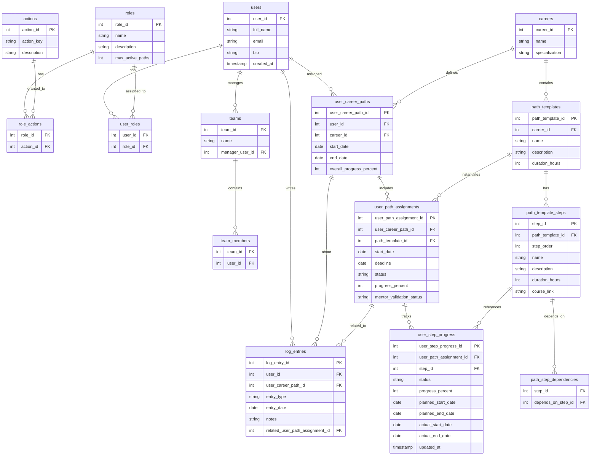

# UpSkills

A career development and upskilling platform that enables organizations to manage learning paths, track employee progress, and facilitate mentor-mentee relationships.

## Overview

UpSkills helps organizations:

- **Define Career Paths**: Create structured learning journeys with courses, steps, and dependencies
- **Assign & Track Progress**: Mentors assign paths to mentees and monitor completion
- **Validate Learning**: Mentors approve/reject completed steps and provide feedback via logbook entries
- **Manage Teams**: Organize users into teams with managers overseeing progress

## Roles

| Role | Responsibilities |
|------|------------------|
| **Admin** | Full system access - manage users, roles, careers, paths, and all settings |
| **Path Creator** | Create and edit career paths, define steps and dependencies, manage content |
| **Mentor** | Assign paths to mentees, validate progress, approve/reject steps, add logbook feedback |
| **Mentee** | View assigned paths, track progress, mark steps complete (pending validation) |

## Tech Stack

- **Frontend**: React
- **Backend**: .NET 10
- **Database**: Relational (SQL)

## Database Schema



## Project Structure

```
upskilling/
├── db/
│   ├── schema.sql      # Database table definitions
│   └── seed.sql        # Demo data for development
├── docs/
│   └── db/
│       └── tables.md   # Quick reference for tables
└── README.md
```

## Getting Started

1. **Database Setup**
   ```bash
   # Run schema creation
   psql -d your_db -f db/schema.sql
   
   # Load demo data
   psql -d your_db -f db/seed.sql
   ```

2. **Backend** (coming soon)
3. **Frontend** (coming soon)

## License

Internal use only.
