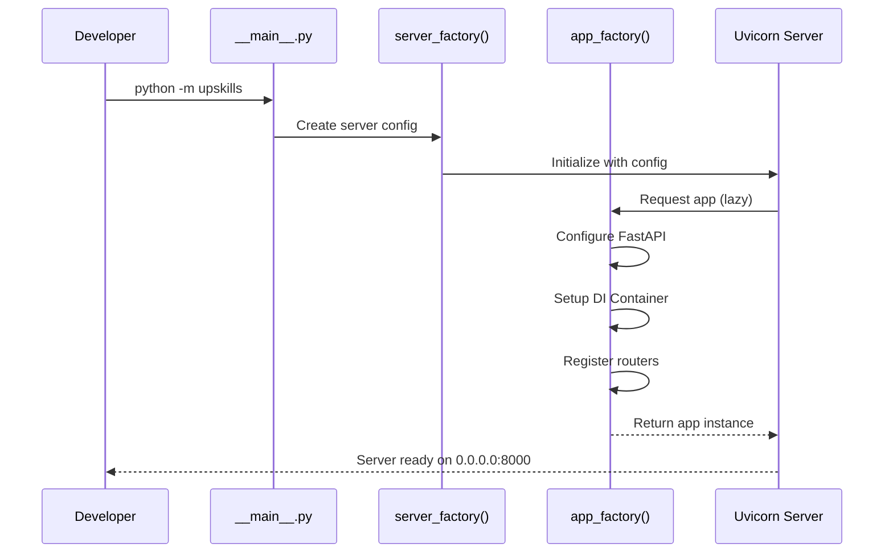
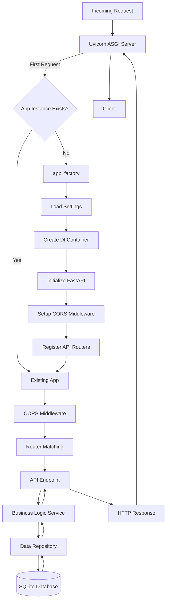
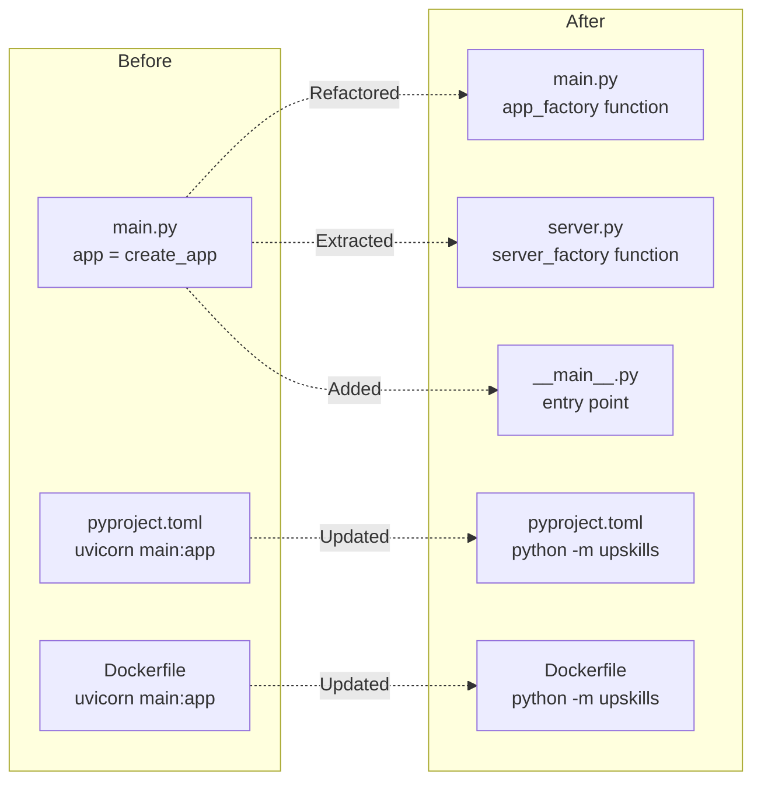

# refactor(backend): implement application factory pattern for improved testability and deployment flexibility

## Overview

This document describes the architectural refactoring of the UpSkills backend from a **module-level application instance** to an **application factory pattern**. This change restructures how the FastAPI application is created and served, introducing better separation of concerns between application configuration, server configuration, and application execution.

## Intent

The primary objective of this refactoring is to **decouple application creation from application execution**, enabling several critical capabilities:

1. **Improved Testability**: By creating the app through a factory function rather than at module import time, tests can instantiate isolated application instances with different configurations, preventing test pollution and enabling parallel test execution.

2. **Flexible Deployment**: The application can now be deployed in multiple ways (uvicorn, gunicorn, hypercorn, or custom ASGI servers) without modifying core application code, as the app creation logic is decoupled from the server implementation.

3. **Better Configuration Management**: Server-specific settings (host, port) are now separated from application settings (CORS, middleware), creating clearer boundaries between infrastructure and application concerns.

4. **Module-Level Execution**: The introduction of `__main__.py` allows the application to be run as a Python module (`python -m upskills`), following Python best practices and improving the developer experience.

## Application Lifecycle Transformation

```mermaid
graph TB
    subgraph "Before: Module-Level Instance"
        A1[Import main.py] --> A2[create_app executed]
        A2 --> A3[app instance created]
        A3 --> A4[uvicorn imports app]
        A4 --> A5[Server starts]
        style A2 fill:#ffcccc
        style A3 fill:#ffcccc
    end
    
    subgraph "After: Factory Pattern"
        B1[python -m upskills] --> B2[__main__.py entry]
        B2 --> B3[server_factory creates config]
        B3 --> B4[uvicorn calls app_factory]
        B4 --> B5[FastAPI instance created]
        B5 --> B6[Server starts]
        style B3 fill:#ccffcc
        style B4 fill:#ccffcc
    end
```



## Architectural Benefits

### 1. **Testability and Test Isolation**

The factory pattern enables true test isolation. Each test can create a fresh application instance with custom configuration, dependency injection containers, and mocked services. This eliminates a major source of test flakiness—shared state between tests.

**Before**:
```python
# Tests import the singleton app instance
from upskills.main import app
# All tests share the same app configuration
```

**After**:
```python
# Tests create isolated instances
from upskills.main import app_factory
app = app_factory()  # Fresh instance per test
```

### 2. **Configuration Flexibility**

Server settings are now cleanly separated from application settings. The `server.py` module handles uvicorn-specific configuration (host, port, log level), while `main.py` focuses purely on application construction (middleware, routers, DI).

Reference: `backend/src/upskills/core/config.py` now includes:
- `server_host`: Server binding address
- `server_port`: Server listening port

These are consumed by `server_factory()` rather than hardcoded in task definitions.

### 3. **Deployment Versatility**

The application can now be deployed with different ASGI servers without modification:

```python
# With uvicorn (current)
python -m upskills

# With gunicorn (production)
gunicorn upskills.main:app_factory --factory -k uvicorn.workers.UvicornWorker

# With hypercorn (async)
hypercorn "upskills.main:app_factory()" --factory

# Custom server
from upskills.main import app_factory
app = app_factory()
# Your custom ASGI server logic
```

### 4. **Simplified Development Workflow**

The introduction of `__main__.py` provides a canonical entry point for running the application:



### 5. **Cleaner Dependency Management**

The refactor consolidates imports at the module level (line 11-19 in `main.py`), improving startup performance by eliminating deferred imports and making dependencies explicit. This also helps with static analysis tools and IDE navigation.

### 6. **Docker Optimization**

The Docker CMD changed from `uvicorn upskills.main:app` to `python -m upskills`, which:
- Uses the same command developers use locally (consistency)
- Leverages Python's module execution path
- Enables better signal handling (uvicorn graceful shutdown)
- Simplifies debugging with `docker run -it <container> python -m upskills --debug`

Reference: `backend/Dockerfile` line 23

## Request Flow Architecture



## Key Technical Changes

### File Structure Evolution



### Configuration Management

**Settings Enhancement** (`core/config.py`):
- Added `server_host` and `server_port` fields
- Removed excessive docstrings for cleaner code
- Maintained property methods for computed values (`database_url`, `project_root`)

### Code Quality Improvements

**Linting Configuration** (`pyproject.toml`):
- Fixed `line-length` from incorrect value `20` to proper `120` characters
- This likely fixes pre-existing linting errors and improves code readability

**Import Organization**:
- Moved router imports to module level in `main.py`
- Eliminated redundant import-time docstrings
- Improved code clarity without sacrificing functionality

### Version Management

**Dynamic Version Loading** (`__init__.py`):
```python
# Before
__version__ = "0.1.0"

# After
from importlib.metadata import version
__version__ = version("upskills")
```

This ensures the version is always synchronized with `pyproject.toml` without manual updates, following Python packaging best practices (PEP 566).

## Considerations

### Learning Curve

Team members need to understand the factory pattern and when to use `app_factory()` vs. `server_factory()`. Key distinctions:
- **`app_factory()`**: Creates the FastAPI application instance (used in tests, custom deployments)
- **`server_factory()`**: Creates the uvicorn server with application (used for standard execution)

Consider documenting common scenarios and providing examples in the repository.

### Backward Compatibility

External tools or scripts that directly import `app` from `upskills.main` will break:

```python
# This will fail after refactor
from upskills.main import app
```

**Mitigation**: Search for any external references to `upskills.main:app` in deployment scripts, monitoring tools, or documentation and update them.

### Testing Migration

Existing tests that rely on the module-level app instance need refactoring:

```python
# Old pattern
from upskills.main import app
client = TestClient(app)

# New pattern
from upskills.main import app_factory
app = app_factory()
client = TestClient(app)
```

This is a positive change but requires test suite updates.

### Performance Implications

The factory pattern introduces minimal overhead (microseconds) during application startup. However, it enables lazy loading—the app is only created when first needed, which can speed up certain deployment scenarios where the server initializes but doesn't immediately serve traffic.

### Configuration Validation

Settings are now validated at server creation time rather than module import time. This means configuration errors might appear later in the startup process. Consider adding a `mise validate-config` task to check settings before deployment.

### Production Deployment

For production deployments with gunicorn, the factory pattern is essential for multi-worker scenarios:

```bash
# Each worker gets its own app instance
gunicorn upskills.main:app_factory --factory -w 4 -k uvicorn.workers.UvicornWorker
```

Without the factory, workers would share state, leading to subtle bugs. This refactor prepares the codebase for production scaling.

## Next Steps

### 1. Implement Integration Test Suite with Factory Pattern

**Title**: Create comprehensive integration tests leveraging isolated app instances

**User Story**: As a backend developer, I need a suite of integration tests that create isolated FastAPI application instances for each test case using the app_factory pattern, so that I can verify API endpoints, middleware behavior, and database interactions without test pollution or shared state affecting test reliability and enabling parallel test execution for faster CI/CD pipelines.

**Estimation**: 5 days

**Reference**: [FastAPI Testing Guide - Using TestClient](https://fastapi.tiangolo.com/tutorial/testing/)

---

### 2. Add Production ASGI Server Configuration with Gunicorn

**Title**: Configure multi-worker production deployment using gunicorn with uvicorn workers

**User Story**: As a DevOps engineer, I need production-ready server configuration using gunicorn with uvicorn workers that leverages the factory pattern for proper process forking and worker isolation, so that the application can handle production traffic loads with multiple workers while maintaining stability and graceful shutdown capabilities, including appropriate worker count recommendations and timeout settings.

**Estimation**: 3 days

**Reference**: [Gunicorn with Uvicorn Workers Deployment](https://www.uvicorn.org/deployment/#gunicorn)

---

### 3. Create Configuration Validation Task

**Title**: Build pre-flight configuration validation for deployment safety

**User Story**: As a platform engineer, I need a mise task or CLI command that validates all application and server settings before starting the application, checking for required environment variables, valid port numbers, database connectivity, and configuration schema compliance, so that I can catch configuration errors early in the deployment process rather than discovering them during runtime failures in production environments.

**Estimation**: 2 days

**Reference**: [Pydantic Settings Validation](https://docs.pydantic.dev/latest/concepts/pydantic_settings/)

---

### 4. Implement Application Health Checks with Lifespan Awareness

**Title**: Enhance health endpoint to report application initialization status and dependencies

**User Story**: As an SRE monitoring application health, I need comprehensive health check endpoints that report not only application uptime but also the status of critical dependencies like database connections, external API availability, and lifespan event completion, so that I can accurately determine when the application is truly ready to receive traffic and implement proper Kubernetes readiness/liveness probes with meaningful status information.

**Estimation**: 3 days

**Reference**: [FastAPI Advanced Dependencies - Health Checks](https://fastapi.tiangolo.com/advanced/health-checks/)

---

### 5. Add Hot Reload Configuration for Development

**Title**: Configure development server with hot reload and debugging capabilities

**User Story**: As a backend developer actively developing features, I need a development mode that enables hot reloading when I save Python files, provides detailed error traces with source code context, and includes debugging capabilities through breakpoints, so that I can rapidly iterate on code changes without manual server restarts and efficiently troubleshoot issues using interactive debugging tools integrated with the factory pattern.

**Estimation**: 2 days

**Reference**: [Uvicorn Deployment - Development Mode](https://www.uvicorn.org/deployment/#development)

---

### 6. Create Testing Fixtures for Common App Configurations

**Title**: Build pytest fixtures for different application configuration scenarios

**User Story**: As a backend developer writing tests, I need reusable pytest fixtures that provide pre-configured application instances for common testing scenarios like authenticated users, database with seed data, mock external services, and different permission levels, so that I can write focused tests without duplicating setup code and easily test various application states by composing fixtures with the app_factory pattern providing clean isolation between tests.

**Estimation**: 4 days

**Reference**: [Pytest Fixtures Documentation](https://docs.pytest.org/en/stable/how-to/fixtures.html)

---

### 7. Implement Graceful Shutdown with Cleanup Handlers

**Title**: Add comprehensive cleanup handlers for resources during application shutdown

**User Story**: As a platform engineer concerned with resource management, I need the application to properly clean up resources during shutdown including closing database connections, flushing logs, completing in-flight requests, and releasing file handles, so that deployments with rolling updates or pod terminations in Kubernetes don't cause data loss, connection leaks, or orphaned resources, with configurable grace period and forced termination after timeout.

**Estimation**: 3 days

**Reference**: [FastAPI Lifespan Events](https://fastapi.tiangolo.com/advanced/events/)

---

### 8. Add Application Metrics and Observability Hooks

**Title**: Integrate Prometheus metrics and OpenTelemetry instrumentation at factory level

**User Story**: As an SRE monitoring application performance, I need built-in metrics collection that tracks request counts, response times, error rates, and resource utilization exposed via Prometheus endpoints, along with distributed tracing via OpenTelemetry, so that I can monitor application health in production, troubleshoot performance bottlenecks, and correlate errors across microservices with minimal configuration required in the app_factory initialization.

**Estimation**: 5 days

**Reference**: [Prometheus FastAPI Instrumentator](https://github.com/trallnag/prometheus-fastapi-instrumentator)

---

### 9. Create Multi-Environment Configuration Management

**Title**: Implement environment-specific configuration with validation and secrets management

**User Story**: As a developer working across development, staging, and production environments, I need a robust configuration management system that loads environment-specific settings from secure sources like AWS Secrets Manager or Azure Key Vault, validates all required configuration at startup, and provides clear error messages for misconfiguration, so that I can confidently deploy the same codebase across environments without hardcoding secrets or risking configuration drift between environments.

**Estimation**: 4 days

**Reference**: [Pydantic Settings - Secrets Management](https://docs.pydantic.dev/latest/concepts/pydantic_settings/#secrets)

---

### 10. Build Custom Application Factory Variants for Specific Deployments

**Title**: Create specialized factory functions for Lambda, Cloud Run, and serverless deployments

**User Story**: As a cloud architect exploring serverless deployment options, I need alternative factory functions optimized for serverless platforms like AWS Lambda or Google Cloud Run that minimize cold start times, handle function lifecycle differences, and adapt request/response formats to platform-specific requirements, so that I can deploy the same application codebase to traditional servers or serverless platforms by simply changing the factory function without rewriting core application logic.

**Estimation**: 6 days

**Reference**: [Mangum - AWS Lambda Adapter for ASGI](https://mangum.io/)

---

## Conclusion

The refactoring to an application factory pattern represents a significant architectural maturation of the UpSkills backend. By decoupling application creation from application execution, this change unlocks critical capabilities:

- **Testability**: Isolated test instances prevent state pollution
- **Flexibility**: Multiple deployment strategies without code changes  
- **Maintainability**: Clear separation of concerns between app and server
- **Scalability**: Foundation for multi-worker production deployments

While the changes appear modest in scope—primarily restructuring `main.py` and adding `server.py` and `__main__.py`—the architectural implications are profound. The factory pattern is a fundamental design pattern in application development that enables sophisticated dependency injection, testing strategies, and deployment flexibility.

This refactor positions the UpSkills project for growth. As the application scales to handle more users, requires sophisticated testing for regulatory compliance, or needs deployment across multiple environments (on-premises, cloud, serverless), the factory pattern provides the architectural foundation to support these requirements without major rewrites.

The investment in proper architecture now pays dividends throughout the application lifecycle—from faster development cycles through better testability, to reduced operational risk through flexible deployment options, to easier onboarding through clearer code organization. The factory pattern is a best practice for production FastAPI applications, and this refactor brings UpSkills in line with industry standards.
