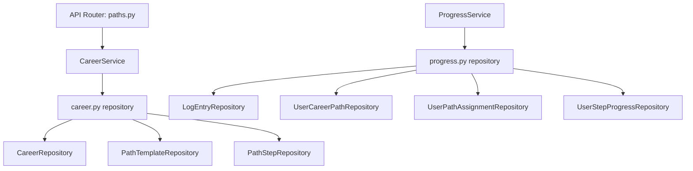
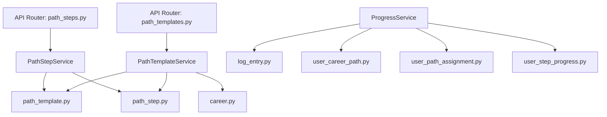
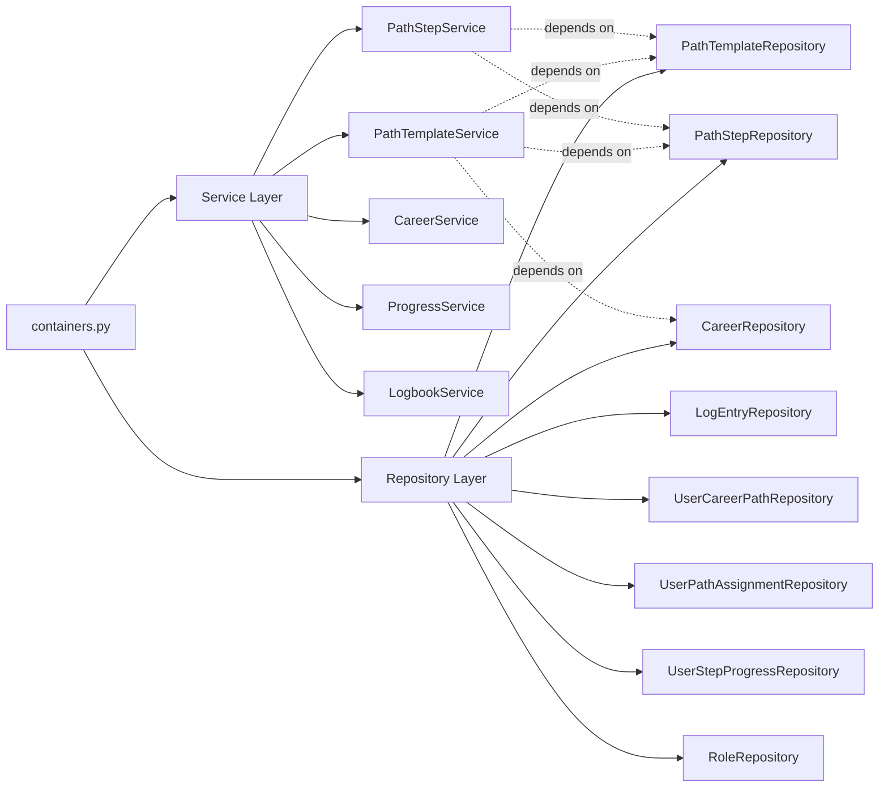

# refactor(architecture): decompose monolithic services into atomic, single-responsibility components

## Intent

The primary objective of this refactoring was to decompose monolithic service and repository modules into smaller, atomic components that follow the Single Responsibility Principle. The previous architecture had large files like `career.py` and `progress.py` that contained multiple classes handling different concerns. This refactoring extracts these nested classes into dedicated modules, creating a more maintainable and scalable codebase.

The core intent is to establish clear boundaries between different business domains (path templates, path steps, career paths, user progress tracking, etc.) at both the service and repository layers, making the codebase easier to understand, test, and extend.

## Benefits

### 1. **Enhanced Maintainability**
Each service and repository now has a single, well-defined responsibility. Developers can locate and modify specific functionality without navigating through large, multi-purpose files. For example, `PathTemplateService` exclusively handles path template operations, while `PathStepService` focuses solely on individual step management.

### 2. **Improved Testability**
Atomic components are easier to test in isolation. Mock dependencies are more straightforward when each service has a focused scope. Unit tests can target specific behaviors without the complexity of large, multi-responsibility classes.

### 3. **Clearer Dependency Graph**
The dependency injection container (`containers.py`) now explicitly shows all service and repository dependencies through individual imports rather than nested class structures. This transparency makes it easier to understand component relationships and identify circular dependencies or architectural issues.

Reference: [`backend/src/upskills/injections/containers.py`](../backend/src/upskills/injections/containers.py)

### 4. **Better Scalability**
As the application grows, new features can be added as new services/repositories without bloating existing files. The modular structure supports team collaboration by reducing merge conflicts—different developers can work on different modules simultaneously.

### 5. **Reduced Cognitive Load**
Smaller files with focused responsibilities reduce the mental overhead required to understand code. Developers can quickly grasp what a module does without parsing through hundreds of lines of unrelated functionality.

### 6. **Improved Code Navigation**
IDEs and static analysis tools work more effectively with well-organized module structures. Features like "Find References" and "Go to Definition" become more useful when components are properly separated.

## Architecture Evolution

### Before: Monolithic Structure

### After: Atomic Components

### Dependency Injection Flow

## Key Changes Summary

### Services Layer
- **Created**: `PathTemplateService` (148 lines) - Handles path template CRUD operations, career associations
- **Created**: `PathStepService` (112 lines) - Manages individual path steps, dependencies, ordering
- **Reduced**: `CareerService` from ~247 lines to focused career-specific operations
- **Modified**: `ProgressService` now delegates to specialized repositories

### Repository Layer
- **Created**: `PathTemplateRepository` - Path template data access
- **Created**: `PathStepRepository` - Path step data access  
- **Created**: `LogEntryRepository` - Learning log entries
- **Created**: `UserCareerPathRepository` - User-career associations
- **Created**: `UserPathAssignmentRepository` - Path assignment management
- **Created**: `UserStepProgressRepository` - Step completion tracking
- **Created**: `RoleRepository` - User role management
- **Removed**: Monolithic `progress.py` repository (236 lines eliminated)
- **Simplified**: `CareerRepository` reduced by ~98 lines

### API Layer
- **Split**: `paths.py` (280 lines) into:
  - `path_templates.py` (136 lines) - Path template endpoints
  - `path_steps.py` (150 lines) - Path step endpoints
- **Result**: Better route organization and API documentation clarity

## Considerations

### 1. **Learning Curve**
Developers new to the codebase need to understand the distribution of responsibilities across more files. Clear documentation and naming conventions mitigate this concern. The benefit of clarity outweighs the initial learning investment.

### 2. **Import Management**
More modules mean more imports. Python's import system handles this well, but developers must ensure they import from the correct atomic module rather than attempting to import from the old monolithic structures.

### 3. **Cross-Service Communication**
Some operations may require coordination between multiple services. For example, creating a complete learning path might involve `PathTemplateService`, `PathStepService`, and `CareerService`. Service composition patterns and careful transaction management become more important.

### 4. **Backward Compatibility**
While the API layer was refactored (splitting the `paths.py` router), care must be taken to ensure API endpoints maintain backward compatibility or that API versioning strategies are in place for breaking changes.

### 5. **Testing Strategy**
The atomic structure requires more unit test files but simplifies test maintenance. Integration tests must verify that services coordinate correctly. The testing pyramid should emphasize unit tests for each atomic component with strategic integration tests.

### 6. **Database Transaction Boundaries**
With operations potentially spanning multiple repositories, careful attention must be paid to transaction management to maintain data consistency. The repository pattern's session management becomes critical.

## Next Steps

### 1. Add Comprehensive Unit Test Coverage for New Services
**Time Estimate**: 5 days

**User Story**: As a developer, I want comprehensive unit tests for `PathTemplateService` and `PathStepService` so that I can confidently refactor and extend these services without fear of breaking existing functionality. The tests should cover all public methods, edge cases, error handling, and mock all repository dependencies to ensure true isolation.

**Reference**: [Python Testing Best Practices - pytest documentation](https://docs.pytest.org/en/stable/goodpractices.html)

---

### 2. Implement Service-Level Integration Tests
**Time Estimate**: 4 days

**User Story**: As a quality assurance engineer, I want integration tests that verify cross-service workflows (e.g., creating a path template with steps, assigning it to users, tracking progress) so that I can ensure the atomic services work together correctly and maintain data consistency across complex operations involving multiple repositories and services.

**Reference**: [Testing FastAPI Applications](https://fastapi.tiangolo.com/tutorial/testing/)

---

### 3. Create API Documentation with OpenAPI Examples
**Time Estimate**: 2 days

**User Story**: As an API consumer, I want comprehensive OpenAPI documentation for the new `/path-templates` and `/path-steps` endpoints with practical examples and request/response schemas so that I can integrate with the API without needing to read the source code or guess at proper payload structures.

**Reference**: [FastAPI OpenAPI Documentation](https://fastapi.tiangolo.com/tutorial/metadata/)

---

### 4. Implement Circuit Breaker Pattern for Service Communication
**Time Estimate**: 6 days

**User Story**: As a reliability engineer, I want circuit breaker patterns implemented between services so that cascading failures are prevented and the system degrades gracefully when individual services experience issues, improving overall system resilience and user experience during partial outages.

**Reference**: [Circuit Breaker Pattern - Martin Fowler](https://martinfowler.com/bliki/CircuitBreaker.html)

---

### 5. Add Service-Level Caching Strategy
**Time Estimate**: 5 days

**User Story**: As a performance engineer, I want caching implemented at the service layer (especially for `PathTemplateService.get_path()` and frequently-accessed career data) so that database load is reduced and API response times improve significantly for read-heavy operations that don't require real-time data freshness.

**Reference**: [Python Caching with Redis](https://redis.io/docs/clients/python/)

---

### 6. Implement Service Observability with Structured Logging
**Time Estimate**: 4 days

**User Story**: As a DevOps engineer, I want structured JSON logging with correlation IDs across all service methods so that I can trace requests through the entire call chain, debug production issues efficiently, and analyze system behavior patterns through log aggregation and analysis tools.

**Reference**: [Python Structured Logging - structlog](https://www.structlog.org/en/stable/)

---

### 7. Create Service-Level Authorization Policies
**Time Estimate**: 7 days

**User Story**: As a security engineer, I want fine-grained authorization policies implemented at the service layer (not just API endpoints) so that business logic enforces proper access control regardless of the entry point, preventing unauthorized data access through direct service calls or future API additions.

**Reference**: [OWASP Authorization Cheat Sheet](https://cheatsheetseries.owasp.org/cheatsheets/Authorization_Cheat_Sheet.html)

---

### 8. Implement Event-Driven Architecture for Cross-Service Communication
**Time Estimate**: 10 days

**User Story**: As a software architect, I want an event bus system where services publish domain events (e.g., 'PathTemplateCreated', 'StepCompleted') so that services remain decoupled, new features can subscribe to existing events without modifying core services, and we have a complete audit trail of business operations.

**Reference**: [Event-Driven Architecture Patterns](https://martinfowler.com/articles/201701-event-driven.html)

---

### 9. Add Service Metrics and Performance Monitoring
**Time Estimate**: 3 days

**User Story**: As a platform engineer, I want Prometheus metrics collecting service-level performance data (method execution times, repository query counts, error rates) so that I can create dashboards showing system health, identify performance bottlenecks, and establish SLOs for each service component.

**Reference**: [Prometheus Python Client](https://prometheus.io/docs/instrumenting/clientlibs/)

---

### 10. Refactor Remaining Monolithic Components
**Time Estimate**: 8 days

**User Story**: As a technical lead, I want to apply the same atomic decomposition pattern to remaining services like `TeamService` and `UserService` so that the entire codebase maintains architectural consistency, making it easier for the team to navigate, maintain, and extend the application with a predictable structure.

**Reference**: [Refactoring: Improving the Design of Existing Code - Martin Fowler](https://refactoring.com/)

---

## Conclusion

This refactoring represents a significant improvement in code organization and architectural clarity. By breaking down monolithic components into atomic, single-responsibility services and repositories, the codebase becomes more maintainable, testable, and scalable. The clear separation of concerns and explicit dependency management through the injection container provide a solid foundation for future development.

The reduced line count (net reduction of 282 lines while adding functionality) demonstrates that better organization can achieve more with less code. The next steps focus on hardening this architecture with comprehensive testing, observability, and resilience patterns to ensure the system scales reliably as the application grows.
