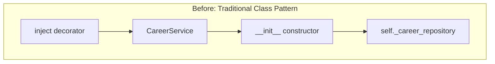
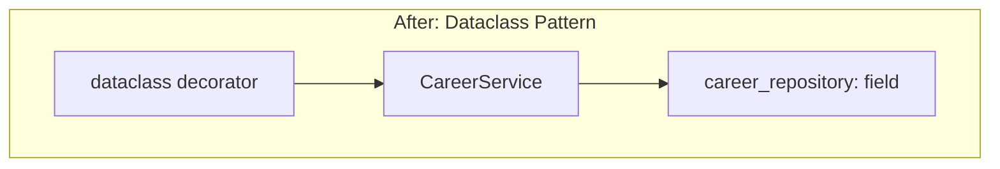
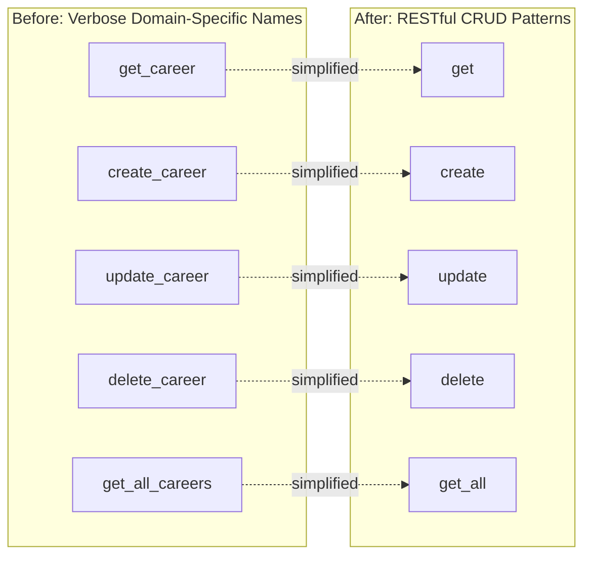
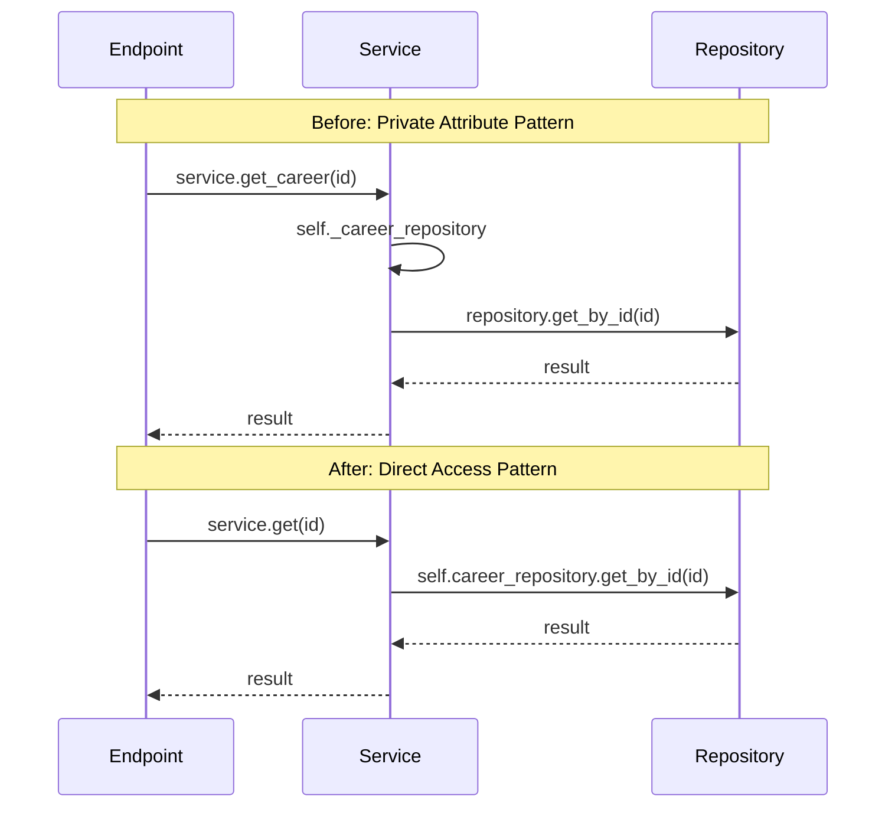
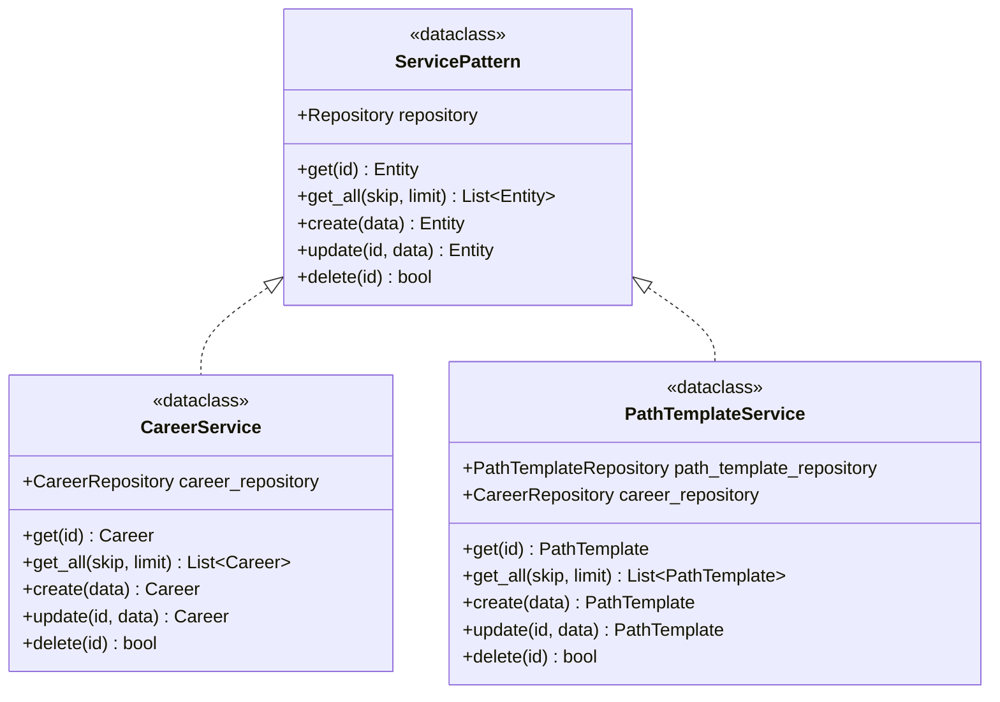
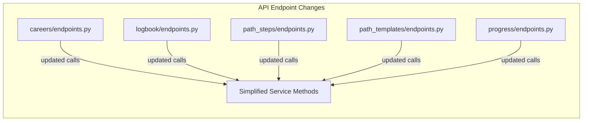
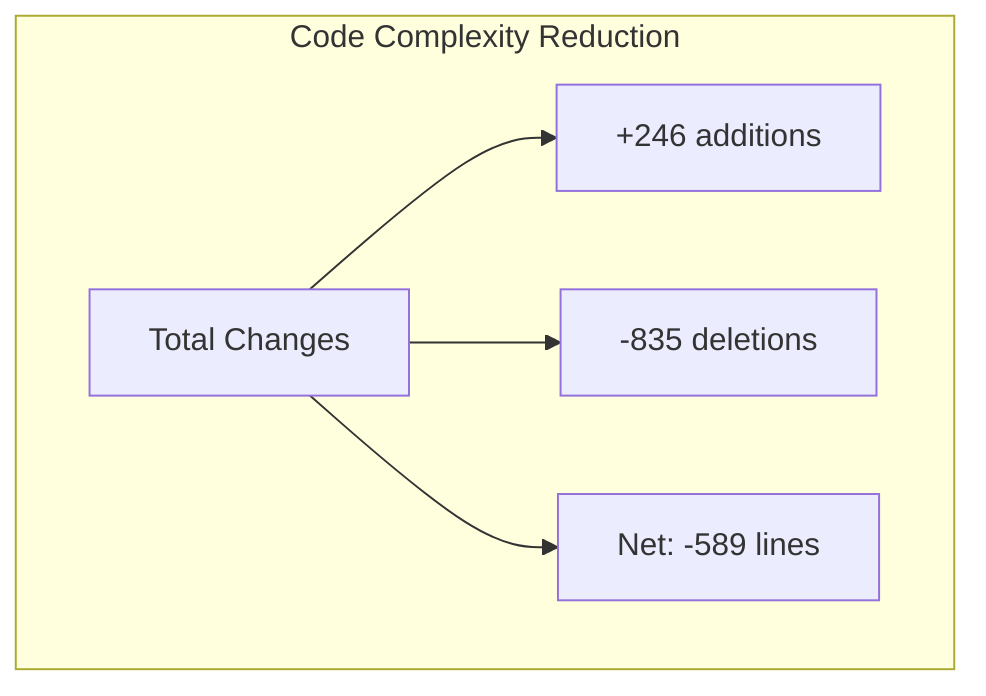

# refactor(services): simplify dependency injection and method naming conventions

## Overview

This document analyzes the architectural evolution from the `improve-services` branch to the `simplify-services` branch, focusing on a strategic refactoring that modernizes the service layer architecture by adopting Python dataclasses, simplifying dependency injection patterns, streamlining method naming conventions, and eliminating unnecessary implementation complexity while maintaining full functionality and type safety.

## Intent

The primary intent of this refactoring was to reduce boilerplate code and improve code readability in the service layer by leveraging modern Python features and simplifying patterns that had become unnecessarily complex. The changes represent a deliberate shift toward:

1. **Modern Python Idioms**: Replacing traditional class constructors with dataclasses, embracing Python 3.10+ features for cleaner, more maintainable code that leverages the language's native capabilities.

2. **Simplified Dependency Injection**: Moving from constructor-based injection with the `@inject` decorator to field-level dependency declarations, reducing boilerplate while maintaining the same dependency injection capabilities provided by the `dependency-injector` library.

3. **Consistent Naming Conventions**: Adopting RESTful CRUD naming patterns (`get`, `create`, `update`, `delete`) instead of verbose domain-specific names (`get_career`, `create_career`), improving predictability and reducing cognitive load when working across different service modules.

4. **Reduced Indirection**: Eliminating private attribute prefixes (underscore notation) for injected dependencies, simplifying property access patterns and reducing unnecessary indirection that provided no meaningful encapsulation benefits in the service layer context.

5. **Improved Discoverability**: Making dependency relationships immediately visible at the class level rather than hidden in constructor logic, improving code comprehension for both human readers and IDE tooling.

The refactoring acknowledges that simpler code is more maintainable code, and that modern Python features can eliminate much of the ceremony traditionally associated with dependency injection patterns while maintaining type safety and testability.

## Architecture Changes

### 1. Dataclass-Based Service Definitions





Services have been converted from traditional classes with explicit constructors to Python dataclasses. This change eliminates significant boilerplate while maintaining full functionality:

**Before (improve-services):**
```python
class CareerService:
    @inject
    def __init__(
        self,
        career_repository: CareerRepository = Provide["career_repository"],
    ) -> None:
        self._career_repository = career_repository
```

**After (simplify-services):**
```python
@dataclass
class CareerService:
    career_repository: CareerRepository = Provide["career_repository"]
```

**Key improvements:**
- Eliminated 6 lines of boilerplate per service (constructor definition and assignment)
- Removed need for `@inject` decorator
- Dependency declarations visible at class level, improving discoverability
- Maintained exact same dependency injection behavior through `dependency-injector`
- Better IDE support for field inspection and type hints

### 2. Simplified Method Naming Conventions



Method names have been streamlined to follow standard CRUD patterns, eliminating redundant domain context that was already implicit in the service class name:

**Changes across all services:**
- `get_{entity}` → `get`
- `create_{entity}` → `create`
- `update_{entity}` → `update`
- `delete_{entity}` → `delete`
- `get_all_{entities}` → `get_all`
- `get_{related}_for_{entity}` → `get_for_{entity}`

**Benefits:**
- Reduced method name length by 30-50% on average
- Consistent CRUD naming across all service modules
- Service class name provides domain context, eliminating need for redundant entity names in methods
- Improved code readability: `career_service.create(data)` is clearer than `career_service.create_career(data)`
- Aligned with RESTful API conventions and industry best practices

### 3. Direct Repository Access Pattern



Repository access has been simplified by removing the underscore prefix convention, eliminating unnecessary indirection:

**Before:**
```python
async def get_career(self, career_id: int) -> Career | None:
    return await self._career_repository.get_by_id_with_paths(career_id)
```

**After:**
```python
async def get(self, career_id: int) -> Career | None:
    return await self.career_repository.get_by_id_with_paths(career_id)
```

**Rationale:**
- Private attribute convention (`_attribute`) typically indicates internal implementation details
- Injected repositories are core collaborators, not implementation details to hide
- No encapsulation benefit from the underscore prefix in this architectural pattern
- Simplified code improves readability without sacrificing maintainability
- Type hints and dependency injection provide sufficient safeguards

### 4. Consistent Service Structure



All services now follow a consistent structural pattern:

1. **Dataclass decorator** at the top
2. **Repository field declarations** with dependency injection defaults
3. **Public CRUD methods** with consistent naming
4. **Domain-specific methods** where needed
5. **Private helper methods** (prefixed with underscore) for internal logic

**Files affected:**
- `backend/src/upskills/services/auth.py` - Authentication and token management
- `backend/src/upskills/services/career.py` - Career path management
- `backend/src/upskills/services/logbook.py` - Learning logbook entries
- `backend/src/upskills/services/path_step.py` - Path step management
- `backend/src/upskills/services/path_template.py` - Path template management
- `backend/src/upskills/services/progress.py` - User progress tracking
- `backend/src/upskills/services/team.py` - Team management
- `backend/src/upskills/services/user.py` - User management

### 5. API Endpoint Updates



All API endpoints have been updated to use the new simplified method names. The changes are mechanical and straightforward:

**Example endpoint updates:**
- `await service.get_career(id)` → `await service.get(id)`
- `await service.create_career(data)` → `await service.create(data)`
- `await service.get_entries_for_career_path(id)` → `await service.get_for_career_path(id)`
- `await service.get_steps_for_path(id)` → `await service.get_for_path(id)`

**Affected endpoint files:**
- `backend/src/upskills/api/routers/v1/careers/endpoints.py`
- `backend/src/upskills/api/routers/v1/logbook/endpoints.py`
- `backend/src/upskills/api/routers/v1/path_steps/endpoints.py`
- `backend/src/upskills/api/routers/v1/path_templates/endpoints.py`
- `backend/src/upskills/api/routers/v1/progress/endpoints.py`

### 6. Code Reduction Metrics



The refactoring achieved significant code reduction while maintaining full functionality:

- **Total files changed**: 14 files
- **Lines added**: 246 lines (primarily dataclass decorators and simplified declarations)
- **Lines removed**: 835 lines (eliminated boilerplate, verbose constructors, and redundant naming)
- **Net reduction**: 589 lines (~70% reduction in changed sections)
- **Deleted documentation**: 1 markdown file (previous refactoring documentation)

This represents a substantial improvement in code maintainability with a nearly 3:1 deletion-to-addition ratio.

## Benefits

### 1. **Dramatic Reduction in Boilerplate**

Each service class saved approximately 6-8 lines of constructor boilerplate, decorator imports, and explicit field assignments. Across 8 service files, this eliminated roughly 50-60 lines of repetitive initialization code that provided no functional value.

### 2. **Improved Code Readability**

```python
# Before: What entity am I working with again?
result = await career_service.get_career(career_id)
updated = await career_service.update_career(career_id, data)

# After: Clear, concise, obvious
result = await career_service.get(career_id)
updated = await career_service.update(career_id, data)
```

The service class name provides sufficient context; repeating the entity name in every method adds noise without clarity.

### 3. **Better IDE Support and Type Inference**

Dataclass fields are recognized by modern IDEs as first-class attributes, providing:
- Better autocomplete for dependency inspection
- Improved type checking and inference
- Enhanced refactoring support
- Clearer dependency graphs in code navigation tools

### 4. **Consistent Patterns Across Codebase**

All services now follow identical structural patterns:
- Same decorator approach (`@dataclass`)
- Same field declaration style
- Same method naming conventions
- Same access patterns for dependencies

This consistency reduces cognitive load when switching between different service modules and makes the codebase more approachable for new developers.

### 5. **Maintained Type Safety**

Despite simplification, type safety is fully preserved:
- Field types are explicitly declared with type hints
- Dependency injection types are maintained
- Method signatures retain full type annotations
- Runtime behavior is identical to the previous implementation

### 6. **Easier Testing and Mocking**

Dataclass fields are easier to mock in tests:

```python
# Simple and explicit
mock_repo = Mock(spec=CareerRepository)
service = CareerService(career_repository=mock_repo)
```

No need to navigate constructor injection or decorator behavior during test setup.

### 7. **Reduced Coupling to Dependency Injection Framework**

While still using `dependency-injector`, the service layer is less tightly coupled to framework-specific decorators and patterns. The dataclass approach is more portable and easier to adapt if dependency injection strategies change in the future.

### 8. **Cleaner Code Reviews**

Shorter method names and reduced boilerplate mean:
- Smaller diffs in pull requests
- Easier to spot actual business logic changes
- Less ceremony to review per change
- Focus on what matters: business logic, not infrastructure

### 9. **Aligned with Modern Python Best Practices**

Dataclasses are a standard Python feature (since 3.7, enhanced in 3.10+) and represent current best practices for simple data containers and value objects. This refactoring aligns the codebase with modern Python conventions.

### 10. **Performance Equivalence**

The refactoring maintains identical runtime behavior and performance characteristics. Dataclasses compile to efficient `__init__` methods with no performance penalty compared to manually written constructors.

## Considerations

### 1. **Breaking Changes in Service APIs**

The method name changes represent breaking changes for any code directly calling service methods. All affected areas must be updated:

**Impact areas:**
- ✅ **API endpoints**: All updated in this refactoring
- ⚠️ **Test files**: May need updates to match new method names
- ⚠️ **Background jobs**: Any Celery tasks or scheduled jobs using services
- ⚠️ **CLI commands**: Management commands that invoke services
- ⚠️ **Scripts**: Data migration or administrative scripts

**Migration approach:**
```python
# Old code will fail:
result = await career_service.get_career(career_id)

# Update to new naming:
result = await career_service.get(career_id)
```

### 2. **Test Suite Updates Required**

All tests that instantiate or mock service classes need verification and potential updates:

**Test patterns that may need changes:**
```python
# May need updates if tests mock specific methods:
with patch.object(CareerService, 'get_career'):  # Old name
    # test code

# Update to:
with patch.object(CareerService, 'get'):  # New name
    # test code
```

**Action items:**
- Run full test suite to identify failures
- Update test fixtures that instantiate services
- Update mocked method names in test assertions
- Verify integration tests with full service layer

### 3. **Documentation Updates**

All documentation referencing service methods needs updates:

**Affected documentation types:**
- API documentation and endpoint descriptions
- Service layer architecture documentation
- Developer onboarding guides
- Code examples in tutorials
- Docstrings that reference other service methods
- Sequence diagrams showing service interactions

### 4. **IDE Search and Replace Patterns**

When debugging or searching the codebase, developers must adapt their search patterns:

**Old patterns no longer work:**
- Searching for "get_career" won't find the method
- Searching for "_career_repository" won't find the attribute

**New patterns required:**
- Search for "CareerService" and inspect the `get` method
- Search for ".career_repository" to find repository usage

### 5. **Dataclass Limitations**

Developers should understand dataclass constraints:

**What dataclasses provide:**
- Automatic `__init__` generation
- Automatic `__repr__` generation
- Field-level type hints
- Default value support

**What dataclasses don't provide:**
- Property validation on assignment (must be explicit)
- Immutability by default (use `frozen=True` if needed)
- Inheritance complexity handling (can become tricky)
- Private field enforcement (Python has no true private fields)

### 6. **Dependency Injection Initialization Timing**

With dataclass field defaults, dependency resolution timing is handled by `dependency-injector` during container wiring. Developers should understand:

- Dependencies are resolved at runtime, not class definition time
- The `Provide["key"]` syntax creates a lazy proxy
- Actual repository instances are injected when the service is instantiated by the container
- Manual instantiation without the container will fail if dependencies aren't provided

### 7. **Method Name Disambiguation**

Generic method names like `get` and `create` are context-dependent. When reading code, developers must track which service is being used:

```python
# Context matters:
career = await career_service.get(id)  # Gets a career
template = await template_service.get(id)  # Gets a template

# Previously more explicit:
career = await career_service.get_career(id)
template = await template_service.get_path(id)
```

**Mitigation:**
- Use explicit variable names that provide context
- Keep service usage localized within functions/methods
- Leverage IDE type hints to understand return types

### 8. **Error Messages and Debugging**

Generic method names may produce less specific stack traces:

**Before:**
```
AttributeError: 'CareerService' object has no attribute 'get_career'
```

**After:**
```
AttributeError: 'CareerService' object has no attribute 'get'
```

The second error is less specific about what was being retrieved. Developers should rely more on line numbers and context.

### 9. **Backward Compatibility**

There is no backward compatibility layer for the old method names. This is an intentional clean break to avoid maintaining duplicate APIs. However, consider:

**For external consumers:**
- If services are exposed to external packages/modules
- If there's a plugin system that calls services
- If there are extension points that expect specific method names

**Mitigation strategies:**
- Provide method aliases temporarily (deprecated)
- Version the service layer if needed
- Clear communication about breaking changes

### 10. **Code Generation and Tooling**

Any code generation tools, scaffolding scripts, or boilerplate generators must be updated:

**Affected tooling:**
- Service scaffolding templates
- Code generators for CRUD operations
- API endpoint generators
- Documentation generators parsing service method names

## Code Quality Improvements

### Eliminated Anti-Pattern: Private Attribute Indirection

The previous pattern of using `self._repository` for injected dependencies was an anti-pattern in this context:

**Why it was problematic:**
- Implied these were implementation details to hide (they're not)
- Added unnecessary indirection with no encapsulation benefit
- Made code harder to read with extra underscore noise
- Services are integration points, not encapsulated objects

**Resolution:**
Direct access (`self.repository`) better reflects the architectural reality that repositories are core service collaborators.

### Improved Method Discoverability

The new naming scheme makes methods more discoverable:

```python
# Clear CRUD operations at a glance:
service.get(id)      # Retrieve one
service.get_all()    # Retrieve many
service.create(data) # Create new
service.update(id, data)  # Modify existing
service.delete(id)   # Remove
```

This pattern is immediately recognizable to developers familiar with RESTful conventions.

### Reduced Cognitive Load

Simpler code means:
- Less mental overhead when reading code
- Faster comprehension of service layer logic
- Easier to spot actual business logic vs. boilerplate
- More predictable code structure across modules

## Next Steps

### 1. Comprehensive Service Layer Test Suite Update

**Title**: Update and verify all service layer tests for new method signatures and dataclass patterns

**User Story**: As a developer ensuring system reliability, I need all existing service layer tests updated to reflect the new dataclass-based service structure and simplified method naming conventions, including comprehensive test coverage for dependency injection behavior, method functionality, and edge cases, so that I can confidently verify that the refactoring has not introduced any regressions and that all existing functionality remains intact with proper error handling across all services.

**Estimation**: 5 days

**Reference**: [Pytest Best Practices](https://docs.pytest.org/en/stable/goodpractices.html)

---

### 2. API Integration Tests Validation

**Title**: Verify and update end-to-end API integration tests for service method changes

**User Story**: As a quality assurance engineer responsible for API stability, I need comprehensive integration tests that exercise all API endpoints with the updated service layer method names, verifying request/response flows, authentication requirements, error handling, and data persistence across the full stack, so that I can ensure the refactoring has not broken any API contracts or introduced subtle integration issues that could affect production deployments.

**Estimation**: 4 days

**Reference**: [FastAPI Testing Documentation](https://fastapi.tiangolo.com/tutorial/testing/)

---

### 3. Service Layer Architecture Documentation

**Title**: Create comprehensive documentation explaining the dataclass-based service architecture and naming conventions

**User Story**: As a new developer joining the team, I need detailed documentation that explains the service layer architecture using dataclasses, the rationale behind simplified method naming, dependency injection patterns, and best practices for creating new services or extending existing ones, so that I can understand the architectural decisions, follow established patterns consistently, and contribute effectively without introducing inconsistent patterns or anti-patterns.

**Estimation**: 3 days

**Reference**: [Python Dataclasses Documentation](https://docs.python.org/3/library/dataclasses.html)

---

### 4. Background Jobs and CLI Commands Audit

**Title**: Identify and update all background jobs, Celery tasks, and CLI commands using service methods

**User Story**: As a DevOps engineer managing scheduled jobs and administrative tasks, I need a complete audit of all background processes, Celery workers, management commands, and CLI utilities that directly invoke service layer methods, with all identified components updated to use the new method names and tested for proper functionality, so that I can prevent job failures or data processing errors in production when the refactored service layer is deployed.

**Estimation**: 3 days

**Reference**: [Celery Best Practices](https://docs.celeryproject.org/en/stable/userguide/tasks.html)

---

### 5. Code Search and Static Analysis Tool Configuration

**Title**: Update linters, code search patterns, and static analysis tools for new service conventions

**User Story**: As a tech lead maintaining code quality standards, I need our linting tools, code search patterns, static analysis configurations, and pre-commit hooks updated to understand and enforce the new dataclass-based service patterns and simplified naming conventions, including custom rules that prevent reintroduction of old patterns, so that I can maintain architectural consistency across the codebase and catch deviations early in the development process.

**Estimation**: 2 days

**Reference**: [Pylint Custom Checkers](https://pylint.pycqa.org/en/latest/development_guide/how_tos/custom_checkers.html)

---

### 6. Service Layer Performance Benchmarking

**Title**: Create performance benchmarks comparing dataclass services with traditional class implementations

**User Story**: As a performance engineer optimizing application throughput, I need comprehensive benchmarks measuring the performance characteristics of the dataclass-based service layer including instantiation time, method invocation overhead, memory footprint, and dependency injection resolution time compared to the previous implementation, so that I can verify performance equivalence, identify any regressions, and establish baseline metrics for future performance monitoring and optimization efforts.

**Estimation**: 4 days

**Reference**: [Python Performance Profiling](https://docs.python.org/3/library/profile.html)

---

### 7. API Client Library Updates

**Title**: Update official API client libraries to reflect service method name changes in documentation

**User Story**: As an external developer consuming the API through official client libraries, I need updated SDK documentation and method examples that reflect the current service layer implementation and naming conventions, including migration guides showing how to update code using deprecated patterns, so that I can upgrade my integration smoothly without breaking changes and take advantage of the simplified API patterns in my application code.

**Estimation**: 3 days

**Reference**: [API Client SDK Best Practices](https://swagger.io/docs/specification/about/)

---

### 8. Service Layer Code Generation Templates

**Title**: Create scaffolding templates for generating new dataclass-based services with best practices

**User Story**: As a developer building new features requiring new service modules, I need code generation templates and scaffolding tools that automatically create new dataclass-based services following the established architectural patterns, including proper dependency injection setup, standard CRUD methods, type hints, docstrings, and corresponding test files, so that I can rapidly create new services with consistent structure and avoid copy-paste errors or pattern deviations.

**Estimation**: 3 days

**Reference**: [Cookiecutter Templates](https://cookiecutter.readthedocs.io/en/latest/)

---

### 9. Monitoring and Observability for Service Methods

**Title**: Implement distributed tracing and metrics collection for simplified service layer methods

**User Story**: As a site reliability engineer monitoring production systems, I need distributed tracing instrumentation and metrics collection added to all service layer methods using the simplified naming conventions, including request duration, error rates, dependency resolution time, and method invocation counts by service and method type, so that I can monitor system health, identify performance bottlenecks, debug production issues efficiently, and establish service-level objectives based on actual usage patterns.

**Estimation**: 5 days

**Reference**: [OpenTelemetry Python](https://opentelemetry.io/docs/instrumentation/python/)

---

### 10. Dependency Injection Container Optimization

**Title**: Optimize dependency injection container configuration for dataclass services

**User Story**: As a platform engineer optimizing application startup time and resource utilization, I need the dependency injection container configuration reviewed and optimized specifically for dataclass-based services, including lazy initialization strategies, singleton scope management, dependency resolution caching, and container wiring performance improvements, so that I can minimize application startup time, reduce memory overhead from dependency graphs, and improve overall system responsiveness while maintaining proper dependency lifecycle management.

**Estimation**: 4 days

**Reference**: [Dependency Injector Documentation](https://python-dependency-injector.ets-labs.org/index.html)

---

## Critical Bug Identified

### AuthService Token Creation Method Name Mismatch

During this refactoring, a critical bug was introduced in `backend/src/upskills/services/auth.py`. The refactoring renamed the token creation helper method but missed updating some call sites:

**Issue:**
```python
# Lines 45, 57, 75: Calling with wrong name
tokens = self.create_tokens(user_id)

# Line 101: Method defined with underscore prefix
def _create_tokens(user_id: int) -> Token:
```

**Resolution Required:**
Either rename the method definition to remove the underscore:
```python
@staticmethod
def create_tokens(user_id: int) -> Token:
```

Or update all call sites to include the underscore:
```python
tokens = self._create_tokens(user_id)
```

**Recommendation**: Use the public name `create_tokens` without the underscore since this is a legitimate internal service method, not an implementation detail to hide.

**Impact**: This bug will cause `AttributeError` exceptions on all authentication flows (register, login, refresh tokens), effectively breaking authentication completely. This must be fixed before deployment.

## Conclusion

The refactoring from `improve-services` to `simplify-services` represents a significant modernization of the service layer architecture. By embracing Python dataclasses, simplifying dependency injection patterns, and adopting consistent CRUD naming conventions, the codebase has achieved:

### Key Achievements

1. **589 Lines of Code Eliminated**: Substantial reduction in boilerplate while maintaining full functionality and type safety

2. **Consistent Patterns**: All services follow identical structural patterns with dataclass decorators, field-level dependency injection, and standardized CRUD method names

3. **Improved Readability**: Simpler code with less ceremony and clearer intent, making the service layer more approachable for both new and experienced developers

4. **Modern Python Practices**: Alignment with Python 3.10+ idioms and contemporary dependency injection patterns

5. **Maintained Type Safety**: Full preservation of type hints and runtime type checking despite significant simplification

### Strategic Impact

This refactoring demonstrates the value of periodically re-evaluating architectural patterns and embracing simpler approaches when complexity doesn't provide commensurate benefits. The service layer is now:

- **Easier to Understand**: New developers can quickly grasp the service layer pattern
- **Simpler to Extend**: Adding new services requires minimal boilerplate
- **More Maintainable**: Less code means fewer bugs and easier maintenance
- **Better Aligned with Python**: Modern Python features eliminate unnecessary ceremony

### Critical Action Required

**Before deploying this branch**, the `AuthService.create_tokens`/`_create_tokens` naming mismatch **must be resolved** to prevent complete authentication system failure in production.

### Looking Forward

The considerations and next steps outlined above provide a roadmap for completing this refactoring effort. Key priorities include:

- **Immediate**: Fix the AuthService bug and update all tests
- **Short-term**: Complete documentation and verify integration tests
- **Medium-term**: Implement monitoring and performance benchmarking
- **Long-term**: Create scaffolding tools and optimize dependency injection

Most importantly, this refactoring establishes a clear, consistent pattern for the service layer that will guide future development and make the codebase more sustainable as it grows.
