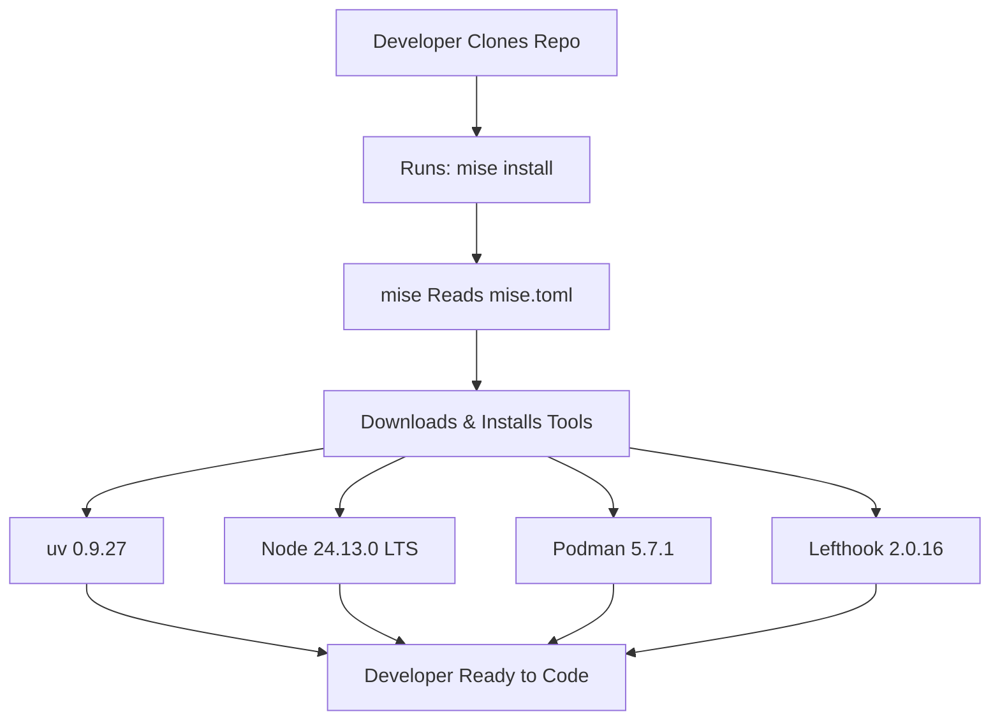
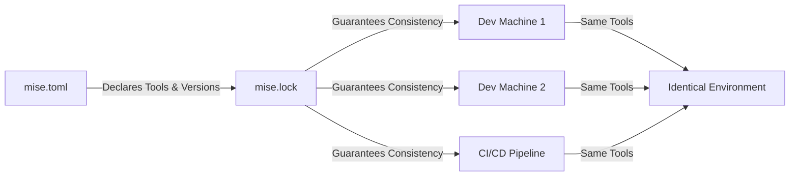
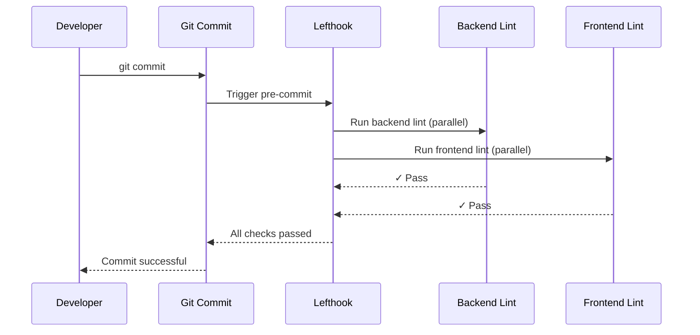
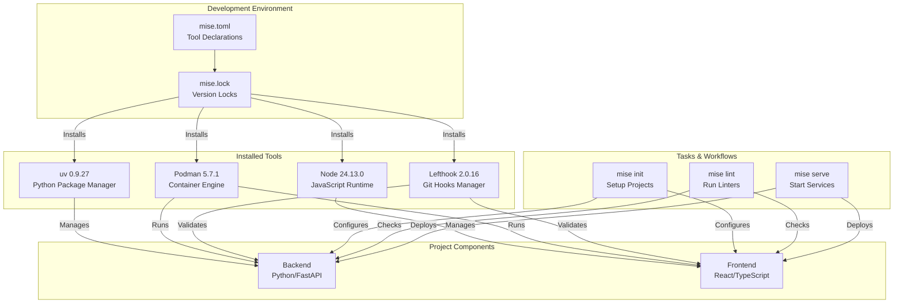

# feat(tooling): standardize development environment with mise

## Overview

This document describes the introduction of **mise** (a polyglot development environment manager) to the UpSkills project. The changes establish a unified, reproducible development toolchain that eliminates "works on my machine" issues and dramatically simplifies onboarding for new developers.

## Intent

The primary goal of these changes is to **standardize the development environment** across all team members and CI/CD pipelines. Before this change, developers needed to manually install and manage multiple tools (Python/uv, Node.js/npm, podman, pre-commit hooks) with potentially mismatched versions. This created friction during onboarding and led to inconsistencies between development and production environments.

With mise, the entire toolchain—including runtimes, package managers, and development utilities—is declared in a single configuration file (`mise.toml`) and locked to specific versions (`mise.lock`). This approach brings dependency management practices from application code to the development environment itself.



## Benefits

### 1. **Simplified Onboarding**

New developers can set up the complete development environment with just two commands:

```bash
mise install  # Install all required tools
mise init     # Initialize projects (uv sync + npm install)
```

No more multi-page setup instructions or debugging version mismatches.

### 2. **Reproducible Environments**

The `mise.lock` file ensures every developer uses identical tool versions, creating perfect reproducibility across machines and over time. This lockfile approach mirrors the benefits of `package-lock.json` (Node.js) and `uv.lock` (Python) but extends it to the entire development toolchain.



### 3. **Unified Task Interface**

Mise provides a consistent task runner across the monorepo, abstracting away the complexity of running commands in different project contexts:

- `mise lint` - Run linters for both backend (prek + ruff) and frontend (eslint)
- `mise serve` - Build and start both services with podman compose
- `mise init` - Initialize both projects with their respective package managers

This eliminates the cognitive overhead of remembering tool-specific commands and working directories.

### 4. **Version Management Without Conflicts**

Each tool (Node.js, Python/uv, Podman) is installed in isolation by mise, preventing conflicts with system-installed versions or other projects. Developers can work on multiple projects with different tool requirements without interference.

### 5. **Improved Pre-Commit Hooks**

The migration to **lefthook** (from standalone pre-commit) provides:
- Faster execution through parallel job running
- Multi-project support for monorepos (separate configs for backend/frontend)
- Simplified configuration via `lefthook.yml`
- Auto-updating of pre-commit tools via `prek auto-update`



## Key Changes

### Added Configuration Files

1. **`mise.toml`** - Declares tools and task definitions
   - Tools: uv, Node.js (LTS), podman, lefthook, podman-desktop
   - Tasks: init, build, serve, lint with dependencies
   
2. **`mise.lock`** - Locks tool versions with checksums for all platforms
   - Ensures reproducibility across Linux, macOS, Windows
   - Contains SHA-256 checksums for security verification

3. **`lefthook.yml`** - Configures pre-commit hooks for the monorepo
   - Parallel execution of backend and frontend linters
   - Auto-updates pre-commit hook versions

### Modified Files

- **`README.md`** - Added comprehensive setup instructions using mise
- **`backend/.pre-commit-config.yaml`** - Moved from root to backend-specific location, updated tool versions
- **`backend/pyproject.toml`** - Adjusted ruff linter configuration
- **`frontend/package-lock.json`** - Dependency updates

## Considerations

### Adoption Curve

Team members need to install mise itself (one-time setup). While installation is straightforward, it's a new tool in the workflow. Consider providing platform-specific installation instructions and holding a brief demo session.

### Tool Version Updates

The `mise.lock` file pins exact versions, which is excellent for reproducibility but requires intentional updates. Establish a process for:
- Regularly reviewing and updating tool versions
- Testing updates in a branch before merging
- Documenting breaking changes in tool upgrades

### CI/CD Integration

CI/CD pipelines must be updated to use mise for installing tools and running tasks. This ensures the same commands work locally and in CI, but requires modifying existing pipeline configurations.

### Learning Curve for Tasks

The task system (`mise serve`, `mise lint`) is powerful but abstracts underlying commands. Developers should understand what these tasks do under the hood for debugging purposes. Consider adding `--verbose` flags for transparency.

### Toolchain Bloat

Mise makes it easy to add tools, but each addition increases download time and storage. Be intentional about adding tools to `mise.toml`—only include those truly needed for development.

## Technical Architecture



## Next Steps

### 1. Update CI/CD Pipeline Configuration

**User Story**: As a DevOps engineer, I need the CI/CD pipeline to use mise for tool installation and task execution, so that the build environment exactly matches local development and eliminates environment-related failures in the pipeline.

**Estimation**: 2 days

**Reference**: [Mise CI/CD Integration Guide](https://mise.jdx.dev/continuous-integration.html)

---

### 2. Create Developer Onboarding Documentation

**User Story**: As a new team member, I need comprehensive onboarding documentation that explains mise setup, common workflows, and troubleshooting steps, so that I can become productive quickly without requiring extensive hand-holding from senior developers.

**Estimation**: 1 day

**Reference**: [Mise Getting Started Guide](https://mise.jdx.dev/getting-started.html)

---

### 3. Add Environment Variable Management

**User Story**: As a developer, I need mise to manage environment variables and secrets for different environments (dev, staging, prod), so that I can securely configure my local environment without hardcoding sensitive values or maintaining multiple .env files manually.

**Estimation**: 3 days

**Reference**: [Mise Environment Variables](https://mise.jdx.dev/environments.html)

---

### 4. Implement Pre-Push Hooks for Test Execution

**User Story**: As a developer, I need automated tests to run before I push code to the remote repository, so that I catch failures early and prevent breaking the main branch, saving time for the entire team during code review.

**Estimation**: 2 days

**Reference**: [Lefthook Pre-Push Hooks](https://github.com/evilmartians/lefthook/blob/master/docs/configuration.md#pre-push)

---

### 5. Configure Watch Mode for Development

**User Story**: As a developer, I need a watch mode that automatically rebuilds and reloads both backend and frontend when I save files, so that I can see my changes instantly without manually restarting services, improving my development feedback loop.

**Estimation**: 3 days

**Reference**: [Mise Watch Tasks](https://mise.jdx.dev/tasks/#file-watching)

---

### 6. Add Database Migration Task

**User Story**: As a developer, I need a mise task to run database migrations and seed data, so that I can easily set up and reset my local database to a known state without memorizing complex SQL commands or manual procedures.

**Estimation**: 2 days

**Reference**: [Alembic Migrations](https://alembic.sqlalchemy.org/en/latest/tutorial.html)

---

### 7. Setup Tool Version Update Automation

**User Story**: As a maintainer, I need automated checks that notify me when new versions of mise-managed tools are available, so that I can keep dependencies current and benefit from security patches and new features without manual monitoring.

**Estimation**: 4 days

**Reference**: [Renovate Bot Configuration](https://docs.renovatebot.com/modules/manager/mise/)

---

### 8. Create Task for Running E2E Tests

**User Story**: As a QA engineer, I need a mise task that spins up the entire application stack and runs end-to-end tests, so that I can validate the complete user journey locally before deployment and catch integration issues early.

**Estimation**: 5 days

**Reference**: [Playwright Getting Started](https://playwright.dev/docs/intro)

---

### 9. Add Development Container Configuration

**User Story**: As a developer preferring containerized development, I need a devcontainer configuration that integrates with mise, so that I can develop inside a container with all tools pre-installed and maintain consistency with non-container development workflows.

**Estimation**: 3 days

**Reference**: [Dev Containers with Mise](https://containers.dev/guide/dockerfile)

---

### 10. Implement Task Dependency Caching

**User Story**: As a developer running frequent builds, I need mise tasks to leverage caching mechanisms for dependencies and build artifacts, so that subsequent builds run significantly faster and I spend less time waiting for repetitive operations.

**Estimation**: 4 days

**Reference**: [Mise Task Dependencies](https://mise.jdx.dev/tasks/#dependencies)

---

## Conclusion

The introduction of mise represents a significant maturity step for the UpSkills project's development infrastructure. By treating the development environment as code, we gain the same benefits that infrastructure-as-code provides for production systems: reproducibility, version control, and automation.

While there is an initial investment in learning mise and updating workflows, the long-term payoffs in developer productivity, onboarding speed, and environment consistency make this a high-value change. The standardized task interface (`mise init`, `mise lint`, `mise serve`) creates a common language for development operations, reducing cognitive load and enabling developers to focus on building features rather than managing toolchains.

The foundation laid here enables future enhancements like environment variable management, watch mode development, and sophisticated CI/CD integration, all while maintaining the simplicity of a single command to get started.
