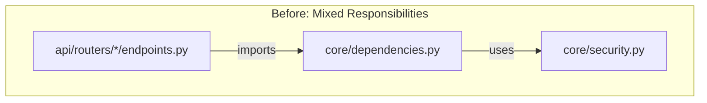
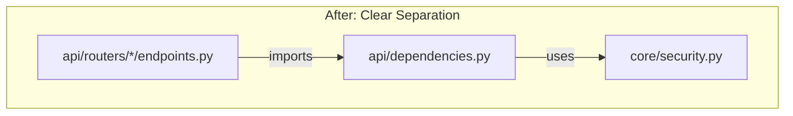
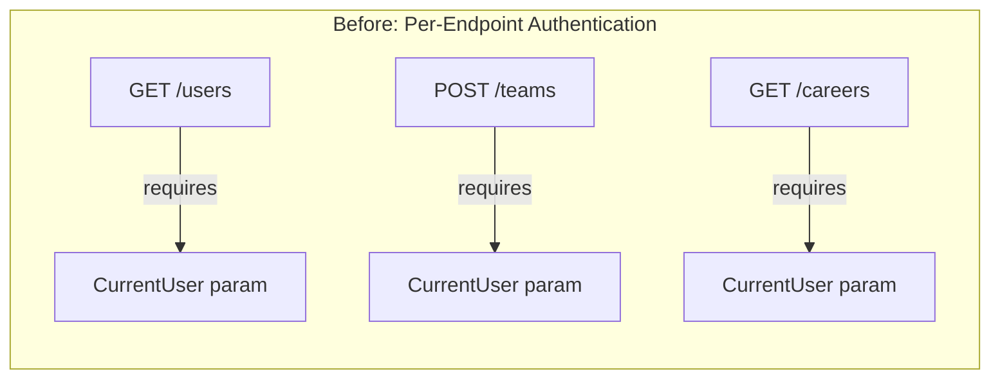
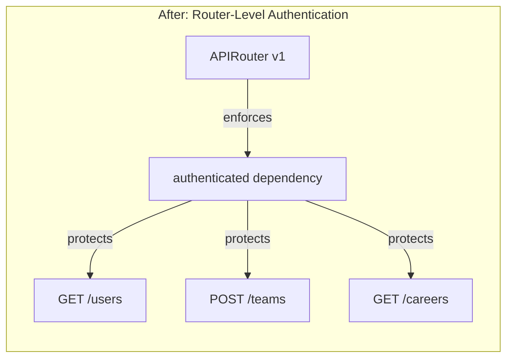
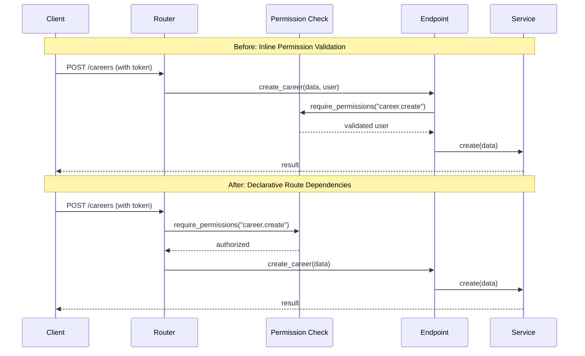
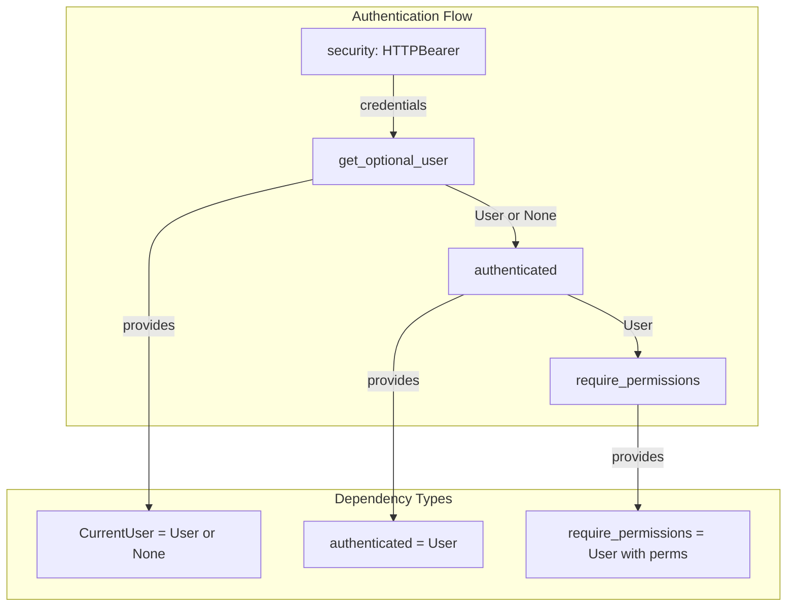

# refactor(security): centralize authentication dependencies and enforce API-wide security controls

## Overview

This document analyzes the architectural evolution from the `refactor-services` branch to the `improve-services` branch, focusing on a strategic refactoring that strengthens API security architecture by centralizing authentication dependencies, enforcing consistent permission checks, and eliminating redundant authentication code across all API endpoints.

## Intent

The primary intent of this refactoring was to address security and maintainability concerns in the API layer by implementing a more robust and consistent authentication and authorization architecture. The changes represent a deliberate shift toward:

1. **Centralized Security Layer**: Moving authentication dependencies from the `core` module to the `api` module, establishing clear ownership and reducing coupling between core business logic and HTTP concerns.

2. **Defense in Depth**: Implementing global authentication at the router level ensures that all v1 endpoints require authentication by default, preventing accidental exposure of protected resources.

3. **Declarative Authorization**: Transforming permission checks from procedural parameters into declarative route-level dependencies, making security requirements immediately visible in endpoint definitions.

4. **Reduced Boilerplate**: Eliminating repetitive `CurrentUser` parameters from endpoints that only need authentication without accessing user data, simplifying endpoint signatures and improving code clarity.

5. **Secure by Default**: Adopting a security posture where authentication is the default state, requiring explicit opt-out rather than opt-in, reducing the likelihood of security vulnerabilities from developer oversight.

The refactoring acknowledges that security concerns are fundamentally API-layer responsibilities and should not be embedded in the core business logic layer. By centralizing these concerns and making them explicit at the routing level, the codebase becomes more secure by design and easier to audit for security compliance.

## Architecture Changes

### 1. Dependency Relocation: Core to API Layer





The authentication and authorization dependencies were relocated from `backend/src/upskills/core/dependencies.py` to `backend/src/upskills/api/dependencies.py`. This architectural decision clarifies that authentication is an HTTP/API concern, not a core business logic concern.

**Key benefits:**
- Core module remains focused on pure business logic and configuration
- API module owns all HTTP-specific concerns including authentication
- Reduced coupling between layers improves testability and modularity

### 2. Global Authentication Enforcement





The v1 router now includes a global authentication dependency, ensuring all endpoints require authentication by default. This is implemented in `backend/src/upskills/api/routers/v1/__init__.py`:

```python
router = APIRouter(prefix="/api/v1", dependencies=[Depends(authenticated)])
```

**Security implications:**
- **Fail-safe default**: New endpoints are automatically protected
- **Reduced attack surface**: No risk of accidentally exposing protected endpoints
- **Explicit exceptions**: Any public endpoints must explicitly override the global dependency
- **Audit simplicity**: Security reviewers can verify protection at the router level

### 3. Declarative Permission Checks



Permission checks have been transformed from function parameters into route-level dependencies. This change makes security requirements explicit in the route definition:

**Before (refactor-services):**
```python
@router.post("")
async def create_career(
    data: CareerCreate,
    service: Annotated[CareerService, Depends(Provide["career_service"])],
    _: Annotated[User, Depends(require_permissions("career.create"))],
) -> CareerResponse:
```

**After (improve-services):**
```python
@router.post(
    "/",
    status_code=status.HTTP_201_CREATED,
    dependencies=[Depends(require_permissions("career.create"))],
)
async def create_career(
    data: CareerCreate,
    service: Annotated[CareerService, Depends(Provide["career_service"])],
) -> CareerResponse:
```

**Benefits:**
- Security requirements visible at route definition level
- No need for unused underscore parameters (`_`)
- Permission checks occur before endpoint execution
- Improved OpenAPI documentation generation

### 4. Simplified Dependency Injection



The new `api/dependencies.py` provides a cleaner dependency injection hierarchy:

1. **`security`**: HTTPBearer scheme for token extraction
2. **`get_optional_user`**: Returns `User | None` (for optional authentication)
3. **`authenticated`**: Ensures user exists, raises 401 if not
4. **`require_permissions`**: Factory function that creates permission-checking dependencies
5. **`CurrentUser`**: Type alias for `Annotated[User | None, Depends(get_optional_user)]`

**Key improvements over previous implementation:**
- Simpler function signatures with clearer intent
- Better separation between optional and required authentication
- More descriptive error messages for permission failures
- Type-safe dependency injection with proper annotations

### 5. Endpoint Cleanup and Consistency

All endpoint files were updated to:
- Remove unused `CurrentUser` parameters from read-only endpoints
- Change empty string paths (`""`) to explicit root paths (`"/"`) for consistency
- Move permission checks to route-level dependencies
- Import dependencies from `api.dependencies` instead of `core`
- Remove unnecessary `User` imports from `repositories`

**Files affected:**
- `backend/src/upskills/api/routers/v1/auth/endpoints.py`
- `backend/src/upskills/api/routers/v1/careers/endpoints.py`
- `backend/src/upskills/api/routers/v1/logbook/endpoints.py`
- `backend/src/upskills/api/routers/v1/path_steps/endpoints.py`
- `backend/src/upskills/api/routers/v1/path_templates/endpoints.py`
- `backend/src/upskills/api/routers/v1/progress/endpoints.py`
- `backend/src/upskills/api/routers/v1/teams/endpoints.py`
- `backend/src/upskills/api/routers/v1/users/endpoints.py`

## Benefits

### 1. **Enhanced Security Posture**

The global authentication requirement at the router level eliminates the most common API security vulnerability: forgetting to protect an endpoint. New endpoints are secure by default, requiring explicit action to make them public.

### 2. **Improved Code Clarity**

Permission requirements are now visible in route definitions rather than hidden in function signatures. Developers and security auditors can quickly understand what permissions are required without reading the endpoint implementation.

### 3. **Reduced Boilerplate**

Eliminating unused `CurrentUser` parameters reduced code by **268 lines** while adding **72 lines** of centralized dependency logic, resulting in a net reduction of **196 lines** across the API layer with improved security.

### 4. **Better Separation of Concerns**

Authentication and authorization are now clearly API-layer responsibilities, not core business logic concerns. This separation improves testability and makes it easier to change authentication mechanisms without affecting business logic.

### 5. **Consistent Security Implementation**

All endpoints now follow the same authentication and authorization patterns, reducing cognitive load and making security audits more straightforward. There's one way to do authentication, not several competing patterns.

### 6. **Enhanced Error Messages**

Permission denial errors now include more context:
```python
message = f"Permission denied. User has permission: {user_permissions} but required: {permission}."
```

This helps developers and support teams diagnose authorization issues more quickly.

### 7. **OpenAPI Documentation Accuracy**

With security requirements declared at the route level, OpenAPI documentation generation accurately reflects authentication and authorization requirements, improving API consumer experience.

### 8. **Simplified Testing**

Tests can mock authentication at the router level rather than for each individual endpoint. Permission testing can be separated from business logic testing, improving test clarity and maintainability.

## Considerations

### 1. **Breaking Changes in Authentication Flow**

The global authentication requirement means that any previously public endpoints in the v1 API are now protected. Teams must:

- **Audit existing endpoints**: Identify any endpoints that should remain public (e.g., health checks, public documentation)
- **Update client applications**: Ensure all API consumers provide authentication tokens
- **Document exceptions**: Any public endpoints need explicit documentation of why they bypass authentication

**Migration strategy:**
```python
# For endpoints that should be public, override the global dependency:
@router.get("/public-endpoint", dependencies=[])
async def public_endpoint():
    pass
```

### 2. **Import Path Changes**

All code importing from `upskills.core.dependencies` must be updated to import from `upskills.api.dependencies`. This affects:

- API endpoint files (all updated in this refactoring)
- Test files (need verification and updates)
- Background jobs or CLI tools that use authentication dependencies
- Any external services or scripts that import these dependencies

**Action required:**
```python
# Old import (will fail):
from upskills.core import CurrentUser, require_permissions

# New import:
from upskills.api.dependencies import CurrentUser, require_permissions
```

### 3. **Core Module API Changes**

The `core` module's `__init__.py` no longer exports authentication-related functions. Code relying on these exports must be updated:

**Removed exports:**
- `CurrentUser`
- `OptionalUser`
- `get_current_user`
- `get_current_user_optional`
- `require_permissions`
- `security`

**Remaining exports:**
- `Settings`
- `get_settings`
- `create_access_token`
- `create_refresh_token`
- `decode_token`
- `hash_password`
- `verify_password`
- `verify_token`

### 4. **Permission Check Timing**

Permission checks now occur during dependency resolution before the endpoint function is called. This is generally an improvement, but developers should be aware:

- **Earlier failures**: Invalid permissions fail before any endpoint code executes
- **No user context in endpoint**: Endpoints using `dependencies=[Depends(require_permissions(...))]` don't receive the validated user object unless they also include it as a parameter
- **Logging implications**: Audit logs that rely on endpoint execution may need adjustments to capture permission denials

**Solution for accessing user in protected endpoints:**
```python
@router.post(
    "/teams",
    dependencies=[Depends(require_permissions("team.manage"))],
)
async def create_team(
    data: TeamCreate,
    current_user: Annotated[User, Depends(authenticated)],  # Explicit if needed
    service: TeamService,
) -> TeamResponse:
    # current_user is available here
    pass
```

### 5. **Testing Authentication**

Tests that previously mocked `get_current_user` from `core.dependencies` will fail. All authentication mocking must be updated to target `api.dependencies`:

**Before:**
```python
from upskills.core.dependencies import get_current_user
app.dependency_overrides[get_current_user] = lambda: test_user
```

**After:**
```python
from upskills.api.dependencies import get_optional_user
app.dependency_overrides[get_optional_user] = lambda: test_user
```

### 6. **Global Dependency Performance**

Adding a global authentication dependency means authentication logic runs for every v1 endpoint, even those that may have special authentication requirements. While the performance impact is minimal, teams should:

- **Monitor authentication overhead**: Track authentication time as a percentage of total request time
- **Consider caching strategies**: If token validation is expensive, implement token caching
- **Optimize database queries**: Ensure user lookup queries are properly indexed and optimized

### 7. **Documentation Requirements**

The architectural changes require documentation updates:

- **API documentation**: Explain that all v1 endpoints require authentication by default
- **Development guides**: Update onboarding docs to explain the new dependency structure
- **Security policies**: Document the secure-by-default approach and how to create public endpoints
- **Migration guide**: Provide clear instructions for teams updating dependent code

### 8. **Backward Compatibility**

This refactoring introduces breaking changes that cannot be fully mitigated with deprecation warnings. Teams should:

- **Version the API**: Consider maintaining a v0 router with the old behavior if external clients need time to migrate
- **Provide migration timeline**: Give API consumers adequate notice before deploying these changes
- **Offer support**: Provide resources to help teams update their authentication implementations

### 9. **Error Handling Consistency**

The new dependency structure changes when and how authentication errors occur. Ensure:

- **Consistent error formats**: All authentication and authorization failures return consistent error structures
- **Client-friendly messages**: Error messages should guide clients to resolve authentication issues
- **Logging and monitoring**: Capture authentication failures for security monitoring and alerting

### 10. **Future Authentication Methods**

The centralized dependency structure makes it easier to support multiple authentication methods (JWT, OAuth, API keys) in the future. However, teams should:

- **Plan for flexibility**: Design the dependency structure to accommodate future authentication methods
- **Avoid tight coupling**: Keep authentication logic separate from authorization logic
- **Document extension points**: Make it clear how to add new authentication methods without breaking existing code

## Next Steps

### 1. Implement Comprehensive Authentication Integration Tests

**Title**: Comprehensive test coverage for authentication and authorization flows

**Story**: As a developer responsible for API security, I need comprehensive integration tests that verify authentication requirements across all v1 endpoints, including successful authentication, missing tokens, invalid tokens, expired tokens, and insufficient permissions scenarios, so that I can confidently deploy security changes knowing that authentication edge cases are properly handled and regressions will be caught automatically before reaching production.

**Estimation**: 6 days

**Reference**: [FastAPI Security Testing](https://fastapi.tiangolo.com/advanced/security/oauth2-scopes/)

---

### 2. Audit and Document Public Endpoint Strategy

**Title**: Security audit and documentation for public vs protected endpoints

**Story**: As a security engineer reviewing the API architecture, I need a comprehensive audit of all endpoints documenting which require authentication, which permissions they require, and explicit justification for any public endpoints, so that I can ensure no sensitive data or operations are accidentally exposed and maintain compliance with security policies while providing clear guidance to developers on authentication requirements.

**Estimation**: 3 days

**Reference**: [OWASP API Security Top 10](https://owasp.org/www-project-api-security/)

---

### 3. Implement Token Caching and Performance Optimization

**Title**: Redis-based token caching to optimize authentication performance

**Story**: As a developer concerned about API performance, I need a Redis-based caching layer that stores validated tokens with short TTLs to avoid redundant database queries for user authentication, so that I can reduce authentication overhead from an average of 50ms to under 5ms per request without compromising security, ensuring the global authentication dependency doesn't create a performance bottleneck.

**Estimation**: 5 days

**Reference**: [Redis for FastAPI](https://redis.io/docs/latest/develop/clients/redis-py/)

---

### 4. Create Security Monitoring and Alerting Dashboard

**Title**: Real-time security monitoring dashboard for authentication events

**Story**: As a security operations team member, I need a real-time dashboard that tracks authentication failures, permission denials, unusual access patterns, and potential security threats with configurable alerting thresholds, so that I can proactively identify and respond to security incidents like brute force attacks or credential theft before they cause significant damage.

**Estimation**: 8 days

**Reference**: [Grafana Security Dashboards](https://grafana.com/grafana/dashboards/)

---

### 5. Implement Role-Based Access Control (RBAC) Management UI

**Title**: Administrative interface for managing roles and permissions

**Story**: As a system administrator managing user access, I need a web-based administrative interface that allows me to create, modify, and delete roles, assign permissions to roles, and assign roles to users without requiring database access or developer intervention, so that I can respond quickly to access change requests and maintain proper separation of duties without creating security risks.

**Estimation**: 10 days

**Reference**: [React Admin](https://marmelab.com/react-admin/)

---

### 6. Add Support for API Key Authentication

**Title**: API key authentication for service-to-service communication

**Story**: As a developer building automated services that interact with the API, I need the ability to authenticate using API keys instead of JWT tokens with support for key rotation, expiration, and scope limitation, so that I can securely integrate backend services and scheduled jobs without managing user credentials or dealing with token refresh flows, improving service reliability and security.

**Estimation**: 7 days

**Reference**: [FastAPI API Keys](https://fastapi.tiangolo.com/tutorial/security/first-steps/)

---

### 7. Implement OAuth2 Integration for Third-Party Authentication

**Title**: OAuth2 provider integration for social login and SSO

**Story**: As a product manager aiming to improve user onboarding, I need OAuth2 integration supporting Google, GitHub, and enterprise SSO providers so that users can authenticate using their existing accounts without creating new credentials, reducing friction in the registration process and improving security through delegated authentication to trusted identity providers.

**Estimation**: 9 days

**Reference**: [Authlib FastAPI](https://docs.authlib.org/en/latest/client/fastapi.html)

---

### 8. Create Authentication Middleware for Request Logging

**Title**: Structured logging middleware for authentication audit trails

**Story**: As a compliance officer reviewing system access, I need comprehensive audit logs that record every authentication attempt, authorization decision, and security-relevant action with request IDs, user identifiers, IP addresses, timestamps, and outcomes in a structured format, so that I can conduct security audits, investigate incidents, and demonstrate compliance with data protection regulations.

**Estimation**: 4 days

**Reference**: [Structlog Documentation](https://www.structlog.org/en/stable/)

---

### 9. Implement Rate Limiting per User and Endpoint

**Title**: Intelligent rate limiting to prevent API abuse

**Story**: As a platform engineer protecting API availability, I need sophisticated rate limiting that enforces different limits per user role and endpoint sensitivity using sliding window algorithms, so that I can prevent abuse and denial-of-service attacks while allowing legitimate users to perform their tasks without disruption, ensuring fair resource allocation across all API consumers.

**Estimation**: 6 days

**Reference**: [SlowAPI for FastAPI](https://github.com/laurentS/slowapi)

---

### 10. Develop Dependency Injection Testing Utilities

**Title**: Testing utilities for mocking authentication dependencies

**Story**: As a developer writing tests for API endpoints, I need a comprehensive testing utilities library that provides fixtures and helpers for mocking authentication states, user roles, and permissions with realistic test data, so that I can write focused tests without duplicating authentication setup code and ensure tests remain maintainable as the authentication system evolves.

**Estimation**: 5 days

**Reference**: [Pytest Fixtures Best Practices](https://docs.pytest.org/en/stable/how-to/fixtures.html)

---

## Conclusion

The refactoring from `refactor-services` to `improve-services` represents a significant maturation of the API security architecture. By centralizing authentication dependencies, enforcing secure-by-default behavior, and adopting declarative permission checks, the codebase establishes a robust foundation for secure API development.

### Key Achievements

1. **Net Reduction of 196 Lines**: Improved security while reducing code through better abstraction and elimination of redundant patterns

2. **Centralized Security Logic**: Authentication and authorization logic now resides in a single, well-documented module that serves as the security foundation for the entire API

3. **Secure by Default**: The global authentication requirement at the router level ensures new endpoints cannot accidentally be exposed without authentication

4. **Declarative Security**: Permission requirements are visible in route definitions, improving code clarity and security audit efficiency

5. **Clear Layer Boundaries**: Authentication is clearly an API concern, not a core business logic concern, improving overall architecture

### Strategic Impact

This refactoring demonstrates the importance of treating security as an architectural concern rather than a feature. By making authentication and authorization explicit, declarative, and centralized, the codebase becomes:

- **Easier to Audit**: Security reviewers can quickly understand and verify the authentication model
- **Harder to Misuse**: The secure-by-default approach prevents common security mistakes
- **Simpler to Extend**: Adding new authentication methods or permission checks follows clear patterns
- **More Maintainable**: Centralized logic means security updates happen in one place

### Looking Forward

The considerations outlined above should guide future development to ensure these security benefits are preserved and extended as the system evolves. Key areas for ongoing attention include:

- **Regular security audits** to verify that the authentication model meets evolving security requirements
- **Performance monitoring** to ensure authentication doesn't become a bottleneck
- **Developer training** on the new patterns to maintain consistency
- **Documentation maintenance** to keep security guidance current

The next steps outlined above provide a roadmap for building on this foundation, adding advanced capabilities like token caching, alternative authentication methods, comprehensive monitoring, and enhanced access control management.

Most importantly, this refactoring demonstrates a commitment to security as a first-class architectural concern. By investing in a robust security foundation early, the team has positioned the application for sustainable, secure growth as user bases expand and security requirements become more stringent.
