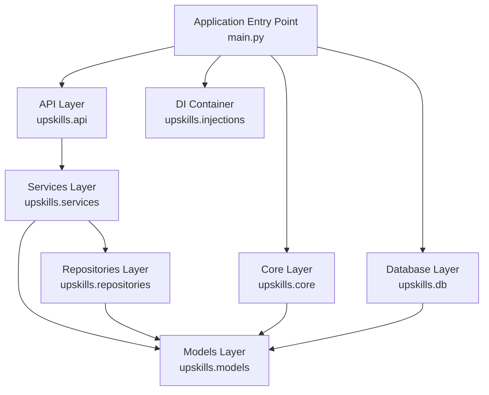
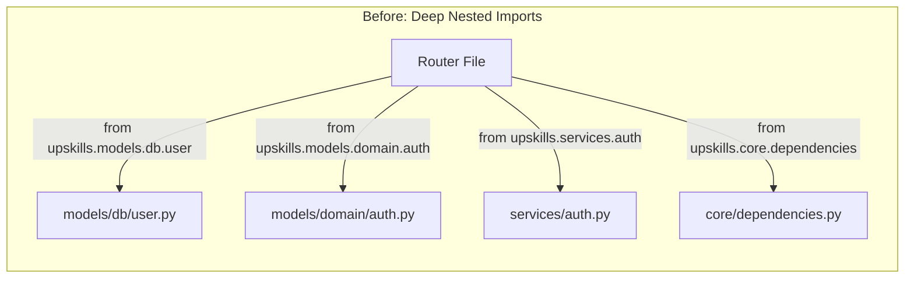
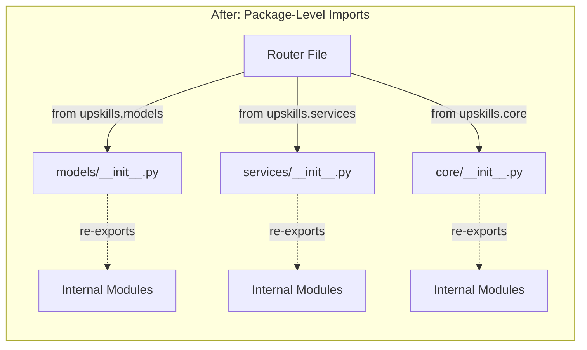
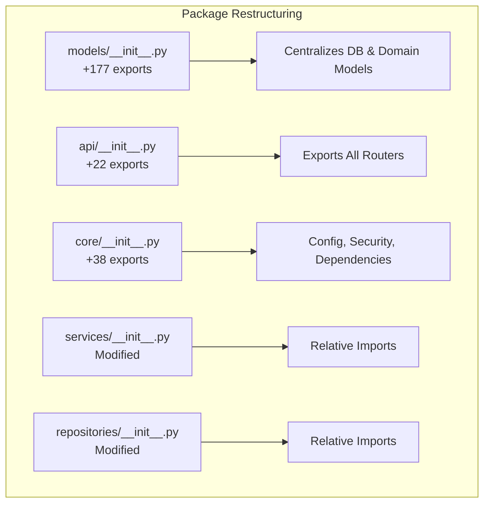

# refactor(api): restructure package imports for simplified access and better developer experience

## Intent

The **simplify-imports** branch introduces a comprehensive restructuring of the Python package architecture to centralize and simplify import statements across the entire codebase. This refactoring transforms the import strategy from deep, nested imports to a flat, package-level import system, making the codebase more maintainable and developer-friendly.

The core intent is to establish a cleaner API surface for internal modules by leveraging Python's `__init__.py` files as explicit export boundaries. This approach follows Python best practices for package design, where packages expose their public API through their `__init__.py` files, hiding implementation details and reducing coupling between modules.

## Benefits

### 1. **Reduced Import Complexity**

Before this refactoring, developers needed to know the exact internal structure of each package to import the required components. For example:

- **Before**: `from upskills.models.db.user import User`
- **After**: `from upskills.models import User`

This simplification reduces cognitive load and makes the codebase more approachable for new developers.

### 2. **Improved Maintainability**

By centralizing exports in `__init__.py` files, the refactoring creates clear boundaries between packages. If internal file structures need to change, only the `__init__.py` file needs updating, rather than hunting down dozens of import statements across the codebase.

**Key files affected**: 
- `backend/src/upskills/models/__init__.py` - Now exports 177 models from both database and domain layers
- `backend/src/upskills/core/__init__.py` - Centralizes all core utilities (config, security, dependencies)
- `backend/src/upskills/api/__init__.py` - Exports all routers with consistent naming

### 3. **Consistent Code Style**

The refactoring introduces relative imports within `__init__.py` files (e.g., `from .auth import AuthService`), while allowing absolute package-level imports throughout the rest of the codebase. This creates a consistent pattern that's easy to follow.

### 4. **Cleaner Main Application File**

The `main.py` file demonstrates the value of this approach most clearly. Router imports are now more readable and explicit:

- **Before**: Import router modules, then access `.router` attribute
- **After**: Import router objects directly with descriptive names (`auth_router`, `users_router`, etc.)

Reference: `backend/src/upskills/main.py`

### 5. **Better IDE Support**

Modern IDEs can now provide better autocomplete and refactoring support since all exports are explicitly declared in `__all__` lists. This makes it easier to discover available components without diving into internal module structures.

### 6. **Reduced Line Count**

The refactoring resulted in a net reduction of 62 lines of code (486 insertions, 548 deletions) across 51 files, primarily by consolidating repetitive import statements.

## Architecture Overview

## Import Strategy Before and After

## Key Changes by Layer

## Considerations

### 1. **Import Cycle Risk**

Centralizing imports increases the risk of circular import dependencies. The current architecture mitigates this by maintaining clear layer separation (repositories → services → routers), but developers must be vigilant when adding cross-layer dependencies.

**Mitigation**: Maintain strict layer separation and consider using Protocol classes or dependency injection for cross-layer communication.

### 2. **Namespace Pollution**

With 177+ models exported from the `models` package, there's potential for name collisions and namespace pollution. Developers need to be aware of what they're importing.

**Mitigation**: The `__all__` list provides explicit documentation of exports. Consider using qualified imports (e.g., `from upskills import models; models.User`) when clarity is needed.

### 3. **Initial Import Cost**

Package-level imports mean that importing any single component from a package loads the entire `__init__.py` file. For very large packages, this could impact startup time.

**Current Status**: Not a concern for the current codebase size, but worth monitoring as the application grows.

### 4. **Migration Learning Curve**

Developers familiar with the old import style need to learn the new patterns. Auto-import features in IDEs may initially suggest the old paths.

**Mitigation**: Update documentation and IDE configurations to prefer the new import style.

### 5. **Refactoring Complexity**

Moving or renaming internal modules now requires updating the `__init__.py` files. However, this is actually a benefit as it provides a single point of maintenance rather than updating multiple import sites.

---

## Next Steps

### 1. Update Developer Documentation and Style Guide - 2 days

**User Story**: As a new developer joining the team, I need comprehensive documentation that explains the new import conventions, package structure, and best practices so that I can write code that follows the established patterns and understand the codebase architecture without extensive onboarding from senior developers.

**Reference**: [Python Packaging Guide](https://packaging.python.org/en/latest/guides/writing-pyproject-toml/)

---

### 2. Configure IDE and Linter Rules for Import Standards - 1 day

**User Story**: As a developer, I need my IDE and linters to automatically suggest and enforce the new package-level import patterns so that I don't accidentally use deprecated deep import paths and maintain consistency across the codebase without manual intervention or code review feedback.

**Reference**: [Ruff Import Rules Configuration](https://docs.astral.sh/ruff/rules/#isort-i)

---

### 3. Implement Import Cycle Detection in CI Pipeline - 2 days

**User Story**: As a DevOps engineer, I need automated tooling in the CI/CD pipeline that detects circular import dependencies before they're merged to main so that we can prevent runtime import errors and maintain the clean architecture that the import refactoring established.

**Reference**: [importchecker - Python Import Cycle Detection](https://github.com/seddonym/import-linter)

---

### 4. Add Pre-commit Hook for Import Style Validation - 1 day

**User Story**: As a developer, I need pre-commit hooks that validate my import statements against the new conventions so that I receive immediate feedback during development rather than discovering import style issues during code review or CI pipeline failures.

**Reference**: [pre-commit hooks documentation](https://pre-commit.com/hooks.html)

---

### 5. Create Migration Guide for Existing Feature Branches - 1 day

**User Story**: As a developer with active feature branches, I need a step-by-step migration guide with automated scripts or clear instructions so that I can update my branches to use the new import patterns without manual search-and-replace or merge conflicts.

**Reference**: [Automated Python Refactoring with Bowler](https://pybowler.io/)

---

### 6. Establish Package API Versioning Strategy - 3 days

**User Story**: As a software architect, I need a versioning strategy for internal package APIs with clear deprecation policies so that we can evolve the package structure over time while maintaining backward compatibility and giving developers time to migrate their code.

**Reference**: [Semantic Versioning Specification](https://semver.org/)

---

### 7. Monitor and Optimize Package Import Performance - 2 days

**User Story**: As a performance engineer, I need profiling tools and metrics to measure application startup time and import overhead so that I can identify performance bottlenecks introduced by package-level imports and optimize them before they impact production.

**Reference**: [Python Import Performance Profiling](https://docs.python.org/3/library/profile.html)

---

### 8. Refactor Type Hints for Circular Dependency Prevention - 3 days

**User Story**: As a developer working on type-safe code, I need a strategy for using TYPE_CHECKING blocks and forward references in type hints so that I can maintain full type coverage without introducing circular import dependencies in the new centralized import structure.

**Reference**: [Python Type Checking Best Practices](https://docs.python.org/3/library/typing.html#typing.TYPE_CHECKING)

---

### 9. Implement Lazy Import Loading for Optional Features - 4 days

**User Story**: As a backend developer, I need to implement lazy loading for optional features and heavy dependencies so that the application startup time remains fast even as we add more models and services to the package-level exports.

**Reference**: [Python importlib for Lazy Loading](https://docs.python.org/3/library/importlib.html#importing-a-source-file-directly)

---

### 10. Create Architectural Decision Record for Import Strategy - 1 day

**User Story**: As a technical lead, I need to document the rationale, trade-offs, and long-term implications of this import refactoring in an ADR so that future developers understand the context behind these decisions and can make informed choices when evolving the architecture further.

**Reference**: [ADR Template and Best Practices](https://adr.github.io/)

---

## Summary

This refactoring represents a significant improvement in code organization and developer experience. By centralizing imports at the package level, the codebase becomes more maintainable, discoverable, and resilient to internal structural changes. The 51 files modified demonstrate a comprehensive and consistent application of this pattern across all layers of the application.

The key success metric is the reduction in import path complexity: developers can now import any model, service, or utility from its package root rather than navigating deep folder hierarchies. This makes the codebase more intuitive and reduces the barrier to entry for new contributors.
