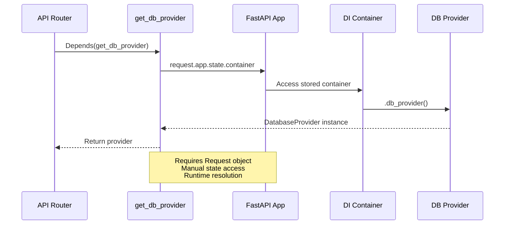
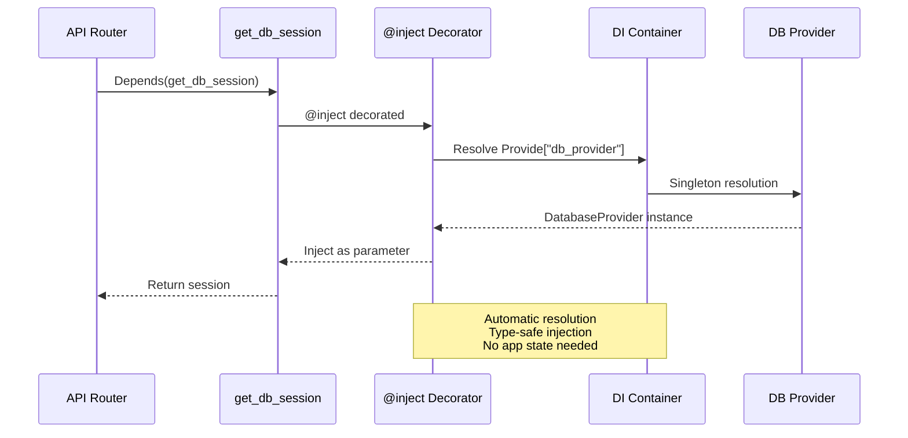
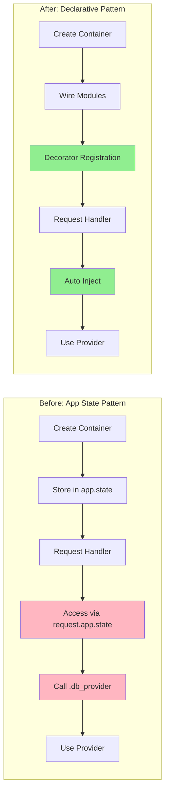

# refactor(dependency-injection): implement declarative dependency injection with Provide pattern for improved testability and maintainability

## Overview

This document describes the architectural evolution from **imperative container management via app.state** to **declarative dependency injection using the Provide pattern**. This refactoring shifts the dependency management approach from manual container passing through FastAPI's application state to automated dependency resolution through decorators and type annotations.

## Intent

The primary objective of this refactoring is to **eliminate manual dependency wiring** and **embrace dependency-injector's declarative capabilities**, which brings several critical improvements to the application architecture:

1. **Eliminate State Coupling**: Remove dependency on `app.state.container`, decoupling the dependency injection container from the FastAPI application lifecycle and state management.

2. **Declarative Dependencies**: Use `@inject` decorators and `Provide` markers to declare dependencies at the point of use, making dependency requirements explicit and type-safe.

3. **Simplified Dependency Access**: Dependencies are automatically resolved by the framework rather than manually extracted from application state, reducing boilerplate and potential errors.

4. **Better Testing Isolation**: Dependencies can be overridden at the container level without needing to manipulate application state, enabling cleaner test fixtures and mocks.

5. **Reduced Import Coupling**: Functions no longer need access to the FastAPI `Request` object solely to retrieve the container, reducing unnecessary coupling between layers.

6. **Framework-Agnostic Services**: Business logic components can declare dependencies without importing FastAPI-specific types, improving reusability across different contexts.

## Architectural Transformation

### Before: Imperative Container Access



### After: Declarative Dependency Injection



## Dependency Resolution Architecture

```mermaid
graph TB
    subgraph "Application Initialization"
        A[app_factory] --> B[Create Container]
        B --> C[Configure from Settings]
        C --> D[Wire Modules]
        D --> E[Return FastAPI App]
    end
    
    subgraph "Dependency Container"
        F[Container] --> G[db_provider: Singleton]
        F --> H[config: Configuration]
    end
    
    subgraph "Dependency Injection"
        I[@inject Decorator] --> J{Resolve Dependency}
        J --> K[Provide Marker]
        K --> L[Container Resolution]
        L --> M[Inject Parameter]
    end
    
    subgraph "FastAPI Dependencies"
        N[get_db_session] --> O[Provide db_provider]
        P[Lifespan Function] --> Q[Provide db_provider]
    end
    
    D -.->|Wires| I
    G -.->|Provides| L
    I --> N
    I --> P
    
    style I fill:#90EE90
    style K fill:#90EE90
    style D fill:#FFE4B5
```

## Benefits

### 1. **Reduced Boilerplate and Complexity**

The old approach required manually extracting the container from application state, which added unnecessary layers of indirection:

**Before** (`core/dependencies.py`):
```python
def get_db_provider(request: Request) -> DatabaseProvider:
    """Get the database provider from the app state."""
    provider: DatabaseProvider = cast("DatabaseProvider", request.app.state.container.db_provider())
    return provider

async def get_db_session(
    db_provider: Annotated[DatabaseProvider, Depends(get_db_provider)],
) -> AsyncIterator[AsyncSession]:
    # ...
```

**After** (`core/dependencies.py`):
```python
@inject
async def get_db_session(
    db_provider: Annotated[DatabaseProvider, Depends(Provide["db_provider"])],
) -> AsyncIterator[AsyncSession]:
    # ...
```

**Impact**: Eliminated an entire intermediary function, reduced lines of code, removed runtime casting, and eliminated the need for `Request` objects in dependency functions.

### 2. **Elimination of Application State Coupling**

By removing `app.state.container`, the dependency injection system is now completely independent of FastAPI's state management. This separation provides:

- **Cleaner Architecture**: The container lifecycle is managed independently from the application state
- **Less Magic**: No hidden state access through the request context
- **Better Testability**: Tests can inject dependencies without creating a full FastAPI application with state

**Before** (`main.py`):
```python
def app_factory() -> FastAPI:
    container = Container()
    app = FastAPI(...)
    app.state.container = container  # Coupling to app state
```

**After** (`main.py`):
```python
def app_factory() -> FastAPI:
    container = Container()
    container.wire(modules=[__name__])  # Declarative wiring
    app = FastAPI(...)
    # No state coupling needed
```

### 3. **Type-Safe Dependency Resolution**

The `Provide` marker works seamlessly with Python's type system and IDE tooling, providing:

- **Autocomplete**: IDEs can infer the correct type from the container definition
- **Static Analysis**: Type checkers (mypy) can verify dependency types at compile time
- **Refactoring Safety**: Renaming container providers is caught by static analysis

### 4. **Framework-Agnostic Dependency Injection**

Dependencies can now be injected into any Python function, not just FastAPI dependencies:

**Before**: Limited to functions with access to `Request`

**After**: Any function can use `@inject` and `Provide`, including:
- Background tasks
- Lifespan functions (as demonstrated in `main.py`)
- CLI commands
- Scheduled jobs
- Business logic services

This is demonstrated in the refactored lifespan function:

```python
@asynccontextmanager
@inject
async def lifespan(
    app: FastAPI,
    db_provider: DatabaseProvider = Provide["db_provider"],
) -> AsyncIterator[None]:
    await db_provider.init_db()
    yield
    await db_provider.close()
```

The lifespan function now receives `db_provider` directly through injection without needing to access `app.state`.

### 5. **Improved Testing Capabilities**

Testing becomes significantly simpler with declarative injection:

**Before**: Tests needed to mock `app.state.container` structure
```python
app.state.container = Mock()
app.state.container.db_provider = Mock(return_value=mock_provider)
```

**After**: Tests can override container providers directly
```python
container.db_provider.override(Mock(return_value=mock_provider))
```

### 6. **Cleaner Container Definition**

The container moved from `containers.py` to `injections/containers.py` with simplified structure:

**Removed**: Complex wiring configuration with explicit module lists
```python
wiring_config = containers.WiringConfiguration(
    modules=[
        "upskills.api.routers.auth",
        "upskills.api.routers.users",
        # ... many more modules
    ]
)
```

**Simplified**: Wiring happens at application initialization with lazy module discovery, only wiring what's needed.

Reference: `backend/src/upskills/injections/containers.py` now contains only essential provider definitions without routing-specific wiring.

## Container Lifecycle Flow



## Considerations

### 1. **Learning Curve for dependency-injector Patterns**

Team members need to understand `dependency-injector` library concepts:

- **`@inject` decorator**: Marks functions for automatic dependency injection
- **`Provide` marker**: Specifies which container provider to inject
- **String-based provider lookup**: `Provide["db_provider"]` uses string keys to resolve providers
- **Container wiring**: Understanding when and where to call `container.wire()`

**Mitigation**: Create internal documentation with examples of common patterns:
- Injecting into FastAPI dependencies
- Injecting into lifespan functions
- Overriding dependencies in tests
- Creating new providers in the container

Reference: `dependency-injector` documentation on [Wiring and @inject](https://python-dependency-injector.ets-labs.org/wiring.html)

### 2. **Magic String Identifiers**

The refactor uses string-based provider lookups (`Provide["db_provider"]`), which:

- **Lose type safety**: Typos in provider names won't be caught at compile time
- **Reduce IDE support**: Autocomplete and refactoring tools can't help with string keys
- **Create runtime errors**: Invalid provider names fail only when the code executes

**Alternative Approaches**:
- Use `Provide[Container.db_provider]` for attribute-based access (stronger typing)
- Consider adding a custom type alias for provider keys
- Implement automated tests to verify all provider keys resolve correctly

### 3. **Debugging Complexity**

Declarative dependency injection can make debugging more challenging:

- **Stack traces**: Additional decorator layers appear in stack traces
- **Resolution errors**: Dependency resolution failures happen at runtime with potentially cryptic error messages
- **Provider lifecycle**: Understanding when singletons are created vs. when factories run

**Mitigation**:
- Enable debug logging for `dependency_injector` during development
- Add comprehensive error messages when providers fail to initialize
- Document the container structure and provider lifecycles

### 4. **Wiring Module Management**

The refactor moved wiring from the container definition to `app_factory()`:

```python
container.wire(modules=[__name__])
```

**Implications**:
- Each module that uses `@inject` must be wired explicitly or discovered automatically
- If wiring is incomplete, `@inject` decorators silently fail (dependencies aren't injected)
- As the application grows, managing which modules need wiring becomes important

**Best Practice**: Consider implementing automatic module discovery or using `auto_wire=True` patterns for broader coverage.

### 5. **Migration Path for Existing Code**

Any code that previously accessed `app.state.container` will break:

```python
# This pattern no longer works
container = request.app.state.container
service = container.some_service()
```

**Search and Replace Required**:
1. Identify all uses of `request.app.state.container`
2. Refactor to use `@inject` with `Provide` markers
3. Ensure all affected modules are wired
4. Update tests that mock `app.state.container`

### 6. **Singleton Lifecycle Management**

The `db_provider` remains a singleton, but its lifecycle is now managed through the container rather than application state:

**Before**: Explicit cleanup in lifespan via `app.state.container.db_provider().close()`

**After**: Injected provider cleanup in lifespan via `@inject` parameter

This ensures the singleton lifecycle is properly managed, but developers need to understand that closing the provider affects all code using that singleton.

### 7. **Testing Dependency Overrides**

While testing becomes cleaner, the pattern for overriding dependencies changes:

**Before**: Mock `app.state.container` structure

**After**: Use `container.db_provider.override()` or wire a different container for tests

This requires updating test fixtures and potentially restructuring test setup code.

## Module Structure Evolution

```mermaid
graph TB
    subgraph "Before Structure"
        OLD_CONT[containers.py<br/>Root Level] --> OLD_MAIN[main.py<br/>app.state.container]
        OLD_MAIN --> OLD_DEP[dependencies.py<br/>get from request.app.state]
        OLD_DEP --> OLD_ROUTE[Routers<br/>Access via Depends]
    end
    
    subgraph "After Structure"
        NEW_CONT[injections/containers.py<br/>Package Level] --> NEW_MAIN[main.py<br/>container.wire]
        NEW_MAIN --> NEW_DEP[dependencies.py<br/>@inject + Provide]
        NEW_DEP --> NEW_ROUTE[Routers<br/>Automatic Injection]
        NEW_MAIN --> NEW_LIFE[Lifespan<br/>@inject + Provide]
    end
    
    style NEW_DEP fill:#90EE90
    style NEW_LIFE fill:#90EE90
    style OLD_DEP fill:#FFB6C1
```

## Key Files Modified

| File | Change Type | Impact |
|------|-------------|---------|
| `backend/src/upskills/injections/containers.py` | Created | New package for dependency injection, simplified container |
| `backend/src/upskills/containers.py` | Deleted | Moved to `injections/` package |
| `backend/src/upskills/core/dependencies.py` | Refactored | Removed `get_db_provider`, added `@inject` to `get_db_session` |
| `backend/src/upskills/main.py` | Enhanced | Added `@inject` to lifespan, removed `app.state.container`, added wiring |
| `backend/pyproject.toml` | Updated | Added isort configuration, updated ruff settings |
| `.pre-commit-config.yaml` | Moved & Updated | Relocated from backend/ to root, version updates |

## Next Steps

### 1. Create Container Provider Registry Documentation

**Title**: Document all available dependency injection providers and their usage patterns

**User Story**: As a backend developer onboarding to the project or implementing new features, I need comprehensive documentation that lists all available container providers, their injection patterns using the `@inject` decorator and `Provide` markers, example code snippets showing proper usage in FastAPI dependencies, service classes, and background tasks, along with explanations of singleton vs factory lifecycles, so that I can correctly implement dependency injection without searching through the codebase or making errors with provider names and understanding when dependencies are created and destroyed during the application lifecycle.

**Estimation**: 2 days

**Reference**: [dependency-injector - Providers Documentation](https://python-dependency-injector.ets-labs.org/providers/index.html)

---

### 2. Implement Repository and Service Layer Providers

**Title**: Add repositories and services to the DI container for consistent dependency management

**User Story**: As a backend developer implementing business logic, I need all repositories and services registered in the dependency injection container with appropriate lifecycles (factory for request-scoped repositories, singleton for stateless services), so that I can inject these dependencies using the `Provide` pattern throughout the application, ensuring consistent database session management, preventing memory leaks from long-lived repository instances holding database sessions, and enabling easy mocking of repositories in unit tests without requiring database connections for faster test execution and better isolation.

**Estimation**: 4 days

**Reference**: [dependency-injector - Dependency Injection in Python](https://python-dependency-injector.ets-labs.org/introduction/di_in_python.html)

---

### 3. Create Test Fixtures with Container Override Patterns

**Title**: Build reusable pytest fixtures leveraging container override capabilities

**User Story**: As a backend developer writing integration and unit tests, I need pytest fixtures that demonstrate how to override container providers for different testing scenarios, including mocking the database provider, creating test-specific configurations, injecting fake services, and setting up isolated containers per test function, with clear examples of using `container.db_provider.override()` and `container.reset_override()` patterns, so that I can write reliable tests that don't interfere with each other, run quickly without external dependencies, and accurately simulate various application states for comprehensive test coverage.

**Estimation**: 3 days

**Reference**: [pytest Fixtures - Best Practices](https://docs.pytest.org/en/stable/explanation/fixtures.html)

---

### 4. Add Type-Safe Provider References

**Title**: Refactor string-based Provide markers to attribute-based container references

**User Story**: As a backend developer maintaining the codebase, I need the dependency injection system to use type-safe provider references like `Provide[Container.db_provider]` instead of string-based `Provide["db_provider"]` lookups, so that I benefit from IDE autocomplete when injecting dependencies, catch typos and invalid provider names during static type checking with mypy rather than at runtime, enable safe refactoring where renaming container providers automatically updates all injection points, and reduce debugging time by catching dependency resolution errors before code execution.

**Estimation**: 2 days

**Reference**: [dependency-injector - Type Hints](https://python-dependency-injector.ets-labs.org/introduction/type_hints.html)

---

### 5. Implement Automatic Module Wiring Discovery

**Title**: Add automatic discovery of modules requiring dependency injection wiring

**User Story**: As a backend developer adding new API routers or services that use dependency injection, I need the application to automatically discover and wire modules that contain `@inject` decorators without manually adding each module path to the wiring configuration, using patterns like module path scanning or convention-based discovery, so that I don't need to remember to wire new modules which prevents silent failures where dependencies aren't injected, reduces maintenance burden of keeping wiring lists updated, and ensures all `@inject` decorators work correctly across the entire application without configuration drift.

**Estimation**: 3 days

**Reference**: [dependency-injector - Auto Wiring](https://python-dependency-injector.ets-labs.org/wiring.html#auto-wiring)

---

### 6. Add Dependency Injection Debug Logging

**Title**: Implement comprehensive logging for dependency resolution and injection lifecycle

**User Story**: As a backend developer debugging dependency injection issues or investigating performance problems, I need detailed debug logging that shows when providers are created, which dependencies are being resolved, how long provider initialization takes, what modules are wired, and when singleton instances are reused versus when new instances are created, with the ability to enable this logging via environment variables or configuration settings, so that I can troubleshoot injection failures, understand the container lifecycle, identify performance bottlenecks in dependency creation, and validate that singletons are working as expected without adding print statements throughout the codebase.

**Estimation**: 2 days

**Reference**: [Python Logging - Advanced Tutorial](https://docs.python.org/3/howto/logging.html#advanced-logging-tutorial)

---

### 7. Create Integration Tests for Dependency Injection Lifecycle

**Title**: Build tests verifying correct dependency injection behavior across application lifecycle

**User Story**: As a quality assurance engineer ensuring application reliability, I need automated integration tests that verify the dependency injection container correctly initializes during application startup, properly wires all required modules, successfully resolves all provider dependencies, maintains singleton semantics across requests, properly cleans up resources during shutdown, and correctly handles failure scenarios like missing dependencies or provider initialization errors, so that I can catch regressions in the dependency injection system, ensure the application starts correctly in all environments, and validate that database connections and other resources are properly managed throughout the application lifecycle.

**Estimation**: 4 days

**Reference**: [FastAPI Testing - Testing Lifecycle Events](https://fastapi.tiangolo.com/advanced/testing-events/)

---

### 8. Implement Configuration-Based Provider Registration

**Title**: Enable dynamic provider registration based on environment configuration

**User Story**: As a platform engineer deploying to different environments, I need the dependency injection container to register different provider implementations based on configuration settings, such as using SQLite providers in development but PostgreSQL providers in production, or enabling mock service providers for testing environments, with clear configuration schemas defining which providers are available per environment, so that I can run the same application code across development, staging, and production with environment-appropriate dependencies, avoid coupling the core application to specific implementations, and easily swap providers for testing or performance tuning without code changes.

**Estimation**: 5 days

**Reference**: [12 Factor App - Configuration](https://12factor.net/config)

---

### 9. Add Container Health Check Endpoints

**Title**: Expose API endpoints reporting dependency injection container status and health

**User Story**: As a DevOps engineer monitoring application health in production, I need HTTP endpoints that report the status of the dependency injection container including which providers are registered, whether all required dependencies successfully initialized, the current state of singleton providers, and any provider initialization errors or warnings, along with readiness checks that verify critical dependencies like database connectivity before marking the application as ready for traffic, so that I can implement accurate Kubernetes health probes, quickly diagnose startup failures, and gain visibility into the container state during debugging sessions without accessing application logs.

**Estimation**: 3 days

**Reference**: [FastAPI Health Checks - Dependency Status](https://fastapi.tiangolo.com/advanced/health-checks/)

---

### 10. Create Migration Guide for Dependency Injection Pattern

**Title**: Document step-by-step migration process from app.state to Provide pattern for existing code

**User Story**: As a backend developer maintaining legacy code that uses the old `request.app.state.container` pattern, I need a comprehensive migration guide with step-by-step instructions showing how to identify code using the old pattern, refactor functions to use `@inject` decorators, convert `app.state.container.provider()` calls to `Provide` markers, update test code to use container overrides instead of mocking app.state, and verify the migration with checklist items and common pitfalls to avoid, with before/after code examples for common scenarios like FastAPI dependencies, background tasks, and CLI commands, so that I can confidently migrate existing functionality to the new pattern, ensure no regressions during migration, and maintain consistent dependency injection practices across the entire codebase.

**Estimation**: 3 days

**Reference**: [dependency-injector - Migration to Dependency Injector](https://python-dependency-injector.ets-labs.org/examples/index.html)

---

## Conclusion

The refactoring from **imperative container management** to **declarative dependency injection** represents a significant architectural improvement in the UpSkills backend. By eliminating the coupling between the dependency injection container and FastAPI's application state, this change achieves several critical objectives:

- **Reduced Complexity**: Eliminated intermediate dependency functions and manual container access patterns
- **Framework Independence**: Dependencies can now be injected anywhere, not just in FastAPI request handlers
- **Better Testing**: Container provider overrides are cleaner and more explicit than mocking application state
- **Type Safety**: Better integration with Python's type system and static analysis tools
- **Maintainability**: Clearer separation between application initialization and dependency resolution

The changes appear modest in scope—primarily updates to `main.py`, `dependencies.py`, and the container structure—but the architectural implications are substantial. The `Provide` pattern is a best practice in Python dependency injection that leverages the full power of the `dependency-injector` library rather than treating it as a simple container storage mechanism.

### Architectural Evolution

This refactoring builds upon the previous factory pattern implementation, taking the next logical step:

1. **Previous refactor**: Decoupled application creation from execution (app factory pattern)
2. **This refactor**: Decoupled dependency resolution from application state (declarative injection)
3. **Future direction**: Full dependency injection across all services, repositories, and business logic

### Strategic Value

The investment in proper dependency injection architecture delivers value throughout the development lifecycle:

- **Development Velocity**: Developers can add new dependencies without modifying multiple layers
- **Test Quality**: Easier mocking and isolation leads to more comprehensive test suites
- **Code Quality**: Explicit dependency declarations improve code readability and maintainability
- **Operational Safety**: Better separation of concerns reduces deployment risks

This refactor positions UpSkills to scale not just in terms of features and users, but also in terms of team size and codebase complexity. As the project grows, the declarative dependency injection pattern will prevent the accumulation of technical debt that commonly plagues applications using imperative dependency management.

### Adoption Considerations

For successful adoption of this pattern across the team:

1. **Training**: Invest in team education on `dependency-injector` concepts and patterns
2. **Documentation**: Create internal guides with project-specific examples
3. **Code Reviews**: Ensure new code follows the `@inject` and `Provide` patterns consistently
4. **Testing**: Validate the pattern with comprehensive test coverage of injection scenarios
5. **Tooling**: Consider adding linters or code quality checks to enforce proper usage

The declarative injection pattern is common in mature Python applications and aligns with industry best practices from frameworks like Spring (Java), Angular (TypeScript), and other modern dependency injection systems. This refactor brings UpSkills in line with professional software engineering standards.
