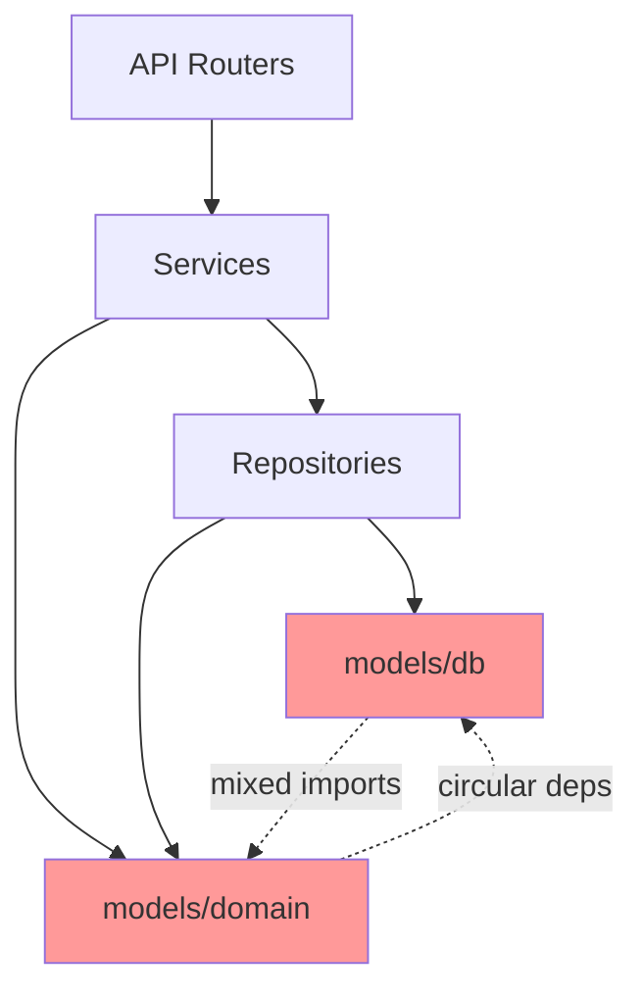
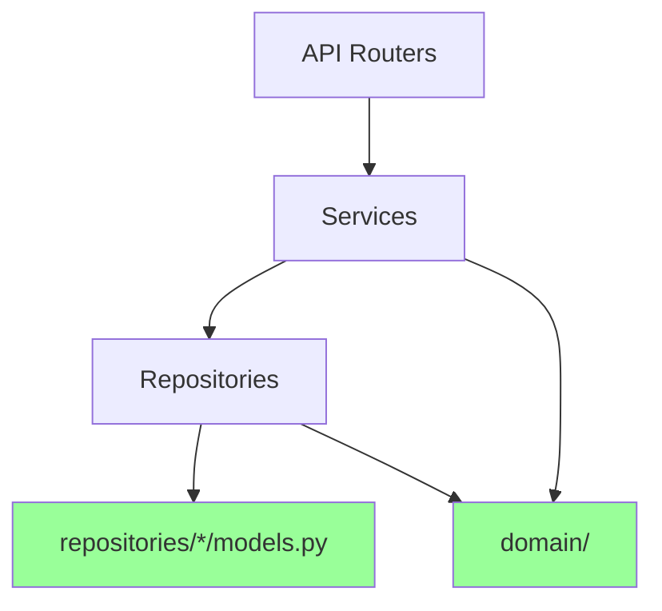
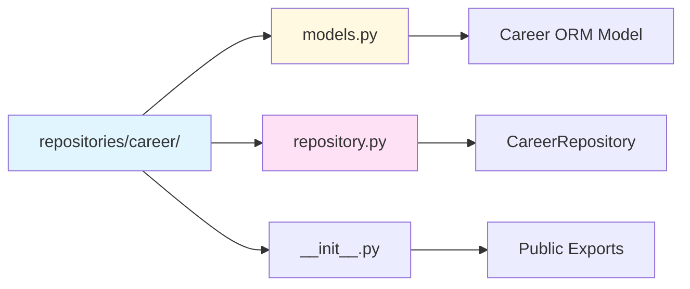
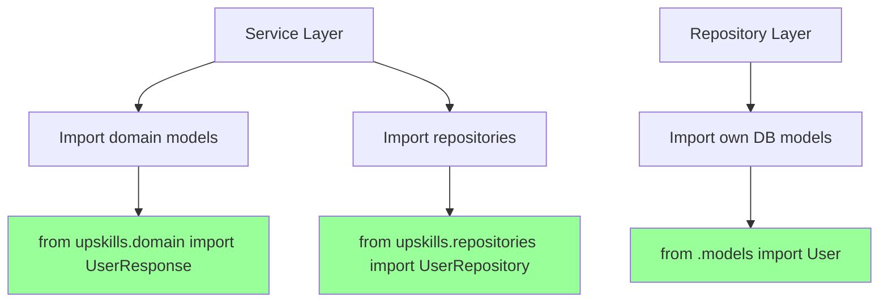
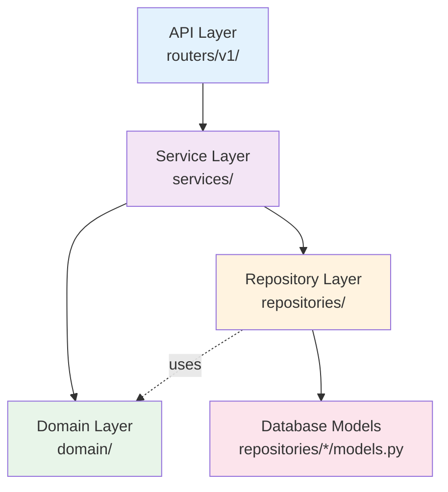
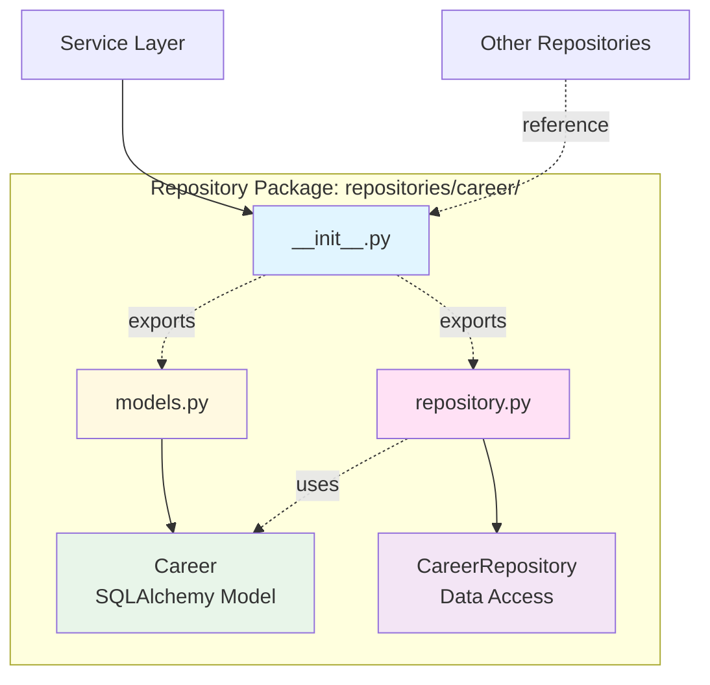

# refactor(architecture): separate domain models from database models and restructure repository packages

## Overview

This document outlines the architectural refactoring performed to improve separation of concerns, maintainability, and code organization in the Upskills backend application. The changes focus on clearly distinguishing between domain models (business logic layer) and database models (persistence layer), while restructuring the repository pattern to follow a more modular package-based approach.

## Intent

The primary goal of this refactoring is to establish a clearer architectural boundary between different layers of the application, specifically:

1. **Domain Layer Clarity**: Rename the `models` folder to `domain` to explicitly indicate that these models represent business concepts and API contracts, not database schemas
2. **Repository Modularization**: Transform flat repository files into self-contained packages, where each repository owns its database models
3. **Improved Encapsulation**: Co-locate database models with their corresponding repositories to reduce cross-module dependencies
4. **Eliminate Ambiguity**: Remove the confusing distinction between `models/domain` and `models/db` by moving database models closer to their usage context

## Architecture Before the Change



## Architecture After the Change



## Key Changes

### 1. Domain Models Relocation

**Before:**
```
backend/src/upskills/models/
├── __init__.py
├── domain/
│   ├── __init__.py
│   ├── auth.py
│   ├── career.py
│   ├── user.py
│   └── ...
└── db/
    ├── __init__.py
    ├── base.py
    ├── user.py
    ├── team.py
    └── ...
```

**After:**
```
backend/src/upskills/domain/
├── __init__.py
├── auth.py
├── career.py
├── user.py
├── path_template.py
├── log_entry.py
└── ...
```

The `models` namespace is eliminated, and domain models are promoted to a top-level `domain` package. This makes it immediately clear that these models represent business entities and API data transfer objects, not database schemas.

**Key File**: `backend/src/upskills/domain/__init__.py` - Now serves as the single source of truth for all domain models, providing a clean public API for the rest of the application.

### 2. Repository Package Structure

**Before:**
```
backend/src/upskills/repositories/
├── __init__.py
├── base.py
├── career.py
├── user.py
├── team.py
└── ...
```

**After:**
```
backend/src/upskills/repositories/
├── __init__.py
├── base/
│   ├── __init__.py
│   ├── models.py      # Base SQLAlchemy models
│   └── repository.py   # BaseRepository class
├── career/
│   ├── __init__.py
│   ├── models.py       # Career database model
│   └── repository.py   # CareerRepository
├── user/
│   ├── __init__.py
│   ├── models.py       # User, Role, Action models
│   └── repository.py   # UserRepository
└── ...
```

Each repository is now a self-contained package that owns:
- Its database models (`models.py`)
- Its repository implementation (`repository.py`)
- Its public API (`__init__.py`)



### 3. Database Models Co-location

Database models are now located within their respective repository packages rather than in a shared `models/db` folder. This provides several benefits:

**Example - Career Models:**

Previously: `models/db/career.py`
Now: `repositories/career/models.py`

**Example - User Models:**

Previously: `models/db/user.py` (contained User, Role, Action, etc.)
Now: `repositories/user/models.py` (all user-related database models together)

**Reference**: See `backend/src/upskills/repositories/career/models.py` for an example of how database models are structured within their repository package.

### 4. Simplified Import Paths



**Before:**
```python
from upskills.models import User, Career  # Ambiguous - domain or db?
from upskills.models.domain import UserResponse
from upskills.models.db import User as UserDB
```

**After:**
```python
from upskills.domain import UserResponse, CareerResponse  # Clearly domain
from upskills.repositories import User, Career  # Clearly database
from upskills.repositories.user import User  # Explicit when needed
```

### 5. Dependency Flow



The refactoring enforces a clear dependency flow:
1. **API Layer** depends on Services and Domain models
2. **Service Layer** depends on Repositories and Domain models
3. **Repository Layer** depends on Database models (internal) and Domain models (for conversions)
4. **Domain Layer** is independent - pure data structures

## Benefits

### 1. **Clear Separation of Concerns**
Domain models and database models are now in distinctly different locations, making it impossible to confuse their roles. Domain models represent business contracts, while database models represent persistence structure.

### 2. **Improved Maintainability**
Each repository package is self-contained with its own models and logic. Changes to a repository's database schema only affect files within that package, reducing the blast radius of changes.

### 3. **Better Encapsulation**
Database models are private to their repositories by default. Other modules interact with repositories through domain models, not directly with database models, enforcing proper layering.

### 4. **Reduced Import Complexity**
The flat structure of imports makes dependencies more obvious. Services import from `domain`, repositories import from `.models`, and the flow is always downward.

### 5. **Enhanced Testability**
Each repository package can be tested in isolation with its own database models, without needing to import unrelated models from a shared location.

### 6. **Scalability**
Adding a new entity now follows a clear pattern:
   - Create domain models in `domain/`
   - Create a repository package in `repositories/`
   - Add database models and repository logic in the package
   - Export through `__init__.py` files

### 7. **Eliminates Circular Dependencies**
By moving database models into repository packages and keeping domain models separate, the previous circular import issues between `models/domain` and `models/db` are completely eliminated.

## Considerations

### 1. **Migration Learning Curve**
Developers need to understand the new structure and know where to place code:
- Business logic models → `domain/`
- Database models → `repositories/*/models.py`
- Repository logic → `repositories/*/repository.py`

### 2. **Import Path Updates**
All existing imports need to be updated throughout the codebase. While this is a one-time cost, it touches many files (71 files changed in this refactoring).

### 3. **IDE Auto-import Configuration**
Development tools may need to be reconfigured to suggest the correct import paths (e.g., prefer `from upskills.domain import` over `from upskills.repositories import`).

### 4. **Documentation Updates**
Architecture documentation, onboarding guides, and code examples need to be updated to reflect the new structure.

### 5. **Package Overhead**
Each repository now has at least 3 files (`__init__.py`, `models.py`, `repository.py`) instead of 1, which increases file count. However, this is offset by better organization.

### 6. **Shared Database Models**
Some database models are shared across multiple tables (e.g., `Base`, mixins). These are now in `repositories/base/`, which may seem counterintuitive at first but maintains consistency.

**Reference**: See `backend/src/upskills/repositories/base/models.py` for base database models and mixins.

## Repository Structure Example



## Files Impacted

**Deleted:**
- `backend/src/upskills/models/__init__.py`
- `backend/src/upskills/models/db/__init__.py`
- `backend/src/upskills/models/db/base.py`
- `backend/src/upskills/models/db/progress.py`
- `backend/src/upskills/models/domain/career.py`
- `backend/src/upskills/models/domain/progress.py`

**Moved/Renamed:**
- `models/domain/*` → `domain/*`
- `models/db/base.py` → `repositories/base/models.py`
- `repositories/*.py` → `repositories/*/repository.py`

**Modified:**
- All router files (8 files in `api/routers/v1/`)
- All service files (8 files in `services/`)
- Core dependencies and database providers

## Next Steps

### 1. Add Repository Unit Tests (Estimated: 5 days)
**User Story**: As a developer, I need comprehensive unit tests for each repository package so that I can confidently make changes without breaking existing functionality and ensure that database operations work correctly in isolation from the rest of the application

**Reference**: [SQLAlchemy Testing Documentation](https://docs.sqlalchemy.org/en/20/orm/session_transaction.html#joining-a-session-into-an-external-transaction-such-as-for-test-suites)

### 2. Implement Repository Pattern Documentation (Estimated: 2 days)
**User Story**: As a new team member, I need clear documentation explaining the repository pattern implementation, including the package structure, responsibilities of each layer, and code examples, so that I can quickly understand how to add new entities and follow established patterns

**Reference**: [Repository Pattern - Martin Fowler](https://martinfowler.com/eaaCatalog/repository.html)

### 3. Create Database Migration Strategy (Estimated: 3 days)
**User Story**: As a backend engineer, I need a clear migration strategy using Alembic that works with the new repository structure so that I can safely evolve database schemas without breaking existing data or causing downtime in production environments

**Reference**: [Alembic Documentation](https://alembic.sqlalchemy.org/en/latest/tutorial.html)

### 4. Add Domain Model Validation Layer (Estimated: 4 days)
**User Story**: As a backend developer, I need comprehensive validation logic in domain models using Pydantic v2 validators so that I can ensure data integrity at the API boundary and provide clear error messages when clients send invalid data to endpoints

**Reference**: [Pydantic Validators](https://docs.pydantic.dev/latest/concepts/validators/)

### 5. Implement Repository Interface Abstractions (Estimated: 3 days)
**User Story**: As a developer working on testing, I need abstract base classes or protocols for repositories so that I can easily create mock implementations for unit tests and potentially swap database implementations without changing service layer code

**Reference**: [Python Protocols](https://peps.python.org/pep-0544/)

### 6. Create Architecture Decision Record (Estimated: 1 day)
**User Story**: As a technical lead, I need an ADR documenting this architectural change including the context, decision, and consequences so that future team members understand why this structure was chosen and what trade-offs were considered when making this significant refactoring

**Reference**: [ADR Tools](https://github.com/npryce/adr-tools)

### 7. Refactor Services to Use Domain Models Exclusively (Estimated: 5 days)
**User Story**: As a backend developer, I need all service layer methods to only work with domain models and never directly with database models so that the separation of concerns is enforced and services remain database-agnostic, making them easier to test and maintain

**Reference**: [Clean Architecture by Uncle Bob](https://blog.cleancoder.com/uncle-bob/2012/08/13/the-clean-architecture.html)

### 8. Add OpenAPI Documentation Generation (Estimated: 2 days)
**User Story**: As an API consumer or frontend developer, I need automatically generated OpenAPI documentation from the domain models so that I can understand available endpoints, request/response schemas, and validation rules without reading backend code or asking backend developers

**Reference**: [FastAPI OpenAPI](https://fastapi.tiangolo.com/advanced/extending-openapi/)

### 9. Implement Repository Query Builder Pattern (Estimated: 4 days)
**User Story**: As a backend engineer, I need a reusable query builder pattern for common operations like filtering, sorting, and pagination across all repositories so that I can avoid code duplication and maintain consistent query behavior throughout the application

**Reference**: [SQLAlchemy Query API](https://docs.sqlalchemy.org/en/20/orm/queryguide/index.html)

### 10. Create Dependency Injection Container Configuration (Estimated: 3 days)
**User Story**: As a backend developer, I need a centralized dependency injection configuration that properly wires repositories, services, and database providers together so that the application follows SOLID principles and remains testable with clear dependency graphs

**Reference**: [Dependency Injector](https://python-dependency-injector.ets-labs.org/)

---

## Summary

This refactoring represents a significant improvement in architectural clarity and maintainability. By separating domain models from database models and restructuring repositories into self-contained packages, the codebase now follows a more standard layered architecture pattern. The changes reduce coupling, improve testability, and make the codebase more approachable for new developers.

The investment in this structural change pays dividends in the form of reduced cognitive load, fewer bugs from circular dependencies, and a clearer path forward for scaling the application.
