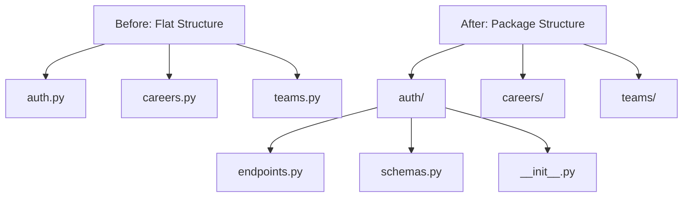
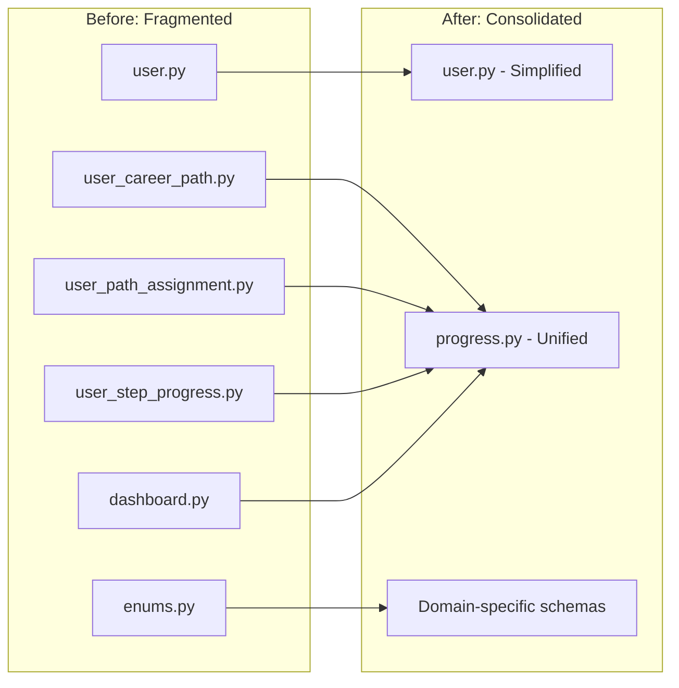
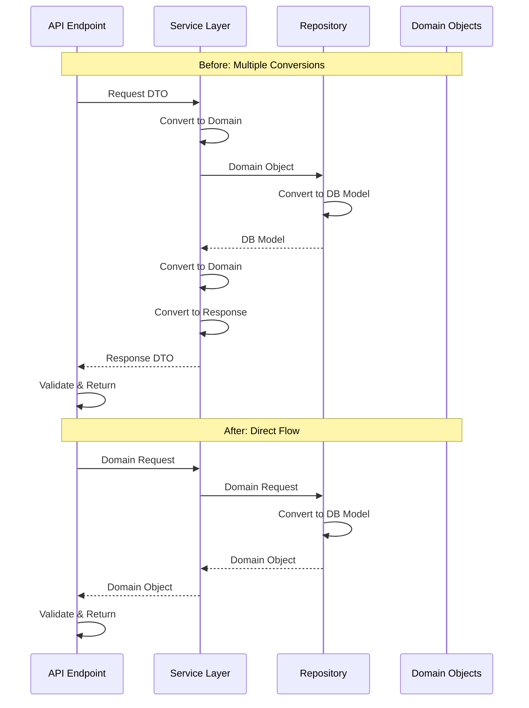
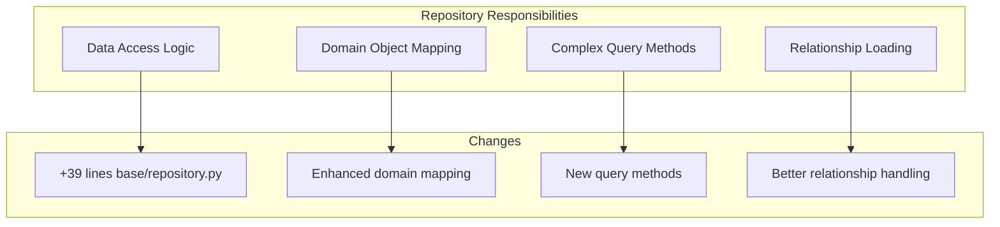

# refactor(architecture): consolidate domain layer and simplify service patterns

## Overview

This document analyzes the architectural evolution from the `restructure-models` branch to the `refactor-services` branch, focusing on the significant refactoring effort that transformed the codebase from a verbose, multi-layered architecture into a leaner, more maintainable system following cleaner separation of concerns.

## Intent

The primary intent of this refactoring was to address architectural complexity that had accumulated through the natural evolution of the application. The changes represent a deliberate shift toward:

1. **Single Responsibility Principle**: Each layer now has a clearly defined responsibility without overlapping concerns
2. **Domain-Driven Design**: Moving request/response schemas into the domain layer alongside business logic
3. **Service Simplification**: Eliminating unnecessary transformation logic from services, allowing them to focus on orchestration
4. **API Layer Clarity**: Organizing endpoints and schemas into cohesive modules while keeping conversion logic where it belongs

The refactoring acknowledges that the initial structure, while well-intentioned, created unnecessary indirection and duplication. By consolidating related concerns and eliminating redundant transformations, the codebase becomes more approachable for new developers and easier to maintain for existing ones.

## Key Changes

### 1. API Router Modularization



The router layer underwent a structural transformation from single-file modules to organized packages. This change provides better discoverability and maintains related functionality together.

**Key files affected:**
- `backend/src/upskills/api/routers/v1/auth/endpoints.py`
- `backend/src/upskills/api/routers/v1/careers/endpoints.py`
- `backend/src/upskills/api/routers/v1/teams/endpoints.py`
- And all other v1 routers (logbook, path_steps, path_templates, progress, users)

### 2. Domain Layer Consolidation



The domain layer saw a dramatic reduction of **696 lines** (net change after consolidation). This was achieved by:

- Removing `domain/user_career_path.py` (43 lines)
- Removing `domain/user_path_assignment.py` (48 lines)
- Removing `domain/user_step_progress.py` (47 lines)
- Removing `domain/dashboard.py` (31 lines)
- Removing `domain/enums.py` (29 lines)
- Creating unified `domain/progress.py` (80 lines) that encompasses all progress-related domain logic
- Moving request/response schemas from separate locations into their respective domain modules

**Key insight**: Related domain concepts are now co-located, making it easier to understand the full context of any business entity.

### 3. Service Layer Simplification



The service layer underwent the most dramatic transformation, with **759 lines removed**. Services now:

- Return domain objects directly instead of performing response schema conversions
- Delegate model validation to the API layer (where HTTP concerns belong)
- Focus on business logic orchestration rather than data transformation
- Work primarily with domain objects and repository abstractions

**Example transformation** (`backend/src/upskills/services/auth.py`):

*Before (restructure-models)*: Services manually converted database models to domain objects, then to response schemas, creating multiple transformation steps.

*After (refactor-services)*: Services return domain objects (`AuthResult`, `Token`) directly, with conversion to response schemas happening in the API layer where it belongs.

### 4. Repository Enhancement



Repositories gained **132 net lines** across the layer, representing added functionality rather than bloat:

- Enhanced base repository patterns with better domain object support
- New query methods that encapsulate complex data access patterns
- Improved relationship loading to support domain object construction
- Better separation between database concerns and domain logic

**Key files enhanced:**
- `backend/src/upskills/repositories/base/repository.py` (+39 lines)
- `backend/src/upskills/repositories/path_template/repository.py` (+61 lines)
- `backend/src/upskills/repositories/user_path_assignment/repository.py` (+85 lines)

### 5. Schema Reorganization

The API layer gained **286 net lines** due to the addition of schema modules in each router package. However, this represents a reorganization rather than net new code—schemas were moved from the domain layer and centralized common schemas were distributed to their appropriate modules.

**Net effect across all layers**:
- **Domain layer**: -696 lines (consolidation)
- **Service layer**: -759 lines (simplification)
- **API layer**: +286 lines (organization)
- **Repository layer**: +132 lines (enhancement)
- **Overall**: **-1,037 lines removed** while improving functionality

## Benefits

### 1. **Reduced Cognitive Load**

Developers no longer need to trace through multiple transformation steps to understand data flow. The path from API request to database and back is more direct and transparent.

### 2. **Improved Maintainability**

With schemas co-located with their domain logic and services focused on orchestration, changes to business requirements require modifications in fewer places with clearer impact analysis.

### 3. **Better Testability**

Services that return domain objects are easier to test without mocking response schemas. The separation of concerns allows unit tests to focus on business logic without HTTP concerns.

### 4. **Enhanced Discoverability**

The package-based router structure makes it immediately clear where to find endpoint implementations and their associated schemas. New developers can navigate the codebase more intuitively.

### 5. **Cleaner Dependency Graph**

By consolidating the domain layer and removing circular dependencies between schemas and domain models, the codebase has a cleaner, more hierarchical dependency structure:

```
API Layer (HTTP concerns) 
    ↓
Service Layer (Orchestration)
    ↓
Repository Layer (Data access)
    ↓
Domain Layer (Business logic)
```

### 6. **Performance Improvements**

Eliminating unnecessary object transformations reduces memory allocations and CPU cycles, particularly noticeable in high-throughput endpoints that previously performed multiple model conversions per request.

### 7. **Type Safety**

With domain objects flowing through the entire stack, type checkers (mypy, pyright) can provide better validation and catch more errors at development time rather than runtime.

## Considerations

### 1. **Migration Complexity**

While the end result is simpler, the migration itself required coordinated changes across all layers. Teams attempting similar refactoring should:

- Implement changes incrementally per module rather than all at once
- Maintain comprehensive test coverage before beginning
- Use feature flags to gradually roll out changes if the application is in production

### 2. **Learning Curve**

Developers accustomed to the previous structure will need to understand:

- Where schema validation now occurs (API layer vs service layer)
- How domain objects flow through the stack
- The new organizational structure for routers

Consider providing architecture documentation and onboarding materials to ease the transition.

### 3. **Breaking Changes**

The refactoring introduces breaking changes in service interfaces. Any external consumers of service methods (tests, background jobs, CLI tools) will need updates:

- Services now return domain objects instead of response DTOs
- Import paths for schemas have changed
- Some domain models have been consolidated or renamed

### 4. **Domain Model Boundaries**

The consolidation of progress-related models into a single module (`progress.py`) requires careful attention to ensure:

- The module doesn't become a "god object" that accumulates too many responsibilities
- Clear sub-boundaries are maintained within the module
- Future additions respect the cohesion of the module

### 5. **API Layer Responsibility**

With more conversion logic in the API layer, endpoints have additional responsibilities. Teams should:

- Establish clear patterns for domain-to-response conversions
- Consider helper functions or mixins to avoid duplication
- Document the conversion responsibilities in code review guidelines

### 6. **Repository Pattern Complexity**

Enhanced repositories with more query methods could trend toward repositories knowing too much about business logic. Monitor:

- Repository methods should encapsulate data access patterns, not business rules
- Consider whether complex query logic belongs in a query object or specification pattern
- Regular reviews to ensure repositories don't become "fat"

### 7. **Documentation Drift**

Significant architectural changes can cause documentation to become outdated. Ensure:

- Architecture diagrams reflect the new structure
- API documentation is regenerated from code annotations
- Development guides are updated with new patterns and conventions
- This document is maintained as the architecture continues to evolve

## Next Steps

### 1. Implement Comprehensive Integration Tests

**Story**: As a developer ensuring system reliability, I need comprehensive integration tests covering all API endpoints with the new architecture, so that I can confidently refactor code knowing that behavioral regressions will be caught automatically, reducing the risk of bugs in production and improving development velocity.

**Estimation**: 5 days

**Reference**: [FastAPI Testing Best Practices](https://fastapi.tiangolo.com/tutorial/testing/)

---

### 2. Add OpenAPI Schema Validation and Documentation Generation

**Story**: As an API consumer, I need auto-generated, accurate API documentation that reflects the current schema structure and includes request/response examples, so that I can integrate with the API without constantly referring to source code, reducing integration time and support requests.

**Estimation**: 3 days

**Reference**: [FastAPI OpenAPI Customization](https://fastapi.tiangolo.com/advanced/extending-openapi/)

---

### 3. Implement Domain Event Pattern for Cross-Module Communication

**Story**: As a developer building features that span multiple modules, I need a domain event system that allows modules to communicate without tight coupling, so that I can add new functionality (like sending notifications when progress is updated) without modifying existing code, improving maintainability and extensibility.

**Estimation**: 8 days

**Reference**: [Domain Events Pattern](https://martinfowler.com/eaaDev/DomainEvent.html)

---

### 4. Create Architectural Decision Records (ADRs) System

**Story**: As a team member joining the project or making architectural decisions, I need a documented history of significant architectural choices with their context and rationale, so that I understand why certain patterns exist and can make informed decisions about future changes, preventing repeated discussions and inconsistent patterns.

**Estimation**: 2 days

**Reference**: [ADR GitHub Organization](https://adr.github.io/)

---

### 5. Implement Repository Query Builder Pattern

**Story**: As a developer writing complex data queries, I need a fluent query builder interface for repositories that prevents SQL injection and improves type safety, so that I can construct dynamic queries safely without writing raw SQL, reducing security vulnerabilities and improving code maintainability.

**Estimation**: 10 days

**Reference**: [SQLAlchemy Query API](https://docs.sqlalchemy.org/en/20/orm/queryguide/)

---

### 6. Add Service Layer Transaction Management

**Story**: As a developer implementing multi-step business operations, I need explicit transaction boundaries in service methods with automatic rollback on errors, so that I can ensure data consistency across multiple repository operations without manually managing database sessions, preventing data corruption and simplifying error handling.

**Estimation**: 6 days

**Reference**: [SQLAlchemy Session Basics](https://docs.sqlalchemy.org/en/20/orm/session_basics.html)

---

### 7. Establish Error Handling and Logging Strategy

**Story**: As a developer debugging production issues, I need a consistent error handling pattern across all layers with structured logging that includes request IDs and context, so that I can quickly trace issues from user reports to specific code paths, reducing mean time to resolution for production incidents.

**Estimation**: 4 days

**Reference**: [Python Logging Best Practices](https://docs.python.org/3/howto/logging-cookbook.html)

---

### 8. Implement API Versioning Strategy

**Story**: As a product manager planning feature releases, I need a clear API versioning strategy that allows us to evolve endpoints without breaking existing clients, so that we can ship improvements continuously while maintaining backward compatibility, reducing coordination overhead with API consumers.

**Estimation**: 5 days

**Reference**: [API Versioning Best Practices](https://www.baeldung.com/rest-versioning)

---

### 9. Create Developer Onboarding Documentation

**Story**: As a new developer joining the team, I need comprehensive onboarding documentation explaining the architecture, development setup, coding standards, and common patterns, so that I can become productive quickly without repeatedly asking the same questions, improving team velocity and developer satisfaction.

**Estimation**: 4 days

**Reference**: [Documentation Guide for Developers](https://documentation.divio.com/)

---

### 10. Setup Performance Monitoring and Profiling

**Story**: As a developer optimizing application performance, I need integrated performance monitoring showing query counts, response times, and memory usage per endpoint with historical trends, so that I can identify bottlenecks before they impact users and make data-driven optimization decisions, ensuring consistent user experience.

**Estimation**: 7 days

**Reference**: [FastAPI Performance Monitoring](https://github.com/trallnag/prometheus-fastapi-instrumentator)

---

## Conclusion

The refactoring from `restructure-models` to `refactor-services` represents a significant maturation of the codebase architecture. By removing over 1,000 lines of code while improving functionality, the changes demonstrate that simplicity and capability are not mutually exclusive.

The consolidated domain layer, simplified services, and better-organized API structure create a foundation for sustainable growth. As the application evolves, this architecture will make it easier to:

- Add new features without increasing complexity
- Onboard new developers more quickly
- Maintain high code quality with less effort
- Identify and fix bugs more rapidly

The considerations outlined above should guide future development to ensure these benefits are preserved as the system continues to evolve. Regular architecture reviews and adherence to the patterns established in this refactoring will help maintain the improved structure over time.

Most importantly, this refactoring demonstrates the value of regularly reassessing architectural decisions. What worked for an initial implementation may not be optimal as the system matures. The willingness to refactor significant portions of the codebase shows a commitment to long-term maintainability over short-term convenience—a hallmark of mature engineering practices.
