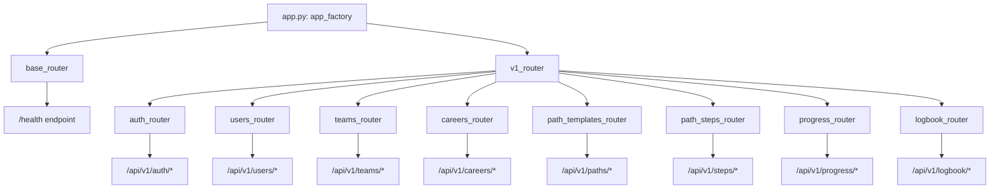
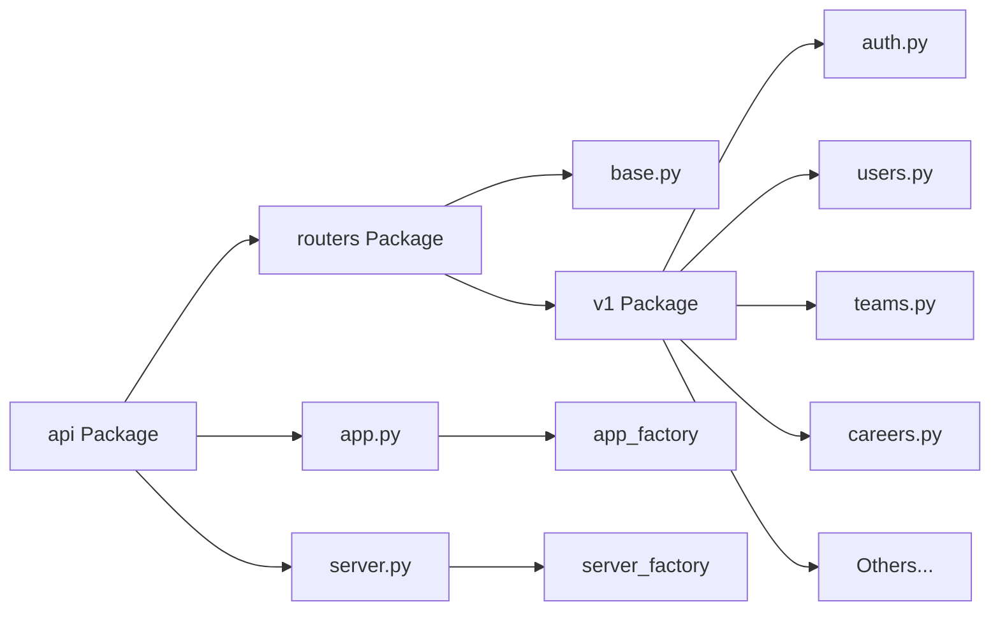
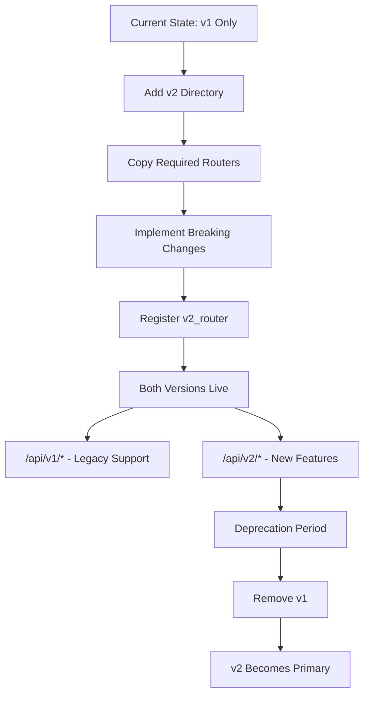

# refactor(api): restructure FastAPI application for API versioning and improved modularity

## Overview

This refactoring transforms the FastAPI application architecture from a flat router structure to a versioned, modular organization. The changes establish a foundation for API versioning (v1, v2, etc.) while improving code maintainability and separation of concerns.

## Intent

The primary goal of this restructure is to **prepare the application for future API evolution** by introducing a versioned routing architecture. By organizing routers into versioned namespaces (v1/) and separating application concerns into dedicated modules within the `api` package, the codebase becomes more scalable and easier to maintain as the application grows.

### Key Objectives

1. **Enable API Versioning**: Create a structure that supports multiple API versions running concurrently
2. **Improve Modularity**: Move related components closer together in the file system
3. **Simplify Router Registration**: Delegate router organization to version-specific modules
4. **Enhance Maintainability**: Reduce coupling and make the codebase easier to navigate

## Architecture Changes

### Before: Flat Router Structure

```
backend/src/upskills/
├── main.py                    # App factory with all router registrations
├── server.py                  # Server factory
└── api/
    ├── __init__.py            # Exports individual routers
    └── routers/
        ├── __init__.py        # Re-exports all routers
        ├── auth.py
        ├── careers.py
        ├── logbook.py
        ├── path_steps.py
        ├── path_templates.py
        ├── progress.py
        ├── teams.py
        └── users.py
```

### After: Versioned Router Structure

```
backend/src/upskills/
├── __main__.py                # Updated import path
└── api/
    ├── __init__.py            # Exports factories and version routers
    ├── app.py                 # App factory (moved from main.py)
    ├── server.py              # Server factory (moved here)
    └── routers/
        ├── __init__.py        # Exports base and v1 routers
        ├── base.py            # Non-versioned endpoints (e.g., /health)
        └── v1/
            ├── __init__.py    # Aggregates all v1 routers
            ├── auth.py
            ├── careers.py
            ├── logbook.py
            ├── path_steps.py
            ├── path_templates.py
            ├── progress.py
            ├── teams.py
            └── users.py
```

## Detailed Changes

### 1. API Module Consolidation

**File: `backend/src/upskills/api/app.py`** (formerly `main.py`)

The application factory has been moved into the `api` package, consolidating all API-related code. Router registration is now simplified:

```python
# Before: 8 individual router registrations with prefixes and tags
app.include_router(auth_router, prefix="/api/v1/auth", tags=["Authentication"])
app.include_router(users_router, prefix="/api/v1/users", tags=["Users"])
# ... 6 more similar registrations

# After: 2 router registrations
app.include_router(base_router)
app.include_router(v1_router)
```

The health check endpoint has been extracted to `base.py`, separating non-versioned endpoints from versioned ones.

### 2. Versioned Router Organization

**File: `backend/src/upskills/api/routers/v1/__init__.py`**

A new v1 namespace aggregates all version 1 endpoints. Each router now declares its own prefix and tags:

```python
router = APIRouter(prefix="/api/v1")

router.include_router(auth_router)      # Handles its own /auth prefix
router.include_router(users_router)     # Handles its own /users prefix
# ... other routers
```

Individual routers (e.g., `auth.py`, `careers.py`) now define their configuration inline:

```python
# In each router file
router = APIRouter(prefix="/auth", tags=["Authentication"])
```

### 3. Base Router for Non-Versioned Endpoints

**File: `backend/src/upskills/api/routers/base.py`**

A dedicated router for endpoints that don't require versioning (health checks, metrics, etc.):

```python
router = APIRouter()

@router.get("/health")
async def health_check() -> dict[str, str]:
    return {"status": "healthy"}
```

### 4. Simplified Import Hierarchy

The `api/__init__.py` now exports higher-level constructs:

```python
# Before: Exported 8 individual routers
__all__ = [
    "auth_router", "careers_router", "logbook_router",
    # ... 5 more routers
]

# After: Exports factories and aggregated routers
__all__ = [
    "app_factory",
    "base_router",
    "server_factory",
    "v1_router",
]
```

## Benefits

### 1. **API Versioning Support**
The structure now supports multiple API versions running side-by-side. Adding v2 would be as simple as:
- Create `routers/v2/` directory
- Copy and modify needed routers
- Register v2_router in app.py
- Both versions coexist: `/api/v1/*` and `/api/v2/*`

### 2. **Reduced Coupling**
The app factory no longer needs to know about individual routers. It only includes version aggregates and base routes, reducing the number of imports and dependencies.

### 3. **Better Code Organization**
Related code is now grouped together:
- All API concerns live in the `api` package
- All v1 endpoints are in the `v1` directory
- Router configuration lives with the router definition

### 4. **Easier Navigation**
Developers can quickly find:
- Version-specific logic: `api/routers/v1/`
- App setup: `api/app.py`
- Server configuration: `api/server.py`
- Non-versioned endpoints: `api/routers/base.py`

### 5. **Scalable Router Management**
Adding new endpoints to v1 only requires:
1. Create the router file in `routers/v1/`
2. Add one line to `v1/__init__.py`

No need to modify `app.py`, maintaining the Open-Closed Principle.

### 6. **Cleaner Testing**
Version-specific routers can be tested in isolation. The v1 router can be imported and tested without the entire application context.

## Considerations

### Migration Path

**For New Endpoints:**
- Place them in `api/routers/v1/` by default
- Follow the pattern: `router = APIRouter(prefix="/resource", tags=["Resource"])`
- Register in `v1/__init__.py`

**For Breaking Changes:**
- Create `api/routers/v2/` when needed
- Copy affected routers from v1
- Implement breaking changes in v2 versions
- Both versions remain accessible during transition

### Backward Compatibility

✅ **No Breaking Changes**: All endpoints remain at the same paths (`/api/v1/*`)

The restructure is purely organizational. URL paths, response formats, and API contracts remain unchanged.

### Import Paths

Some internal imports have changed:

```python
# Before
from upskills.server import server_factory
from upskills.api import auth_router, users_router, ...

# After
from upskills.api import server_factory
from upskills.api.routers import v1_router
```

External consumers (frontend, mobile apps) are unaffected.

### Testing Impact

Minimal. Test imports need updating:

```python
# Before
from upskills.api import auth_router

# After
from upskills.api.routers.v1 import auth_router
```

### Documentation

API documentation (OpenAPI/Swagger) remains unchanged. FastAPI automatically generates docs from the router structure, regardless of how routers are organized internally.

## Visual Architecture

### Router Registration Flow



### Module Organization



### Future Versioning Strategy



## Next Steps

### 1. **Implement API Documentation Standards** (3 days)
**User Story**: As a frontend developer, I need comprehensive API documentation with examples and response schemas so that I can integrate with backend endpoints efficiently without guessing payload structures or consulting backend developers for every endpoint.

**Reference**: [FastAPI Documentation Best Practices](https://fastapi.tiangolo.com/tutorial/schema-extra-example/)

### 2. **Add Comprehensive Integration Tests for v1 Router** (5 days)
**User Story**: As a quality assurance engineer, I need automated integration tests covering all v1 endpoints including authentication flows, authorization checks, error scenarios, and edge cases so that I can confidently verify API behavior without manual testing.

**Reference**: [FastAPI Testing Guide](https://fastapi.tiangolo.com/tutorial/testing/)

### 3. **Implement API Rate Limiting and Throttling** (4 days)
**User Story**: As a platform administrator, I need rate limiting on API endpoints to prevent abuse and ensure fair resource allocation so that a single client cannot degrade service quality for other users through excessive requests.

**Reference**: [SlowAPI - Rate Limiting for FastAPI](https://github.com/laurentS/slowapi)

### 4. **Create API Versioning Deprecation Strategy** (2 days)
**User Story**: As a product manager, I need a documented API deprecation policy with sunset dates, migration guides, and communication templates so that I can plan version upgrades that minimize disruption to API consumers.

**Reference**: [API Versioning Best Practices](https://restfulapi.net/versioning/)

### 5. **Add Request/Response Logging Middleware** (3 days)
**User Story**: As a DevOps engineer, I need structured logging for all API requests including request ID, user context, duration, status codes, and errors so that I can troubleshoot production issues and monitor API health effectively.

**Reference**: [Python Logging Best Practices](https://docs.python.org/3/howto/logging.html)

### 6. **Implement OpenAPI Spec Versioning** (2 days)
**User Story**: As an API consumer, I need version-specific OpenAPI specifications (swagger.json) accessible at `/api/v1/openapi.json` so that I can generate client SDKs matching the exact version I'm integrating against.

**Reference**: [FastAPI Custom OpenAPI](https://fastapi.tiangolo.com/advanced/extending-openapi/)

### 7. **Create Automated API Regression Tests** (5 days)
**User Story**: As a continuous integration engineer, I need automated regression tests comparing v1 responses against golden files to detect unintentional breaking changes so that I can prevent accidental API contract violations before deployment.

**Reference**: [Contract Testing with Pact](https://docs.pact.io/)

### 8. **Add API Monitoring and Alerting** (4 days)
**User Story**: As a site reliability engineer, I need real-time monitoring dashboards showing endpoint latency, error rates, and throughput with alerts for anomalies so that I can proactively respond to performance degradation before users report issues.

**Reference**: [Prometheus FastAPI Instrumentator](https://github.com/trallnag/prometheus-fastapi-instrumentator)

### 9. **Implement Request Validation Error Handling** (3 days)
**User Story**: As a frontend developer, I need consistent, detailed validation error responses with field-level error messages and error codes so that I can display meaningful error messages to users rather than generic error notifications.

**Reference**: [FastAPI Custom Exception Handlers](https://fastapi.tiangolo.com/tutorial/handling-errors/)

### 10. **Design and Document v2 API Changes** (5 days)
**User Story**: As a technical architect, I need a detailed design document for v2 API changes including breaking modifications, new capabilities, migration paths, and timeline so that stakeholders can provide feedback before development investment.

**Reference**: [API Change Management](https://swagger.io/blog/api-design/api-change-management/)

---

## Summary

This restructuring establishes a robust foundation for API evolution. The versioned architecture enables the team to introduce breaking changes through new versions while maintaining backward compatibility. The improved modularity reduces cognitive load and makes the codebase more approachable for new contributors. While the changes are primarily organizational, they set the stage for sustainable API growth as the application scales.
