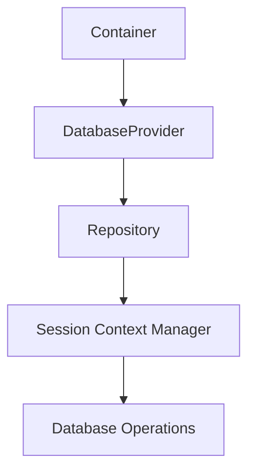
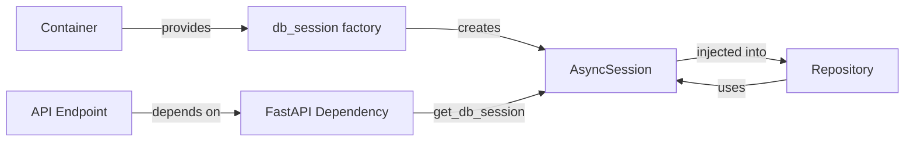
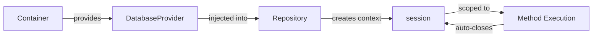
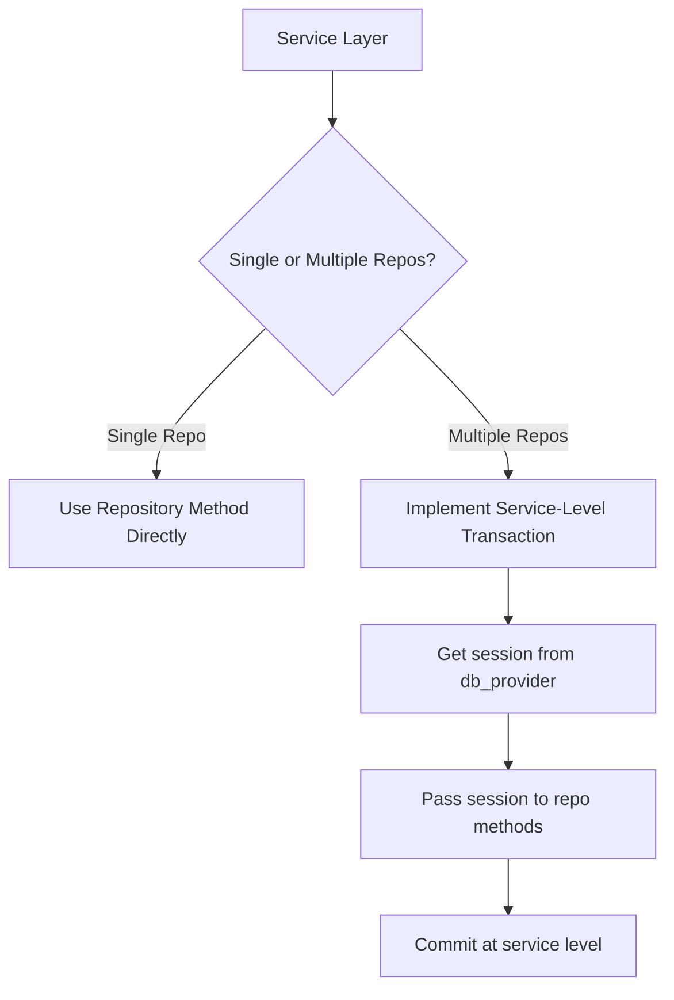
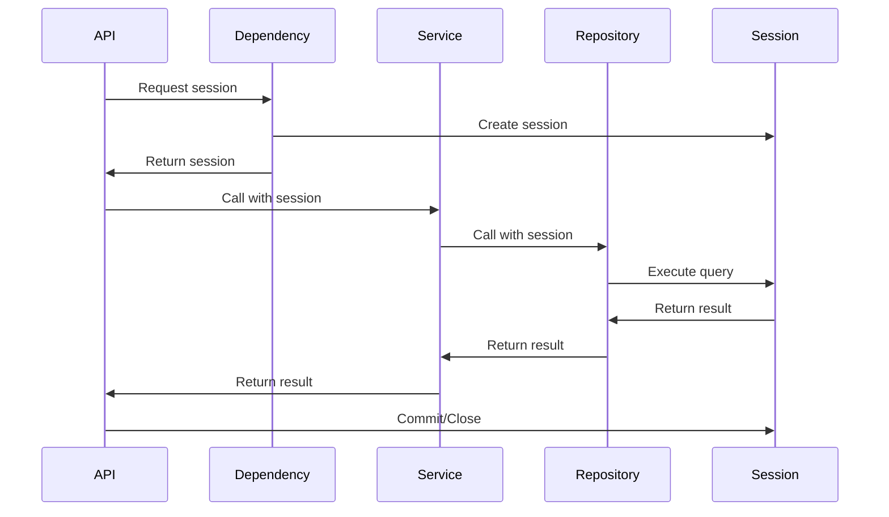
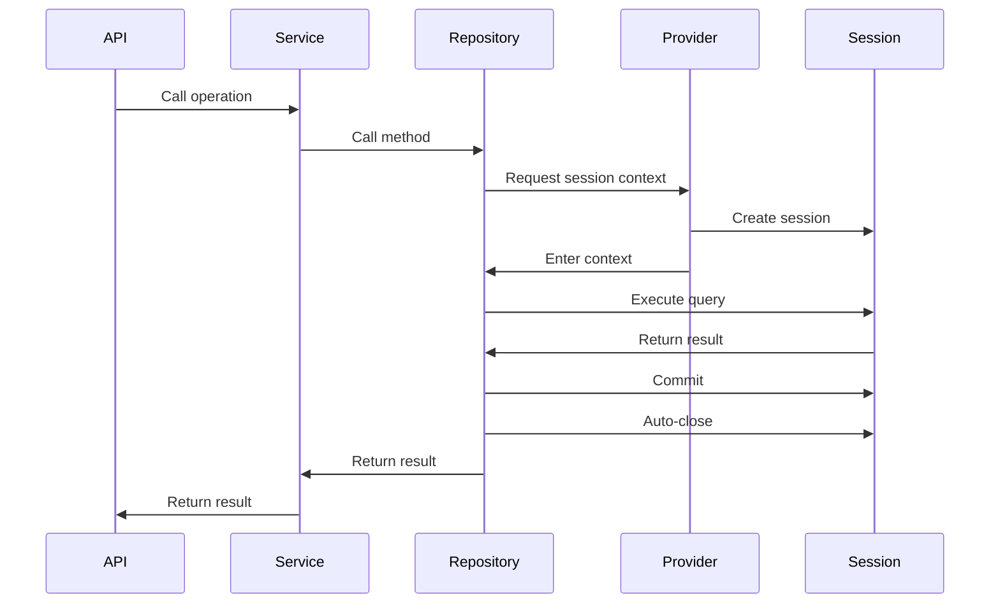
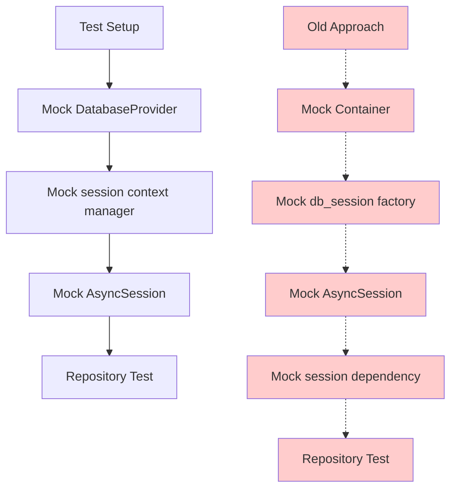

# refactor(repository): simplify database session management with context managers

## Overview

This refactoring represents a fundamental shift in how database sessions are managed throughout the application's repository layer. The change moves from a dependency-injected session pattern to a context manager-based approach, where each repository method controls its own transactional scope through the `DatabaseProvider`.

## Intent

The primary intent of this refactoring is to **simplify session lifecycle management** by eliminating the complexity of session dependency injection and placing transaction boundaries at the repository method level. This architectural decision addresses several pain points in the previous implementation:

1. **Eliminate ambiguous session ownership**: Previously, sessions were injected into repositories, making it unclear who was responsible for committing, rolling back, or closing the session.

2. **Reduce coupling between layers**: By removing the `db_session` from the dependency injection container and the `get_db_session` FastAPI dependency, we reduce the coupling between the API layer, service layer, and data access layer.

3. **Improve transaction clarity**: Each repository method now explicitly manages its transaction scope using `async with self._db_provider.session()`, making it immediately clear where transactions begin and end.

4. **Simplify the dependency graph**: Removing the `db_session` provider from `containers.py` simplifies the dependency injection configuration and makes it easier to understand the application's wiring.

## Benefits

### 1. **Explicit Transaction Boundaries**

Each repository method now has crystal-clear transaction boundaries. Developers can see at a glance where a transaction starts and commits:

```python
async def create(self, data: dict[str, Any]) -> ModelType:
    async with self._db_provider.session() as session:
        instance = self._model(**data)
        session.add(instance)
        await session.flush()
        await session.refresh(instance)
        await session.commit()
        return instance
```

### 2. **Reduced Risk of Session Leaks**

The context manager pattern (`async with`) guarantees proper session cleanup even when exceptions occur. Sessions are automatically closed when exiting the context, eliminating the risk of lingering connections.

### 3. **Simplified Testing**

Testing becomes more straightforward because repositories only need a `DatabaseProvider` mock that returns a session context manager, rather than mocking both the provider and the session dependency injection chain.

### 4. **Better Isolation**

Each method operates in its own isolated session context. This prevents subtle bugs where multiple operations might inadvertently share state through a shared session instance.

### 5. **Cleaner Dependency Injection**

The removal of `db_session` from the DI container and the `get_db_session` dependency function in `backend/src/upskills/core/dependencies.py` simplifies the overall architecture:



### 6. **Consistent Pattern Across All Repositories**

All repository methods (`backend/src/upskills/repositories/*.py`) now follow the same pattern, creating consistency that improves code maintainability and reduces cognitive load for developers working across different repositories.

## Architecture Changes

### Before: Injected Session Pattern



### After: Context Manager Pattern



## Key Technical Changes

### 1. DatabaseProvider Interface Simplification

The `get_session()` method was removed from the `DatabaseProvider` abstract class (`backend/src/upskills/db/provider.py`), leaving only the `session()` context manager. This enforces the context manager pattern at the interface level.

### 2. Repository Base Class Refactoring

The `BaseRepository` class (`backend/src/upskills/repositories/base.py`) was updated to:
- Accept `DatabaseProvider` instead of `AsyncSession` in its constructor
- Wrap all database operations in `async with self._db_provider.session()` blocks
- Handle session merging for update and delete operations to properly attach detached instances to the new session context

### 3. Dependency Injection Container Simplification

The `db_session` factory was removed from `backend/src/upskills/injections/containers.py`, reducing the complexity of the DI configuration.

### 4. FastAPI Dependencies Cleanup

The `get_db_session` function was removed from `backend/src/upskills/core/dependencies.py`, eliminating an unnecessary layer between the API and data access layers.

### 5. Repository Methods Updated

All 17 repository files were updated to follow the new pattern:
- `career.py`
- `log_entry.py`
- `path_step.py`
- `path_template.py`
- `role.py`
- `team.py`
- `user.py`
- `user_career_path.py`
- `user_path_assignment.py`
- `user_step_progress.py`

## Considerations and Trade-offs

### Potential Concerns

1. **Session Per Operation Overhead**: Each repository method now creates a new session. While this adds a small overhead, the benefits of isolation and clarity outweigh the minimal performance cost. Database connection pooling mitigates most of this overhead.

2. **Cross-Repository Transactions**: This pattern makes it more challenging to coordinate transactions across multiple repository calls. If you need to perform multiple operations in a single transaction, you'll need to implement a unit-of-work pattern or pass the same session context to multiple methods.

3. **Instance Merging Complexity**: The update and delete methods now require explicit `session.merge()` calls to attach detached instances to the new session. This adds a bit of boilerplate but ensures correctness.

### Migration Path for Cross-Repository Operations



## Considerations for Future Development

### When This Pattern Works Well

- **CRUD operations**: Simple create, read, update, delete operations benefit significantly from this pattern
- **Independent operations**: When each API call corresponds to a single repository operation
- **Read-heavy workloads**: Query operations are naturally isolated

### When You Might Need Adjustments

- **Complex workflows**: Operations that require multiple repository calls in a single transaction may need service-level transaction management
- **Bulk operations**: If you need to insert/update thousands of records, you might want to optimize by accepting a session parameter
- **Saga patterns**: Long-running business processes may need compensation-based transaction management

## Transaction Flow Comparison

### Old Flow



### New Flow



## Impact on Testing

### Simplified Mock Structure



## Next Steps

### 1. Implement Service-Level Transaction Coordinator Pattern

**User Story**: As a backend developer, I need a way to execute multiple repository operations within a single transaction from the service layer, so that I can maintain data consistency when a business operation requires changes across multiple entities while preserving the benefits of the new session management pattern.

**Estimated Development Time**: 3-5 days

**Reference**: [Martin Fowler - Unit of Work Pattern](https://martinfowler.com/eaaCatalog/unitOfWork.html)

---

### 2. Add Comprehensive Integration Tests for Repository Transaction Boundaries

**User Story**: As a QA engineer, I need integration tests that verify each repository method properly manages its transaction lifecycle including commits, rollbacks, and session cleanup, so that I can ensure the new session management pattern works correctly under various success and failure scenarios without manual testing.

**Estimated Development Time**: 4-6 days

**Reference**: [FastAPI Testing Documentation](https://fastapi.tiangolo.com/tutorial/testing/)

---

### 3. Create Repository Performance Benchmarks for Session Overhead Analysis

**User Story**: As a platform engineer, I need performance benchmarks comparing the old injected session pattern versus the new context manager pattern across various operation types and loads, so that I can quantify the overhead and optimize connection pool settings if necessary.

**Estimated Development Time**: 2-3 days

**Reference**: [SQLAlchemy Performance Documentation](https://docs.sqlalchemy.org/en/20/faq/performance.html)

---

### 4. Implement Read-Only Session Context for Query Operations

**User Story**: As a backend developer, I need a read-only session context option that prevents accidental writes and allows optimization of read-heavy operations, so that I can improve query performance and provide clearer intent for operations that should never modify data.

**Estimated Development Time**: 3-4 days

**Reference**: [SQLAlchemy Session Basics](https://docs.sqlalchemy.org/en/20/orm/session_basics.html)

---

### 5. Add Distributed Tracing for Session Lifecycle Monitoring

**User Story**: As an SRE, I need distributed tracing spans that track the lifecycle of database sessions including creation, query execution, commits, and cleanup, so that I can identify session leaks, slow queries, and transaction bottlenecks in production environments.

**Estimated Development Time**: 5-7 days

**Reference**: [OpenTelemetry Python Documentation](https://opentelemetry.io/docs/instrumentation/python/)

---

### 6. Document Multi-Repository Transaction Patterns and Guidelines

**User Story**: As a software architect, I need comprehensive documentation and code examples showing recommended patterns for handling business operations that span multiple repositories, so that developers can implement complex workflows correctly without breaking transaction semantics or introducing data inconsistency bugs.

**Estimated Development Time**: 2-3 days

**Reference**: [Repository Pattern - Martin Fowler](https://martinfowler.com/eaaCatalog/repository.html)

---

### 7. Implement Connection Pool Monitoring and Alerting Dashboard

**User Story**: As a DevOps engineer, I need real-time monitoring dashboards showing database connection pool metrics including active connections, wait times, and pool exhaustion events, so that I can proactively scale resources and investigate performance degradation before it impacts users.

**Estimated Development Time**: 4-5 days

**Reference**: [SQLAlchemy Connection Pooling](https://docs.sqlalchemy.org/en/20/core/pooling.html)

---

### 8. Create Migration Guide for Existing Service-Level Code

**User Story**: As a team lead, I need a detailed migration guide with code examples, common pitfalls, and refactoring recipes for updating service-layer code that may have dependencies on the old session management approach, so that my team can safely refactor existing features without introducing bugs.

**Estimated Development Time**: 3-4 days

**Reference**: [Refactoring - Martin Fowler](https://refactoring.com/)

---

### 9. Add Automatic Retry Logic for Transient Database Failures

**User Story**: As a reliability engineer, I need automatic retry logic with exponential backoff for database operations that fail due to transient issues like connection timeouts or deadlocks, so that the application can recover gracefully from temporary database problems without requiring manual intervention.

**Estimated Development Time**: 4-6 days

**Reference**: [Tenacity Retry Library](https://tenacity.readthedocs.io/en/latest/)

---

### 10. Implement Session Context Propagation for Nested Operations

**User Story**: As a backend developer, I need a mechanism to optionally propagate session context to nested repository calls within the same service operation, so that I can implement complex business logic that requires multiple repository operations in a single transaction while maintaining backward compatibility with the standalone pattern.

**Estimated Development Time**: 5-7 days

**Reference**: [Context Variables in Python](https://docs.python.org/3/library/contextvars.html)

---

## Conclusion

This refactoring represents a significant improvement in code clarity, maintainability, and correctness. While it introduces some constraints around cross-repository transactions, the benefits of explicit transaction boundaries, automatic cleanup, and simplified dependency injection make this a valuable architectural evolution. The pattern established here provides a solid foundation for future enhancements and sets clear expectations for how database operations should be structured throughout the application.
