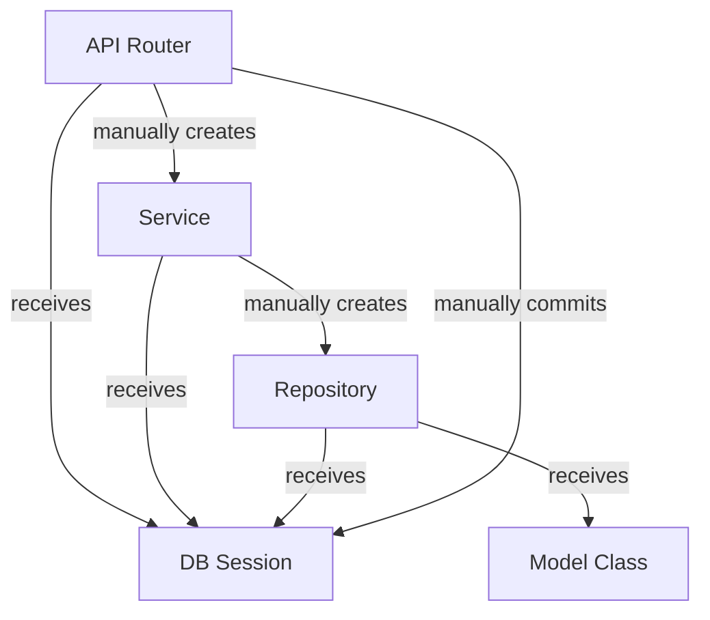
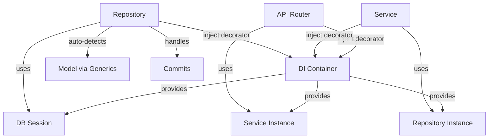
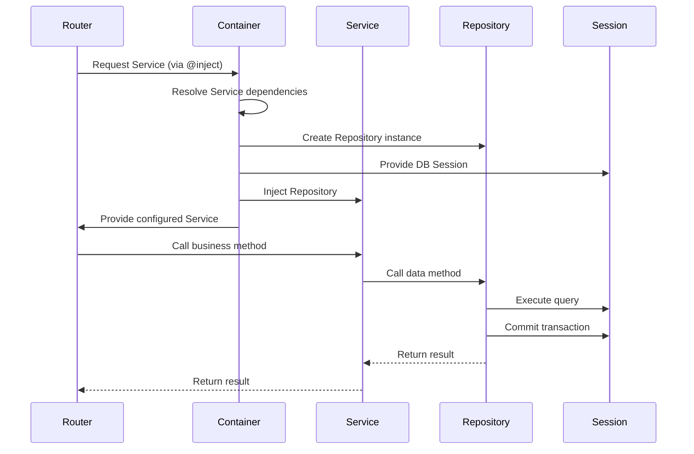
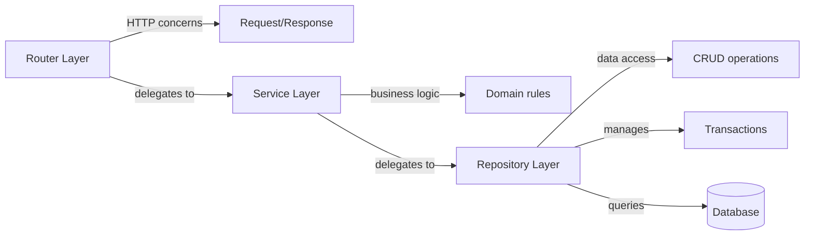

# refactor(dependency-injection): migrate from manual instantiation to comprehensive dependency injection pattern

## Overview

This document outlines the architectural evolution from a hybrid dependency injection approach to a comprehensive, fully-integrated dependency injection pattern using the `dependency-injector` library. The migration represents a significant improvement in code maintainability, testability, and adherence to SOLID principles, specifically the Dependency Inversion Principle.

## Intent

The primary intent of this refactoring was to eliminate manual service and repository instantiation throughout the application, replacing it with a consistent, container-managed dependency injection pattern. This transformation establishes a cleaner separation of concerns where:

- **API Routers** depend on services (not sessions)
- **Services** depend on repositories (not sessions)
- **Repositories** depend on database sessions (injected automatically)
- **All dependencies** are declared explicitly through type annotations and managed by the DI container

By moving from "request a session and build your dependencies" to "declare your dependencies and let the container provide them," the codebase becomes more modular, easier to test, and less prone to coupling issues.

## Architecture Evolution

### Previous Approach (use-provide-in-injections)

In the previous implementation, the application used a partial dependency injection pattern:



**Characteristics:**
- Routers received database sessions via dependency injection
- Services were manually instantiated within router endpoints
- Repositories were manually instantiated within services
- Model classes were passed explicitly to repositories
- Transaction management (commits) handled in router layer
- High coupling between layers

### New Approach (improve-dependency-injection)

The improved implementation uses comprehensive dependency injection across all layers:



**Characteristics:**
- All dependencies declared via `@inject` decorator and `Provide` specifications
- No manual instantiation at any layer
- Automatic model type detection using Python generics
- Transaction management moved to repository layer
- Loose coupling with explicit dependency contracts
- Container manages entire dependency graph

## Key Benefits

### 1. **Enhanced Testability**

Dependencies are now injectable at every layer, making it trivial to substitute mocks or test doubles:

```python
# Easy to mock services in router tests
def test_login():
    mock_service = Mock(spec=AuthService)
    # Inject mock into router endpoint
```

### 2. **Reduced Boilerplate**

Eliminated repetitive instantiation code across 22 files (337 lines removed, as evidenced by the net reduction of -948 to +441 lines in the diff stats).

**Before:**
```python
@router.post("/register")
async def register(data: RegisterRequest, session: DbSession):
    service = AuthService(session)  # Manual instantiation
    result = await service.register(...)
    await session.commit()  # Manual transaction management
    return result
```

**After:**
```python
@router.post("/register")
@inject
async def register(
    data: RegisterRequest,
    service: Annotated[AuthService, Depends(Provide["auth_service"])]
):
    return await service.register(...)  # Commits handled automatically
```

### 3. **Automatic Model Type Detection**

The `BaseRepository` now uses Python's generic type system to automatically determine its model class:

```python
class UserRepository(BaseRepository[User]):
    # No need to pass model class - automatically detected!
    pass
```

This is achieved through introspection of generic type parameters, eliminating error-prone manual model class passing.

### 4. **Consistent Transaction Management**

Database commits are now consistently handled within repository CRUD operations (`create`, `update`, `delete`), ensuring:
- Atomic operations at the data layer
- No forgotten commits in business logic
- Clearer separation between business logic and data persistence

### 5. **Explicit Dependency Graph**

The `injections/containers.py` file now serves as a single source of truth for all application dependencies, making it easy to:
- Understand the complete dependency structure
- Swap implementations (e.g., different database providers)
- Configure lifetime scopes (Singleton vs Factory)
- Debug dependency resolution issues

Reference: `backend/src/upskills/injections/containers.py`

### 6. **Improved Maintainability**

Changes to service or repository signatures no longer cascade through multiple layers. The DI container handles wiring automatically.

## Dependency Injection Flow



## Layer Responsibilities



## Technical Considerations

### Dependency Injection Scope

The container configuration uses two lifetime scopes:

- **Singleton**: `db_provider` - One instance per application lifecycle
- **Factory**: Services, Repositories, Sessions - New instance per request

This ensures thread-safety and proper request isolation while maintaining performance.

### Generic Type Introspection

The `BaseRepository._model` property uses runtime introspection to extract the model type:

```python
@property
def _model(self) -> type[ModelType]:
    base = self.__class__.__orig_bases__[0]
    args = get_args(base)
    return args[0] if args else raise_error()
```

This works because Python preserves generic type information at runtime when using `Generic[T]` syntax.

**Trade-off**: Slightly more complex base class implementation in exchange for significantly simpler derived classes.

### Wiring Configuration

The container must be wired to specific modules to enable the `Provide` syntax:

```python
container.wire(modules=[__name__])
```

Additional modules (routers, services) inherit wiring through Python's import system. If adding new modules, ensure proper wiring or explicit `@inject` decoration.

Reference: `backend/src/upskills/main.py`

### Transaction Boundaries

Commits now occur within repository methods rather than at the router level. This:
- ✅ Ensures data consistency at the persistence layer
- ✅ Reduces cognitive load in business logic
- ⚠️ May require careful consideration for multi-repository transactions (consider using Unit of Work pattern for complex scenarios)

### Testing Implications

When writing tests, you can now:
1. Override container providers with test doubles
2. Mock services/repositories at any injection point
3. Test layers in true isolation

```python
# Example test setup
container = Container()
container.user_repository.override(MockUserRepository())
```

## Migration Impact Summary

| Metric | Impact |
|--------|--------|
| Files Modified | 22 |
| Lines Removed | 948 |
| Lines Added | 441 |
| Net Reduction | 507 lines (-54%) |
| Manual Instantiations Eliminated | ~70+ |
| Test Complexity | Significantly Reduced |
| Coupling | Dramatically Reduced |

## Breaking Changes

This refactoring changes constructor signatures across the codebase:

- **Services**: No longer accept `session` parameter
- **Repositories**: No longer accept `session` and `model` parameters
- **Routers**: No longer receive `session` dependency directly

Any external code interfacing with these components must be updated accordingly.

## Next Steps

### 1. Implement Unit of Work Pattern (5 days)
**User Story:** As a backend developer, I need a Unit of Work pattern implementation so that I can manage complex multi-repository transactions atomically, ensuring data consistency across related entities when operations span multiple tables or business domains without relying on individual repository commits.

**Reference:** https://martinfowler.com/eaaCatalog/unitOfWork.html

---

### 2. Add Comprehensive Integration Tests for DI Container (3 days)
**User Story:** As a QA engineer, I need comprehensive integration tests for the dependency injection container so that I can verify all services, repositories, and dependencies are correctly wired and resolve properly, preventing runtime dependency resolution failures in production environments.

**Reference:** https://python-dependency-injector.ets-labs.org/examples/fastapi.html#testing

---

### 3. Implement Repository Transaction Decorators (2 days)
**User Story:** As a backend developer, I need declarative transaction decorators for repository methods so that I can explicitly control transaction boundaries and rollback behavior, making it clear which operations are atomic and reducing the risk of partial data commits during errors.

**Reference:** https://docs.sqlalchemy.org/en/20/orm/session_transaction.html

---

### 4. Create Service-Layer Transaction Management (4 days)
**User Story:** As a backend developer, I need service-layer transaction management capabilities so that I can coordinate multiple repository operations within a single transaction boundary, ensuring business operations that span multiple entities maintain ACID properties and can rollback completely on failure.

**Reference:** https://docs.sqlalchemy.org/en/20/orm/contextual.html

---

### 5. Add Container Configuration Validation (2 days)
**User Story:** As a DevOps engineer, I need automatic validation of the DI container configuration at application startup so that I can detect misconfigured dependencies or circular references before deployment, preventing runtime errors caused by dependency resolution issues.

**Reference:** https://python-dependency-injector.ets-labs.org/providers/singleton.html#reset-singleton

---

### 6. Implement Scoped Service Lifetime for Request Context (3 days)
**User Story:** As a backend developer, I need request-scoped service instances that share state within a single HTTP request so that I can maintain per-request context and caching while ensuring proper cleanup after request completion, improving performance without causing data leakage between requests.

**Reference:** https://fastapi.tiangolo.com/advanced/advanced-dependencies/#async-dependencies

---

### 7. Create Mock Service/Repository Factories for Testing (3 days)
**User Story:** As a test automation engineer, I need reusable mock factory utilities for services and repositories so that I can quickly create test doubles with predictable behavior, reducing test setup boilerplate and making unit tests more maintainable and readable across the entire test suite.

**Reference:** https://pypi.org/project/pytest-factoryboy/

---

### 8. Document Dependency Injection Best Practices (2 days)
**User Story:** As a new team member, I need clear documentation on dependency injection best practices and patterns used in this project so that I can understand when to use Singleton vs Factory providers, how to properly wire new modules, and follow established patterns when adding new services or repositories.

**Reference:** https://python-dependency-injector.ets-labs.org/introduction/di_in_python.html

---

### 9. Add Performance Monitoring for DI Resolution (3 days)
**User Story:** As a performance engineer, I need metrics and monitoring for dependency resolution performance so that I can identify slow container operations, detect dependency resolution bottlenecks, and optimize provider configurations to ensure minimal overhead from the DI framework in production.

**Reference:** https://opentelemetry.io/docs/instrumentation/python/

---

### 10. Implement Repository Query Result Caching Strategy (4 days)
**User Story:** As a backend developer, I need a repository-level caching strategy for frequently accessed data so that I can reduce database load for read-heavy operations while maintaining cache invalidation on writes, improving application response times without introducing stale data issues.

**Reference:** https://docs.sqlalchemy.org/en/20/orm/queryguide/api.html#sqlalchemy.orm.Query.options

---

## Conclusion

This migration from partial to comprehensive dependency injection represents a significant architectural improvement. By eliminating manual instantiation and embracing container-managed dependencies throughout all layers, the application gains substantial benefits in testability, maintainability, and adherence to software engineering best practices.

The reduced line count (-507 lines) while maintaining or improving functionality demonstrates the power of well-implemented dependency injection. The codebase is now positioned for easier scaling, testing, and future architectural enhancements.

**Key Takeaway:** Invest in proper dependency injection infrastructure early. The upfront complexity of container configuration pays dividends in reduced coupling, improved testability, and cleaner code structure across the entire application lifecycle.
